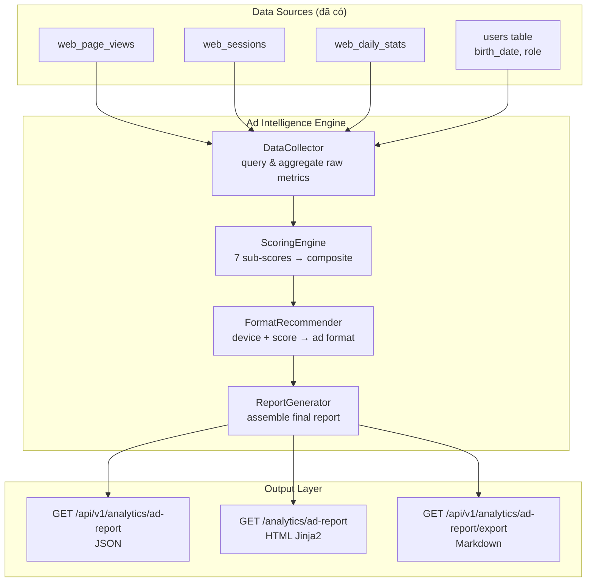

# Design Document: Ad Placement Intelligence

## Overview

Hệ thống báo cáo gợi ý đặt quảng cáo cho KidCoin, xây dựng hoàn toàn trên dữ liệu analytics đã có (`web_page_views`, `web_sessions`, `web_daily_stats`). Không cần bảng DB mới — đây là **pure computation layer** phân tích traffic patterns và chấm điểm từng vị trí quảng cáo tiềm năng trên 3 màn hình chính.

Output là báo cáo actionable: "Đặt banner 300x250 tại sidebar /parent, ước tính 150 impressions/ngày, CPM $2–5, peak 19–21h, confidence HIGH."

---

## Architecture



---

## Ad Slot Definitions

Mỗi trang có các **slot** (vị trí) tiềm năng. Slot ID theo format `{page}_{position}`.

### Trang /login
| Slot ID | Vị trí | Mô tả |
|---------|---------|-------|
| `login_header` | Trên form đăng nhập | Banner ngang, hiển thị trước khi user tương tác |
| `login_below_form` | Dưới nút đăng nhập | Hiển thị sau khi user đọc form |

### Trang /parent
| Slot ID | Vị trí | Mô tả |
|---------|---------|-------|
| `parent_top_banner` | Đầu trang, trên dashboard | Visibility cao nhất |
| `parent_sidebar` | Cột bên phải (desktop) | Persistent, user thấy suốt session |
| `parent_between_section` | Giữa các section (Nhiệm vụ / Quà tặng) | Native-friendly |
| `parent_footer` | Cuối trang | Thấy khi scroll hết |

### Trang /kid
| Slot ID | Vị trí | Mô tả |
|---------|---------|-------|
| `kid_top_banner` | Đầu trang kid dashboard | Visibility cao |
| `kid_between_task` | Giữa các task card | High engagement zone |
| `kid_shop_section` | Tab Cửa hàng | Purchase-intent context |
| `kid_bottom_nav` | Trên bottom navigation bar | Persistent, luôn hiển thị |

---

## Scoring Engine

### 7 Sub-scores (mỗi score từ 0–100)

#### 1. traffic_score
Đo lường volume traffic tuyệt đối của trang chứa slot.

```
traffic_score = min(100, page_views_last_30d / MAX_PAGE_VIEWS_ACROSS_PAGES * 100)
```

#### 2. dwell_score
Thời gian user ở lại trang — càng lâu càng có cơ hội xem quảng cáo.

```
avg_duration_sec = avg_session_duration_ms / 1000
dwell_score = min(100, avg_duration_sec / 300 * 100)  # 300s = 5 phút = điểm tối đa
```

#### 3. engagement_score
Đo độ tương tác: pages/session cao và bounce rate thấp = user engaged.

```
pages_per_session = total_page_views / total_sessions
bounce_rate = sessions_with_1_page / total_sessions * 100
engagement_score = (min(100, pages_per_session / 5 * 100) * 0.6) + ((100 - bounce_rate) * 0.4)
```

#### 4. audience_score
PARENT role có purchasing power cao hơn KID. Tính tỷ lệ PARENT trong traffic của trang.

```
parent_ratio = parent_page_views / total_page_views
audience_score = parent_ratio * 100
# /parent → ~100, /kid → ~0, /login → ~50 (mixed)
```

#### 5. peak_score
Traffic tập trung vào giờ cao điểm = slot có giá trị hơn (advertisers trả nhiều hơn cho prime time).

```
peak_hours_traffic = page_views trong top-3 giờ cao điểm
total_traffic = tổng page_views
peak_score = min(100, peak_hours_traffic / total_traffic * 300)
# Nếu 33% traffic tập trung vào 3 giờ → score = 100
```

#### 6. device_score
Mobile-first context → gợi ý mobile ad format. Desktop → larger formats.

```
mobile_ratio = mobile_page_views / total_page_views
device_score = mobile_ratio * 100
# Score cao = mobile dominant → recommend mobile formats
```

#### 7. return_score
User quay lại nhiều = loyal audience = quảng cáo hiệu quả hơn.

```
return_score = min(100, (wau / mau) * 100) if mau > 0 else 0
```

### Composite Score

```
composite_score = (
    traffic_score    * 0.25 +
    dwell_score      * 0.20 +
    engagement_score * 0.20 +
    audience_score   * 0.15 +
    peak_score       * 0.10 +
    device_score     * 0.05 +
    return_score     * 0.05
)
```

**Trọng số giải thích:**
- Traffic (0.25): volume là yếu tố quan trọng nhất với advertiser
- Dwell + Engagement (0.40 tổng): user engaged = ad được xem
- Audience (0.15): PARENT = higher CPM
- Peak (0.10): prime time value
- Device + Return (0.10): format và loyalty signals

---

## Ad Format Recommender

Dựa trên `device_score` và `composite_score`:

```python
def recommend_format(device_score, composite_score, slot_position) -> AdFormat:
    is_mobile_dominant = device_score >= 60

    if composite_score >= 70:
        if is_mobile_dominant:
            return AdFormat(
                primary="Banner 320x50",
                secondary="Native Ad",
                avoid="Interstitial (UX disruptive on mobile)"
            )
        else:
            return AdFormat(
                primary="Rectangle 300x250",
                secondary="Banner 728x90",
                avoid=None
            )
    elif composite_score >= 40:
        if is_mobile_dominant:
            return AdFormat(primary="Banner 320x50", secondary=None, avoid=None)
        else:
            return AdFormat(primary="Banner 728x90", secondary="Rectangle 300x250", avoid=None)
    else:
        return AdFormat(primary="Text/Native Ad", secondary=None, avoid="Large display ads")
```

**Slot-specific overrides:**
- `kid_bottom_nav`: luôn recommend Banner 320x50 (sticky bottom)
- `parent_sidebar`: luôn recommend Rectangle 300x250 (desktop context)
- `login_*`: recommend Banner nhỏ (user đang trong auth flow, không muốn disrupt)

---

## CPM Estimation

CPM (Cost Per Mille = giá per 1000 impressions) ước tính dựa trên `audience_score`:

| audience_score | CPM Range (USD) | Lý do |
|---------------|-----------------|-------|
| 70–100 | $3–8 | PARENT dominant, purchasing power cao |
| 40–69 | $1.5–4 | Mixed audience |
| 0–39 | $0.5–2 | KID dominant, limited purchasing power |

**Estimated daily impressions:**
```
estimated_impressions = page_views_last_7d / 7 * slot_visibility_factor
# slot_visibility_factor: top_banner=1.0, sidebar=0.8, between_section=0.6, footer=0.3
```

---

## Confidence Level

Dựa trên tổng số data points (page views) trong 30 ngày:

| Data Points | Confidence | Ý nghĩa |
|-------------|------------|---------|
| < 100 | LOW | Chưa đủ data, scores có thể không chính xác |
| 100–1000 | MEDIUM | Đủ để có xu hướng, nhưng cần thêm data |
| > 1000 | HIGH | Đủ tin cậy để ra quyết định |

---

## Components and Interfaces

### AdDataCollector

```python
class AdDataCollector:
    def collect_page_metrics(db, page_path: str, days: int = 30) -> PageMetrics
    def collect_session_metrics(db, days: int = 30) -> SessionMetrics
    def collect_audience_metrics(db, page_path: str, days: int = 30) -> AudienceMetrics
    def collect_peak_hours(db, page_path: str, days: int = 30) -> list[PeakHour]
    def collect_device_metrics(db, page_path: str, days: int = 30) -> DeviceMetrics
    def collect_retention_metrics(db) -> RetentionMetrics
```

### AdScoringEngine

```python
class AdScoringEngine:
    def compute_traffic_score(page_metrics: PageMetrics, max_views: int) -> float
    def compute_dwell_score(session_metrics: SessionMetrics) -> float
    def compute_engagement_score(session_metrics: SessionMetrics) -> float
    def compute_audience_score(audience_metrics: AudienceMetrics) -> float
    def compute_peak_score(peak_hours: list[PeakHour]) -> float
    def compute_device_score(device_metrics: DeviceMetrics) -> float
    def compute_return_score(retention: RetentionMetrics) -> float
    def compute_composite(scores: SubScores) -> float
```

### AdReportService

```python
class AdReportService:
    @staticmethod
    def generate_report(db, days: int = 30) -> AdPlacementReport

    @staticmethod
    def generate_slot_report(db, slot_id: str, days: int = 30) -> SlotReport

    @staticmethod
    def export_markdown(report: AdPlacementReport) -> str
```

---

## Data Models (Pydantic, không cần DB)

```python
class SubScores(BaseModel):
    traffic: float      # 0-100
    dwell: float        # 0-100
    engagement: float   # 0-100
    audience: float     # 0-100
    peak: float         # 0-100
    device: float       # 0-100
    return_rate: float  # 0-100

class AdFormat(BaseModel):
    primary: str
    secondary: Optional[str]
    avoid: Optional[str]

class PeakHour(BaseModel):
    hour: int           # 0-23
    page_views: int
    percentage: float

class SlotReport(BaseModel):
    slot_id: str
    page_path: str
    position_name: str
    composite_score: float          # 0-100
    sub_scores: SubScores
    estimated_daily_impressions: int
    cpm_range: tuple[float, float]  # (min, max) USD
    recommended_format: AdFormat
    peak_hours: list[PeakHour]
    audience_breakdown: dict        # {parent_pct, kid_pct, mobile_pct}
    confidence_level: Literal["LOW", "MEDIUM", "HIGH"]
    data_points: int
    recommendation_text: str        # Human-readable, tiếng Việt

class AdPlacementReport(BaseModel):
    generated_at: datetime
    analysis_period_days: int
    slots: list[SlotReport]
    top_3_slots: list[str]          # slot_ids sorted by composite_score
    summary_text: str               # Executive summary tiếng Việt
```

---

## Algorithmic Pseudocode

### generate_report()

```pascal
FUNCTION generate_report(db, days) → AdPlacementReport
  INPUT: db session, days: int in [7, 90]
  OUTPUT: AdPlacementReport

  BEGIN
    // 1. Collect global metrics
    all_pages ← ["/login", "/parent", "/kid"]
    max_views ← MAX(collect_page_metrics(db, p, days).total_views FOR p IN all_pages)
    retention ← collect_retention_metrics(db)

    slot_reports ← []

    // 2. Score each slot
    FOR EACH slot IN AD_SLOT_DEFINITIONS DO
      page_metrics    ← collect_page_metrics(db, slot.page_path, days)
      session_metrics ← collect_session_metrics(db, days)
      audience        ← collect_audience_metrics(db, slot.page_path, days)
      peak_hours      ← collect_peak_hours(db, slot.page_path, days)
      device_metrics  ← collect_device_metrics(db, slot.page_path, days)

      sub_scores ← SubScores(
        traffic    = compute_traffic_score(page_metrics, max_views),
        dwell      = compute_dwell_score(session_metrics),
        engagement = compute_engagement_score(session_metrics),
        audience   = compute_audience_score(audience),
        peak       = compute_peak_score(peak_hours),
        device     = compute_device_score(device_metrics),
        return_rate = compute_return_score(retention)
      )

      composite ← compute_composite(sub_scores)
      format    ← recommend_format(sub_scores.device, composite, slot.position)
      cpm       ← estimate_cpm(sub_scores.audience)
      impressions ← estimate_impressions(page_metrics, slot.visibility_factor)
      confidence ← determine_confidence(page_metrics.total_views)

      slot_reports.append(SlotReport(
        slot_id = slot.id,
        composite_score = composite,
        sub_scores = sub_scores,
        estimated_daily_impressions = impressions,
        cpm_range = cpm,
        recommended_format = format,
        peak_hours = peak_hours[:3],  // top 3 peak hours
        audience_breakdown = {
          parent_pct: audience.parent_ratio * 100,
          kid_pct: (1 - audience.parent_ratio) * 100,
          mobile_pct: device_metrics.mobile_ratio * 100
        },
        confidence_level = confidence,
        data_points = page_metrics.total_views,
        recommendation_text = generate_recommendation_text(slot, composite, format, impressions, cpm, confidence)
      ))
    END FOR

    // 3. Sort and summarize
    slot_reports.sort(key=composite_score, descending=True)
    top_3 ← [s.slot_id FOR s IN slot_reports[:3]]

    RETURN AdPlacementReport(
      generated_at = NOW(),
      analysis_period_days = days,
      slots = slot_reports,
      top_3_slots = top_3,
      summary_text = generate_summary(slot_reports)
    )
  END
```

**Preconditions:**
- `days` trong range [7, 90]
- `db` session active
- Ít nhất 1 record trong `web_page_views`

**Postconditions:**
- Trả về `AdPlacementReport` với đúng 10 `SlotReport` (2 + 4 + 4 slots)
- `top_3_slots` là 3 slot_id có `composite_score` cao nhất
- Tất cả scores trong [0, 100]
- `confidence_level` phản ánh đúng `data_points`

---

### generate_recommendation_text()

```pascal
FUNCTION generate_recommendation_text(slot, composite, format, impressions, cpm, confidence) → str

  BEGIN
    confidence_note ← MATCH confidence:
      "HIGH"   → ""
      "MEDIUM" → " (cần thêm data để xác nhận)"
      "LOW"    → " (⚠️ chưa đủ data, chỉ mang tính tham khảo)"

    RETURN f"Đặt {format.primary} tại {slot.position_name} ({slot.page_path}). " +
           f"Ước tính {impressions} lượt xem/ngày, CPM ${cpm[0]}–${cpm[1]}. " +
           f"Phù hợp nhất lúc {peak_hours_str}. " +
           f"Điểm tổng: {composite:.0f}/100{confidence_note}."
  END
```

---

## API Endpoints

```
GET /api/v1/analytics/ad-report?days=30
    → JSON: AdPlacementReport
    → Auth: PARENT role required
    → Query params: days (7-90, default 30)

GET /api/v1/analytics/ad-report/{slot_id}?days=30
    → JSON: SlotReport cho 1 slot cụ thể
    → Auth: PARENT role required

GET /api/v1/analytics/ad-report/export?days=30
    → Content-Type: text/markdown
    → Markdown report có thể copy/paste cho advertiser
    → Auth: PARENT role required

GET /analytics/ad-report
    → HTML: Jinja2 dashboard
    → Auth: PARENT role, redirect /login nếu không hợp lệ
```

---

## HTML Report Layout

```
┌─────────────────────────────────────────────────────┐
│  📊 BÁO CÁO GỢI Ý ĐẶT QUẢNG CÁO                   │
│  Phân tích 30 ngày qua | Cập nhật: 10/04/2026       │
│                                                     │
│  🏆 TOP 3 VỊ TRÍ TỐT NHẤT                          │
│  ┌──────────────────────────────────────────────┐   │
│  │ #1 parent_sidebar     Score: 82/100  HIGH ✅ │   │
│  │ #2 kid_shop_section   Score: 74/100  HIGH ✅ │   │
│  │ #3 parent_top_banner  Score: 71/100  MED  ⚠️ │   │
│  └──────────────────────────────────────────────┘   │
│                                                     │
│  📋 CHI TIẾT TỪNG VỊ TRÍ                           │
│  ┌──────────────────────────────────────────────┐   │
│  │ parent_sidebar                               │   │
│  │ 📍 Sidebar /parent (desktop)                 │   │
│  │ Format gợi ý: Rectangle 300x250              │   │
│  │ Impressions/ngày: ~150                       │   │
│  │ CPM ước tính: $3–8                           │   │
│  │ Peak: 19h–21h (38% traffic)                  │   │
│  │ Audience: 95% Parent, 5% Kid                 │   │
│  │ Mobile: 45%                                  │   │
│  │                                              │   │
│  │ Sub-scores:                                  │   │
│  │ Traffic ████████░░ 82  Dwell ███████░░░ 70   │   │
│  │ Engage  ████████░░ 78  Audience ██████████ 95│   │
│  │ Peak    ███████░░░ 68  Device   █████░░░░░ 45│   │
│  │ Return  ████████░░ 80                        │   │
│  └──────────────────────────────────────────────┘   │
│                                                     │
│  [📥 Xuất báo cáo Markdown]  [🔄 Làm mới]          │
└─────────────────────────────────────────────────────┘
```

---

## Correctness Properties

### Property 1: Score bounds
*For any* slot and any dataset, all sub-scores and composite_score SHALL be in range [0, 100].

### Property 2: Top 3 ordering
*For any* report, `top_3_slots[0]` SHALL have `composite_score >= top_3_slots[1]` >= `top_3_slots[2]`.

### Property 3: Confidence reflects data volume
*For any* slot with `data_points < 100`, `confidence_level` SHALL be "LOW".
*For any* slot with `100 <= data_points <= 1000`, `confidence_level` SHALL be "MEDIUM".
*For any* slot with `data_points > 1000`, `confidence_level` SHALL be "HIGH".

### Property 4: CPM range validity
*For any* slot, `cpm_range[0] <= cpm_range[1]` and both values SHALL be > 0.

### Property 5: Slot count
*For any* report, `len(slots)` SHALL equal 10 (tổng số slots đã định nghĩa).

### Property 6: No DB writes
*For any* call to `generate_report`, no INSERT/UPDATE/DELETE SHALL be executed against the database.

### Property 7: Auth isolation
*For any* analytics ad-report endpoint, requests without PARENT role SHALL return 401 or 403.

### Property 8: Weighted sum
*For any* `SubScores`, `compute_composite(scores)` SHALL equal exactly:
`scores.traffic*0.25 + scores.dwell*0.20 + scores.engagement*0.20 + scores.audience*0.15 + scores.peak*0.10 + scores.device*0.05 + scores.return_rate*0.05`

---

## Error Handling

| Scenario | Behavior |
|----------|----------|
| Không có data trong analytics tables | Trả về report với tất cả scores = 0, confidence = LOW, recommendation_text ghi rõ "Chưa có dữ liệu" |
| `days` ngoài range [7, 90] | HTTP 422 Unprocessable Entity |
| `slot_id` không tồn tại | HTTP 404 |
| DB query timeout | HTTP 503, log error |

---

## Dependencies

Không cần thư viện mới. Tái sử dụng:
- `sqlalchemy` — queries
- `fastapi` — endpoints
- `pydantic` — response schemas
- `jinja2` — HTML template

---

## Testing Strategy

### Unit Tests
- `compute_composite()`: verify weighted sum chính xác (Property 8)
- `determine_confidence()`: test 3 boundary cases (< 100, 100–1000, > 1000)
- `recommend_format()`: test matrix device_score × composite_score
- `estimate_cpm()`: test 3 audience_score ranges

### Property-Based Tests (hypothesis)
- **Property 1**: với bất kỳ input metrics nào, tất cả scores trong [0, 100]
- **Property 8**: với bất kỳ SubScores nào, composite = weighted sum chính xác

### Integration Tests
- `generate_report()` với mock DB data → verify 10 slots, top_3 sorted
- API auth: no JWT → 401, KID role → 403, PARENT → 200
- Export endpoint → Content-Type: text/markdown
