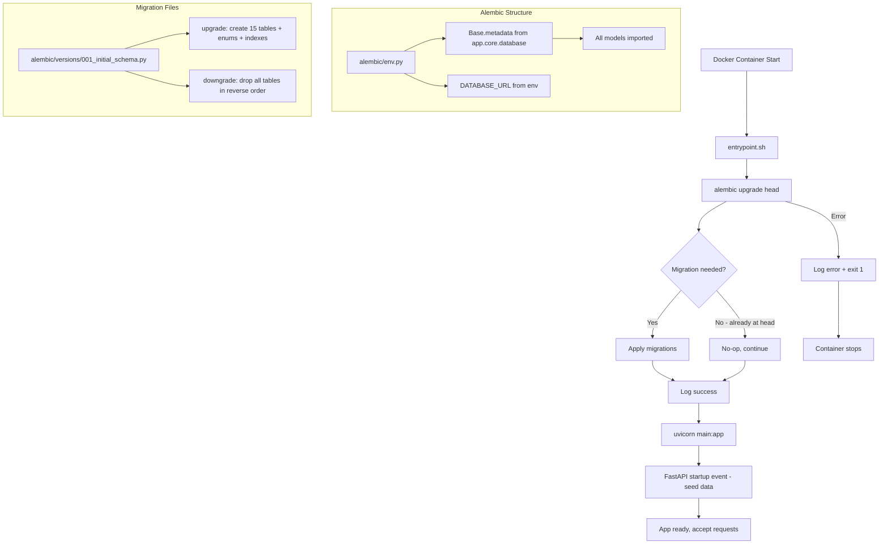

# Design Document: alembic-db-migration

## Overview

Feature này thay thế toàn bộ hệ thống migration thủ công (`app/core/migrations.py`, `migrate.py`) bằng Alembic — công cụ migration chuẩn cho SQLAlchemy. Mục tiêu là:

1. Tạo cấu trúc Alembic chuẩn với `env.py` import đầy đủ models
2. Tạo initial migration script bao gồm toàn bộ 15 bảng, enums, indexes, constraints
3. Tích hợp migration runner vào startup sequence của FastAPI
4. Cập nhật Dockerfile để dùng `entrypoint.sh` chạy migration trước uvicorn
5. Xóa bỏ toàn bộ legacy migration code

Đây là bước chuẩn bị cho golive đầu tiên với DB sạch hoàn toàn, đảm bảo mọi deployment đều tự động đồng bộ schema.

---

## Architecture



**Luồng chính:**
- `entrypoint.sh` là entry point duy nhất của container
- Alembic đọc `DATABASE_URL` từ environment, kết nối DB, apply pending migrations
- Nếu DB đã ở `head`, lệnh hoàn thành ngay lập tức (idempotent)
- Sau migration thành công, uvicorn khởi động FastAPI

---

## Components and Interfaces

### 1. `alembic/env.py`

File cấu hình trung tâm của Alembic. Chịu trách nhiệm:
- Import `Base` từ `app.core.database`
- Import toàn bộ models để `Base.metadata` được populate
- Đọc `DATABASE_URL` từ environment
- Cấu hình `context.configure()` với `compare_type=True`

```python
# Interface chính
def run_migrations_offline() -> None: ...
def run_migrations_online() -> None: ...
```

### 2. `alembic/versions/001_initial_schema.py`

Initial migration script. Chứa toàn bộ DDL cho 15 bảng.

```python
# Interface chính
def upgrade() -> None:
    # Tạo enums → tạo bảng → tạo indexes → tạo constraints
    ...

def downgrade() -> None:
    # Drop bảng theo thứ tự ngược → drop enums
    ...
```

**Thứ tự tạo bảng (dependency order):**
1. `families` (không có FK)
2. `master_tasks`, `master_rewards` (không có FK)
3. `users` (FK → families)
4. `family_tasks` (FK → families, master_tasks)
5. `family_rewards` (FK → families, master_rewards)
6. `clubs` (FK → families)
7. `club_members` (FK → clubs, users)
8. `club_invitations` (FK → clubs, users)
9. `club_tasks` (FK → clubs, families)
10. `task_logs` (FK → users, family_tasks, club_tasks)
11. `redemption_logs` (FK → users, family_rewards)
12. `transactions` (FK → users)
13. `family_devices` (FK → families)
14. `notifications` (FK → users)
15. `audit_logs` (FK → users)

### 3. `app/core/migration_runner.py`

Module mới thay thế `app/core/migrations.py`. Chịu trách nhiệm gọi `alembic upgrade head` programmatically.

```python
def run_alembic_upgrade() -> None:
    """
    Chạy alembic upgrade head.
    Raise exception nếu thất bại để dừng service startup.
    """
    ...
```

### 4. `entrypoint.sh`

Shell script làm ENTRYPOINT của Docker container.

```bash
#!/bin/bash
set -e
alembic upgrade head
exec uvicorn main:app --host 0.0.0.0 --port 8000
```

`set -e` đảm bảo script dừng ngay nếu `alembic upgrade head` thất bại.

### 5. `main.py` (modified)

Xóa bỏ:
- `from app.core.migrations import run_migrations`
- `run_migrations()` call và try/except block
- `Base.metadata.create_all(bind=engine)` call và try/except block

---

## Data Models

### Danh sách 15 bảng và Enum types

**Enum types (PostgreSQL native):**

| Enum Name | Values |
|-----------|--------|
| `role` | PARENT, KID |
| `category` | Học tập, Việc nhà, Giải trí, Xã hội, Cá nhân, Kiếm tiền, Khác |
| `verificationtype` | Tự động duyệt, Cần chụp ảnh, Bố mẹ kiểm tra trực tiếp |
| `taskstatus` | PENDING_APPROVAL, APPROVED, REJECTED |
| `redemptionstatus` | PENDING_DELIVERY, DELIVERED |
| `transactiontype` | TASK_COMPLETION, REWARD_REDEMPTION, PENALTY, BONUS |
| `clubrole` | ADMIN, MEMBER |
| `invitationstatus` | PENDING, ACCEPTED, REJECTED |
| `notificationtype` | SYSTEM, CLUB_INVITE, KID_CLUB_INVITE, TASK_ASSIGNED |
| `auditstatus` | INIT, PROCESSING, SUCCESS, FAILED |

**Bảng và key constraints:**

| Table | PK Type | Notable Constraints |
|-------|---------|---------------------|
| `families` | UUID | - |
| `users` | UUID | UNIQUE username |
| `master_tasks` | Integer (autoincrement) | - |
| `family_tasks` | UUID | FK → families, master_tasks |
| `master_rewards` | Integer (autoincrement) | - |
| `family_rewards` | UUID | FK → families, master_rewards |
| `clubs` | UUID | UNIQUE invite_code |
| `club_members` | Composite PK (club_id, user_id) | FK CASCADE |
| `club_invitations` | UUID | UNIQUE (club_id, invited_user_id, status) |
| `club_tasks` | UUID | FK → clubs, families |
| `task_logs` | UUID | CHECK chk_one_task_source |
| `redemption_logs` | UUID | FK → users, family_rewards |
| `transactions` | UUID | - |
| `family_devices` | UUID | UNIQUE device_token |
| `notifications` | UUID | FK CASCADE → users |
| `audit_logs` | UUID | FK nullable → users |

**CheckConstraint quan trọng:**
```sql
-- task_logs: đảm bảo mỗi log thuộc về ĐÚNG MỘT nguồn task
CONSTRAINT chk_one_task_source CHECK (num_nonnulls(family_task_id, club_task_id) = 1)
```

**Indexes:**

| Index Name | Table | Columns |
|------------|-------|---------|
| idx_family_name | families | name |
| idx_user_family_role | users | family_id, role |
| idx_user_username | users | username |
| idx_master_task_category | master_tasks | category |
| idx_family_task_name | family_tasks | name |
| idx_family_task_is_active | family_tasks | is_active |
| idx_family_reward_name | family_rewards | name |
| idx_family_reward_is_active | family_rewards | is_active |
| idx_club_name | clubs | name |
| idx_club_invite_code | clubs | invite_code |
| idx_club_task_club_id | club_tasks | club_id |
| idx_club_task_is_active | club_tasks | is_active |
| idx_task_log_status | task_logs | status |
| idx_task_log_created_at | task_logs | created_at |
| idx_redemption_log_status | redemption_logs | status |
| idx_redemption_log_created_at | redemption_logs | created_at |
| idx_transaction_type | transactions | transaction_type |
| idx_transaction_created_at | transactions | created_at |
| idx_device_family_id | family_devices | family_id |
| idx_device_token | family_devices | device_token |

---

## Correctness Properties

*A property is a characteristic or behavior that should hold true across all valid executions of a system — essentially, a formal statement about what the system should do. Properties serve as the bridge between human-readable specifications and machine-verifiable correctness guarantees.*

**Đánh giá PBT applicability:**

Feature này chủ yếu là infrastructure/configuration (Alembic setup, Dockerfile, shell script). Hầu hết acceptance criteria là SMOKE hoặc INTEGRATION tests. Tuy nhiên, có hai behaviors có thể test như properties:

1. **CheckConstraint enforcement** (2.4): Logic DB constraint — behavior thay đổi theo input (valid vs invalid data)
2. **Migration idempotence** (3.6): Chạy upgrade head nhiều lần phải cho kết quả giống nhau

### Property 1: CheckConstraint enforcement trên task_logs

*For any* task_log record, nếu cả `family_task_id` và `club_task_id` đều NULL, hoặc cả hai đều có giá trị, thì DB SHALL reject insert đó với constraint violation. Chỉ khi đúng một trong hai có giá trị thì insert mới thành công.

**Validates: Requirements 2.4**

### Property 2: Migration idempotence

*For any* database đã ở trạng thái `head`, chạy `alembic upgrade head` lần thứ hai SHALL không thực hiện thay đổi nào và hoàn thành thành công (no-op).

**Validates: Requirements 3.6**

### Property 3: Upgrade/Downgrade round-trip

*For any* fresh database, sau khi chạy `alembic upgrade head` rồi `alembic downgrade base`, database SHALL trở về trạng thái không có bảng nào (empty schema).

**Validates: Requirements 2.6, 2.8**

---

## Error Handling

### Migration failure khi startup

```
entrypoint.sh: alembic upgrade head thất bại
→ set -e dừng script, exit code != 0
→ Docker container exits với error
→ docker-compose restart policy xử lý (nếu cấu hình)
```

**Nguyên nhân phổ biến và cách xử lý:**

| Lỗi | Nguyên nhân | Xử lý |
|-----|-------------|-------|
| `OperationalError: could not connect` | DB chưa sẵn sàng | `depends_on: db: condition: service_healthy` trong docker-compose |
| `IntegrityError` | Data conflict trong migration | Kiểm tra migration script, fix data |
| `ProgrammingError: type already exists` | Enum đã tồn tại | Dùng `CREATE TYPE IF NOT EXISTS` hoặc `checkfirst=True` |
| `alembic.util.exc.CommandError` | Multiple heads | Chạy `alembic merge heads` |

### Enum "already exists" khi upgrade trên DB cũ

Nếu DB đã có một số bảng từ `create_all` cũ, Alembic sẽ thấy conflict. Giải pháp:
- Với DB production mới (golive): không có vấn đề
- Với DB dev đang chạy: cần `alembic stamp head` để đánh dấu migration đã apply mà không chạy lại

### `migration_runner.py` error handling

```python
try:
    run_alembic_upgrade()
except Exception as e:
    logger.error(f"Migration failed: {e}")
    raise  # Dừng startup
```

---

## Testing Strategy

Feature này là infrastructure/configuration, nên testing strategy tập trung vào:

### Unit Tests (example-based)

**`tests/test_migration_runner.py`**
- Test migration runner log success khi alembic thành công (mock subprocess/alembic command)
- Test migration runner raise exception khi alembic thất bại

**`tests/test_env_config.py`**
- Test `env.py` đọc `DATABASE_URL` từ environment variable
- Test `target_metadata` là `Base.metadata`

### Integration Tests

**`tests/integration/test_migration.py`** (chạy với DB thật hoặc test container)
- Test `alembic upgrade head` trên DB trống tạo đúng 15 bảng
- Test tất cả indexes tồn tại sau upgrade
- Test FK constraints với đúng ondelete behavior
- Test `alembic downgrade base` sau upgrade xóa sạch schema

### Property-Based Tests

**`tests/property/test_task_log_constraint.py`**
- Dùng `hypothesis` để generate random task_log data
- Property 1: CheckConstraint enforcement — verify DB reject invalid inserts
- Property 2: Migration idempotence — verify upgrade head là no-op khi đã ở head
- Property 3: Upgrade/downgrade round-trip

**Cấu hình:**
- Library: `hypothesis` (Python)
- Minimum iterations: 100 per property
- Tag format: `# Feature: alembic-db-migration, Property {N}: {property_text}`

### Smoke Tests

- Kiểm tra `alembic/env.py` import đúng models
- Kiểm tra `entrypoint.sh` tồn tại và executable
- Kiểm tra `Dockerfile` có `ENTRYPOINT ["./entrypoint.sh"]`
- Kiểm tra `app/core/migrations.py` và `migrate.py` không còn tồn tại

### Developer Workflow Commands

```bash
# Tạo migration mới từ model changes
alembic revision --autogenerate -m "add_new_column"

# Apply tất cả pending migrations
alembic upgrade head

# Rollback migration gần nhất
alembic downgrade -1

# Rollback về base (xóa sạch)
alembic downgrade base

# Xem lịch sử migrations
alembic history --verbose

# Xem trạng thái hiện tại
alembic current

# Trong Docker
docker-compose exec web alembic upgrade head
docker-compose exec web alembic history
docker-compose exec web alembic revision --autogenerate -m "description"

# Stamp DB hiện tại (khi migrate từ create_all sang Alembic)
docker-compose exec web alembic stamp head
```
