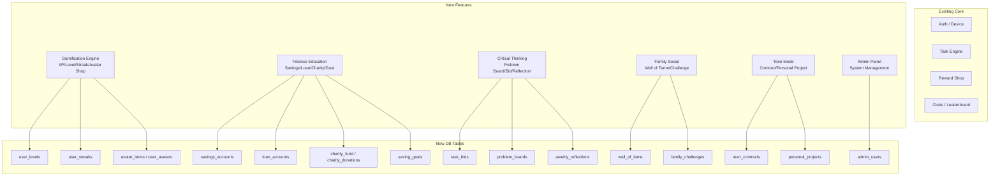

# Design Document: KidCoin Expansion — Tính năng mở rộng & Admin Panel

## Overview

Mở rộng KidCoin từ hệ thống quản lý việc nhà đơn giản thành nền tảng giáo dục tài chính và phát triển tư duy toàn diện cho trẻ em và thiếu niên. Bổ sung 6 nhóm tính năng mới + Admin Panel quản trị hệ thống.

**Ràng buộc kỹ thuật:** Server 1GB RAM, 1 CPU, 45GB — ưu tiên text-based logic, tránh xử lý realtime nặng, dùng cron job cho tác vụ định kỳ.

---

## Architecture Tổng thể



---

## Nhóm 1: Gamification Engine

### 1.1 XP & Level System

**Cơ chế:** `total_earned_score` (đã có) là XP. Thêm bảng `user_levels` để map XP → Level + title.

**Bảng: `user_levels`** (lookup table, seed data)
```
id          INTEGER PK
level       INTEGER UNIQUE NOT NULL        -- 1, 2, 3...
title       VARCHAR(50) NOT NULL           -- "Người mới", "Thợ học việc", "Chiến binh"...
xp_required BIGINT NOT NULL               -- XP tối thiểu để đạt level này
icon_url    VARCHAR(255)                   -- Badge icon
```

**Logic:** Level hiện tại = MAX level WHERE xp_required <= user.total_earned_score. Không cần cột level trong users — tính on-the-fly.

**Streak System:**

**Bảng: `user_streaks`**
```
id              UUID PK
user_id         UUID FK → users.id
current_streak  INTEGER DEFAULT 0          -- Số ngày liên tiếp
longest_streak  INTEGER DEFAULT 0          -- Kỷ lục cá nhân
last_active_date DATE                      -- Ngày cuối cùng có task APPROVED
streak_frozen_until DATE                   -- Freeze streak (dùng item đặc biệt)
updated_at      TIMESTAMP
```

**Cron job (chạy 00:05 hàng ngày):** Quét users có task APPROVED hôm qua → tăng streak. Users không có → reset streak về 0.

**Streak Bonus:** Nếu streak >= 7 ngày → nhân đôi Coin cho task tiếp theo trong ngày. Lưu flag `streak_bonus_active` trong `user_streaks`.

### 1.2 Avatar Shop

**Bảng: `avatar_items`** (catalog, seed data)
```
id          INTEGER PK
name        VARCHAR(100) NOT NULL
item_type   ENUM('FRAME', 'BACKGROUND', 'BADGE', 'ACCESSORY')
icon_url    VARCHAR(255) NOT NULL
price_coin  INTEGER NOT NULL               -- Giá mua bằng Coin
min_level   INTEGER DEFAULT 1             -- Level tối thiểu để mua
is_active   BOOLEAN DEFAULT TRUE
```

**Bảng: `user_avatar_items`** (inventory)
```
id          UUID PK
user_id     UUID FK → users.id
item_id     INTEGER FK → avatar_items.id
purchased_at TIMESTAMP
is_equipped BOOLEAN DEFAULT FALSE
UNIQUE(user_id, item_id)
```

**Logic mua:** Trừ Coin → insert `user_avatar_items` → insert `transactions` (type: AVATAR_PURCHASE). Không hoàn tiền.

---

## Nhóm 2: Giáo dục Tài chính

### 2.1 Heo đất Mục tiêu (Saving Goals)

**Bảng: `saving_goals`**
```
id              UUID PK
kid_id          UUID FK → users.id
name            VARCHAR(100) NOT NULL      -- "Mua Lego Technic"
target_amount   BIGINT NOT NULL            -- Mục tiêu (Coin)
current_amount  BIGINT DEFAULT 0           -- Đã tích lũy
icon_url        VARCHAR(255)
deadline        DATE                       -- Tùy chọn
status          ENUM('ACTIVE', 'COMPLETED', 'CANCELLED') DEFAULT 'ACTIVE'
created_at      TIMESTAMP
completed_at    TIMESTAMP
```

**Logic:** Kid chọn "Gửi vào heo đất" → trừ Coin từ `users.current_coin` → cộng vào `saving_goals.current_amount`. Khi `current_amount >= target_amount` → status = COMPLETED, trả Coin về wallet.

### 2.2 Đầu tư & Rủi ro (Savings/Credit)

**Bảng: `savings_accounts`** (Gửi có kỳ hạn)
```
id              UUID PK
kid_id          UUID FK → users.id
principal       BIGINT NOT NULL            -- Số Coin gốc
interest_rate   DECIMAL(5,2) NOT NULL      -- Lãi suất %/tháng (VD: 20.00)
start_date      DATE NOT NULL
end_date        DATE NOT NULL              -- Ngày đáo hạn
early_withdraw_penalty DECIMAL(5,2) DEFAULT 50.00  -- Phạt rút sớm %
status          ENUM('ACTIVE', 'MATURED', 'WITHDRAWN') DEFAULT 'ACTIVE'
matured_amount  BIGINT                     -- Số tiền nhận khi đáo hạn
created_at      TIMESTAMP
```

**Công thức:** `matured_amount = principal * (1 + interest_rate/100)`. Rút sớm: `return = principal * (1 - early_withdraw_penalty/100)`.

**Cron job (chạy hàng ngày):** Kiểm tra `end_date <= today` → tự động chuyển status = MATURED, cộng `matured_amount` vào wallet, tạo transaction.

**Bảng: `loan_accounts`** (Vay nợ)
```
id              UUID PK
kid_id          UUID FK → users.id
family_id       UUID FK → families.id
loan_amount     BIGINT NOT NULL            -- Số Coin vay
interest_rate   DECIMAL(5,2) DEFAULT 10.00 -- Lãi suất %
total_owed      BIGINT NOT NULL            -- Tổng phải trả = loan * (1 + rate/100)
repaid_amount   BIGINT DEFAULT 0
status          ENUM('ACTIVE', 'REPAID', 'OVERDUE') DEFAULT 'ACTIVE'
due_date        DATE
created_at      TIMESTAMP
approved_by     UUID FK → users.id         -- Parent duyệt
```

**Logic:** Parent tạo loan → cộng `loan_amount` vào kid wallet → kid phải làm thêm việc để trả `total_owed`. Mỗi khi task APPROVED, một phần Coin tự động trừ vào `repaid_amount` nếu có loan active.

### 2.3 Quỹ Sẻ chia (Charity)

**Bảng: `charity_fund`** (per family)
```
id          UUID PK
family_id   UUID FK → families.id UNIQUE
balance     BIGINT DEFAULT 0
total_donated BIGINT DEFAULT 0
created_at  TIMESTAMP
```

**Bảng: `charity_donations`**
```
id          UUID PK
fund_id     UUID FK → charity_fund.id
donor_id    UUID FK → users.id
amount      BIGINT NOT NULL
message     VARCHAR(255)
created_at  TIMESTAMP
```

**Logic:** Khi task APPROVED, tự động trích `charity_rate`% (cấu hình per family, default 5%) vào `charity_fund`. Kid cũng có thể tự nguyện donate thêm.

---

## Nhóm 3: Tư duy Logic & Chủ động

### 3.1 Đề xuất ngược (Task Bid)

Kid tự tìm việc, chụp ảnh, đề xuất giá Coin. Parent đóng vai nhà đầu tư.

**Bảng: `task_bids`**
```
id              UUID PK
kid_id          UUID FK → users.id
family_id       UUID FK → families.id
title           VARCHAR(100) NOT NULL      -- "Con đã lau cửa sổ"
description     VARCHAR(500)
proof_image_url VARCHAR(255)
proposed_coins  BIGINT NOT NULL            -- Giá kid đề xuất
final_coins     BIGINT                     -- Giá parent chấp nhận (có thể khác)
status          ENUM('PENDING', 'ACCEPTED', 'REJECTED', 'COUNTERED') DEFAULT 'PENDING'
parent_comment  VARCHAR(500)
created_at      TIMESTAMP
resolved_at     TIMESTAMP
```

**Flow:** Kid submit bid → Parent xem → ACCEPT (trả `final_coins`) / REJECT / COUNTER (đề xuất giá khác) → Kid accept/reject counter.

### 3.2 Bảng tin Giải quyết vấn đề (Problem Board)

**Bảng: `problem_boards`**
```
id              UUID PK
family_id       UUID FK → families.id
created_by      UUID FK → users.id         -- Parent tạo
title           VARCHAR(200) NOT NULL      -- "Làm bếp sạch trước 8h tối"
description     VARCHAR(1000)
reward_coins    BIGINT NOT NULL            -- Tổng thưởng nếu đạt mục tiêu
deadline        TIMESTAMP
status          ENUM('OPEN', 'COMPLETED', 'EXPIRED') DEFAULT 'OPEN'
created_at      TIMESTAMP
```

**Bảng: `problem_solutions`** (các task con kid tự chọn)
```
id              UUID PK
board_id        UUID FK → problem_boards.id
kid_id          UUID FK → users.id
task_description VARCHAR(200) NOT NULL     -- "Con sẽ rửa bát"
status          ENUM('CLAIMED', 'DONE', 'VERIFIED') DEFAULT 'CLAIMED'
proof_image_url VARCHAR(255)
created_at      TIMESTAMP
```

**Logic:** Parent đăng bài toán → Kids tự phân công (claim tasks) → Làm xong upload ảnh → Parent verify → Nếu tất cả solutions VERIFIED → reward chia đều cho các kid tham gia.

### 3.3 Nhật ký Tự phản biện (Weekly Reflection)

**Bảng: `weekly_reflections`**
```
id              UUID PK
kid_id          UUID FK → users.id
week_start      DATE NOT NULL              -- Thứ 2 đầu tuần
q1_answer       TEXT                       -- "Việc nào vui nhất?"
q2_answer       TEXT                       -- "Việc nào chưa làm được?"
q3_answer       TEXT                       -- "Cách làm nhanh hơn?"
bonus_coins     INTEGER DEFAULT 0          -- Thưởng khi hoàn thành
status          ENUM('PENDING', 'SUBMITTED', 'REWARDED') DEFAULT 'PENDING'
submitted_at    TIMESTAMP
UNIQUE(kid_id, week_start)
```

**Cron job (Chủ Nhật 20:00):** Tạo `weekly_reflections` record cho tất cả kids với status PENDING. Khi kid submit → status = SUBMITTED → Parent review → REWARDED + cộng bonus_coins.

---

## Nhóm 4: Gắn kết & Cảm hứng

### 4.1 Bức tường Vinh danh (Wall of Fame)

**Bảng: `wall_of_fame`**
```
id              UUID PK
family_id       UUID FK → families.id
kid_id          UUID FK → users.id
posted_by       UUID FK → users.id         -- Parent đăng
image_url       VARCHAR(255)               -- Ảnh kid làm việc
caption         VARCHAR(500) NOT NULL      -- Lời khen
task_log_id     UUID FK → task_logs.id     -- Liên kết task (optional)
likes_count     INTEGER DEFAULT 0
created_at      TIMESTAMP
```

**Bảng: `wall_likes`**
```
post_id     UUID FK → wall_of_fame.id
user_id     UUID FK → users.id
PRIMARY KEY (post_id, user_id)
```

### 4.2 Thử thách Gia đình (Family Challenge)

**Bảng: `family_challenges`**
```
id              UUID PK
family_id       UUID FK → families.id
created_by      UUID FK → users.id
title           VARCHAR(200) NOT NULL      -- "Cả nhà đọc sách 7 ngày liên tiếp"
description     VARCHAR(500)
target_count    INTEGER NOT NULL           -- Số lần/ngày cần đạt
duration_days   INTEGER NOT NULL           -- Kéo dài bao nhiêu ngày
reward_coins    BIGINT NOT NULL            -- Thưởng cho mỗi thành viên hoàn thành
start_date      DATE NOT NULL
end_date        DATE NOT NULL
status          ENUM('ACTIVE', 'COMPLETED', 'EXPIRED') DEFAULT 'ACTIVE'
created_at      TIMESTAMP
```

**Bảng: `challenge_progress`**
```
id              UUID PK
challenge_id    UUID FK → family_challenges.id
user_id         UUID FK → users.id
check_in_date   DATE NOT NULL
proof_image_url VARCHAR(255)
UNIQUE(challenge_id, user_id, check_in_date)
```

---

## Nhóm 5: Teen Mode

### 5.1 Hợp đồng Trách nhiệm (Teen Contract)

**Bảng: `teen_contracts`**
```
id              UUID PK
kid_id          UUID FK → users.id
family_id       UUID FK → families.id
title           VARCHAR(200) NOT NULL      -- "Hợp đồng học tập tháng 4"
description     TEXT NOT NULL             -- Cam kết chi tiết
period_type     ENUM('WEEKLY', 'MONTHLY')
start_date      DATE NOT NULL
end_date        DATE NOT NULL
salary_coins    BIGINT NOT NULL            -- "Lương khoán" nếu hoàn thành
milestones      JSONB                      -- [{week: 1, target: "...", coins: 50}]
status          ENUM('DRAFT', 'ACTIVE', 'COMPLETED', 'BREACHED') DEFAULT 'DRAFT'
signed_at       TIMESTAMP                  -- Khi cả 2 bên đồng ý
created_at      TIMESTAMP
```

**Bảng: `contract_checkins`**
```
id              UUID PK
contract_id     UUID FK → teen_contracts.id
kid_id          UUID FK → users.id
checkin_date    DATE NOT NULL
note            TEXT
proof_url       VARCHAR(255)
verified_by     UUID FK → users.id
status          ENUM('PENDING', 'VERIFIED', 'MISSED') DEFAULT 'PENDING'
```

### 5.2 Dự án Cá nhân (Personal Project)

**Bảng: `personal_projects`**
```
id              UUID PK
kid_id          UUID FK → users.id
family_id       UUID FK → families.id
title           VARCHAR(200) NOT NULL      -- "Học Guitar"
description     TEXT
total_budget    BIGINT NOT NULL            -- Tổng Coin bố mẹ đầu tư
milestones      JSONB NOT NULL             -- [{title: "Học 5 hợp âm", coins: 100, deadline: "2026-05-01"}]
status          ENUM('ACTIVE', 'COMPLETED', 'PAUSED') DEFAULT 'ACTIVE'
created_at      TIMESTAMP
```

**Bảng: `project_milestone_logs`**
```
id              UUID PK
project_id      UUID FK → personal_projects.id
milestone_index INTEGER NOT NULL           -- Index trong JSONB milestones array
proof_url       VARCHAR(255)
note            TEXT
verified_by     UUID FK → users.id
coins_released  BIGINT NOT NULL
status          ENUM('PENDING', 'VERIFIED', 'REJECTED') DEFAULT 'PENDING'
created_at      TIMESTAMP
```

---

## Nhóm 6: Admin Panel

### 6.1 Admin User Model

**Bảng: `admin_users`**
```
id              UUID PK
username        VARCHAR(100) UNIQUE NOT NULL
password_hash   VARCHAR(255) NOT NULL      -- bcrypt
display_name    VARCHAR(100) NOT NULL
role            ENUM('SUPER_ADMIN', 'MODERATOR', 'SUPPORT') DEFAULT 'MODERATOR'
is_active       BOOLEAN DEFAULT TRUE
last_login_at   TIMESTAMP
created_at      TIMESTAMP
```

**Auth:** Separate JWT với `admin_secret_key` khác với user JWT. Route prefix `/admin/*`.

### 6.2 Admin Dashboard Features

**Quản lý Families:**
- Xem danh sách tất cả families (tìm kiếm, filter)
- Xem chi tiết family: members, tasks, transactions
- Suspend/Unsuspend family
- Reset PIN cho family

**Quản lý Users:**
- Xem tất cả users (filter by role, family)
- Adjust Coin balance (với audit log)
- Soft delete user

**Quản lý Master Data:**
- CRUD `master_tasks` (tên, category, suggested_value, min/max_age)
- CRUD `master_rewards`
- CRUD `avatar_items` (catalog quản lý)
- CRUD `user_levels` (level progression table)

**System Stats:**
- Tổng số families, users, tasks completed hôm nay
- Revenue metrics (nếu có premium)
- Error log viewer (từ `audit_logs` với status=FAILED)
- Active sessions count

**Cron Job Management:**
- Xem lịch sử chạy cron jobs
- Trigger manual run

### 6.3 Admin API Routes

```
POST   /admin/auth/login
GET    /admin/auth/me

GET    /admin/families
GET    /admin/families/{id}
PUT    /admin/families/{id}/suspend
PUT    /admin/families/{id}/reset-pin

GET    /admin/users
PUT    /admin/users/{id}/adjust-coins
DELETE /admin/users/{id}

GET    /admin/master-tasks
POST   /admin/master-tasks
PUT    /admin/master-tasks/{id}
DELETE /admin/master-tasks/{id}

GET    /admin/master-rewards
POST   /admin/master-rewards
PUT    /admin/master-rewards/{id}

GET    /admin/avatar-items
POST   /admin/avatar-items
PUT    /admin/avatar-items/{id}

GET    /admin/levels
POST   /admin/levels
PUT    /admin/levels/{id}

GET    /admin/stats/overview
GET    /admin/stats/daily-active
GET    /admin/logs/errors
```

---

## Database Schema Summary (Bảng mới)

| Bảng | Nhóm | Mô tả |
|------|------|-------|
| `user_levels` | Gamification | Level progression lookup |
| `user_streaks` | Gamification | Streak tracking per user |
| `avatar_items` | Gamification | Avatar item catalog |
| `user_avatar_items` | Gamification | User inventory |
| `saving_goals` | Finance | Heo đất mục tiêu |
| `savings_accounts` | Finance | Gửi có kỳ hạn |
| `loan_accounts` | Finance | Vay nợ |
| `charity_fund` | Finance | Quỹ sẻ chia per family |
| `charity_donations` | Finance | Lịch sử donate |
| `task_bids` | Thinking | Đề xuất ngược |
| `problem_boards` | Thinking | Bảng tin bài toán |
| `problem_solutions` | Thinking | Giải pháp của kids |
| `weekly_reflections` | Thinking | Nhật ký tự phản biện |
| `wall_of_fame` | Social | Bức tường vinh danh |
| `wall_likes` | Social | Likes |
| `family_challenges` | Social | Thử thách gia đình |
| `challenge_progress` | Social | Check-in tiến độ |
| `teen_contracts` | Teen | Hợp đồng trách nhiệm |
| `contract_checkins` | Teen | Check-in hợp đồng |
| `personal_projects` | Teen | Dự án cá nhân |
| `project_milestone_logs` | Teen | Milestone verification |
| `admin_users` | Admin | Tài khoản quản trị |

**Cần mở rộng bảng hiện có:**
- `users`: thêm `charity_rate` (DECIMAL, default 5.0), `is_teen_mode` (BOOLEAN)
- `families`: thêm `charity_rate` (DECIMAL, default 5.0), `is_suspended` (BOOLEAN)
- `transactions`: thêm type mới: `AVATAR_PURCHASE`, `SAVINGS_DEPOSIT`, `SAVINGS_WITHDRAW`, `LOAN_RECEIVE`, `LOAN_REPAY`, `CHARITY_DONATE`, `STREAK_BONUS`, `BID_REWARD`, `PROBLEM_REWARD`, `REFLECTION_BONUS`, `CONTRACT_SALARY`, `PROJECT_MILESTONE`

---

## Cron Jobs (Lightweight, text-based)

| Job | Schedule | Mô tả |
|-----|----------|-------|
| `streak_updater` | Daily 00:05 | Cập nhật streak, reset nếu miss ngày |
| `savings_maturity` | Daily 08:00 | Kiểm tra savings đáo hạn, trả tiền |
| `loan_overdue` | Daily 08:00 | Đánh dấu loan OVERDUE nếu quá hạn |
| `weekly_reflection_creator` | Sunday 20:00 | Tạo reflection record cho tuần mới |
| `challenge_expiry` | Daily 23:55 | Đánh dấu challenge EXPIRED |
| `problem_board_expiry` | Daily 23:55 | Đánh dấu problem board EXPIRED |

**Implementation:** APScheduler (lightweight, in-process) hoặc simple cron script. Không cần Celery/Redis vì server hạn chế.

---

## Correctness Properties

1. **Coin conservation:** Tổng Coin trong hệ thống = Tổng transactions. Mọi thay đổi `current_coin` phải có transaction record tương ứng.

2. **Streak monotonicity:** `longest_streak >= current_streak` luôn đúng.

3. **Savings integrity:** `savings_accounts.principal > 0` và `matured_amount = principal * (1 + rate/100)` khi status = MATURED.

4. **Loan repayment:** `loan_accounts.repaid_amount <= total_owed` luôn đúng.

5. **Goal progress:** `saving_goals.current_amount <= target_amount` khi status = ACTIVE.

6. **Admin isolation:** Admin JWT không thể dùng cho user endpoints và ngược lại.

7. **Teen mode gate:** `teen_contracts` và `personal_projects` chỉ tạo được khi `users.is_teen_mode = TRUE`.

8. **Charity rate bounds:** `charity_rate` trong [0, 100].
