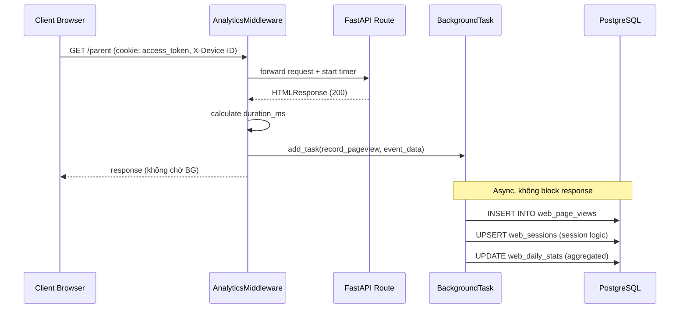
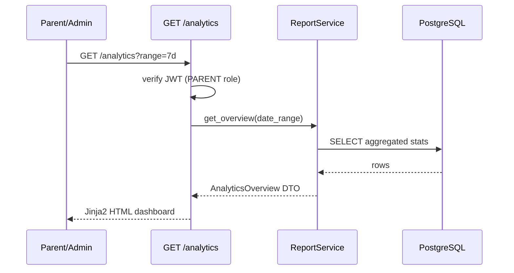

# Design Document: Web Analytics Tracking

## Overview

Hệ thống analytics nội bộ cho KidCoin, tích hợp trực tiếp vào middleware FastAPI hiện có, ghi nhận toàn bộ lượt truy cập web và API vào PostgreSQL. Cung cấp dashboard HTML để xem thống kê chi tiết tương tự Google Analytics (page views, sessions, DAU/WAU/MAU, device breakdown, error rates, performance) mà không cần external service.

Thiết kế ưu tiên **async/non-blocking** (fire-and-forget background task), **không phá vỡ code hiện tại**, và tận dụng tối đa `RequestContextMiddleware` + `FamilyDevice` model đã có.

---

## Architecture

```mermaid
graph TD
    subgraph "Request Flow"
        REQ[HTTP Request] --> MW[RequestContextMiddleware<br/>hiện có]
        MW --> AW[AnalyticsMiddleware<br/>mới - wraps MW]
        AW --> APP[FastAPI App / Routes]
        APP --> AW
        AW --> BG[BackgroundTask<br/>fire-and-forget]
    end

    subgraph "Analytics Pipeline"
        BG --> PS[PageViewService]
        PS --> SES[SessionResolver]
        PS --> GEO[GeoIPResolver<br/>IP → country/city]
        PS --> UA[UserAgentParser<br/>OS/browser/device]
        PS --> DB[(PostgreSQL)]
    end

    subgraph "Reporting Layer"
        DB --> RS[AnalyticsReportService]
        RS --> API[GET /api/v1/analytics/*]
        API --> DASH[/analytics dashboard<br/>Jinja2 HTML]
    end

    subgraph "Existing Models (tái sử dụng)"
        FD[FamilyDevice<br/>device_token, user_agent]
        AL[AuditLog<br/>ip_address, user_agent]
    end
```

---

## Sequence Diagrams

### Luồng ghi nhận page view (async)



### Luồng xem analytics dashboard



---

## Components and Interfaces

### Component 1: AnalyticsMiddleware

**Purpose**: Intercept mọi request/response, thu thập raw event data, đẩy vào BackgroundTask.

**Tích hợp**: Wrap `RequestContextMiddleware` hiện có trong `main.py`, không sửa code cũ.

```python
class AnalyticsMiddleware(BaseHTTPMiddleware):
    async def dispatch(self, request: Request, call_next) -> Response
```

**Responsibilities**:
- Đọc `X-Device-ID` header, JWT cookie để lấy `user_id`
- Đo `duration_ms` = thời gian xử lý request
- Phân loại request: page view (`/login`, `/parent`, `/kid`) vs API call (`/api/*`)
- Bỏ qua: `/static/*`, `/favicon.ico`, `/health`
- Fire-and-forget: `BackgroundTasks.add_task(record_event, ...)`

### Component 2: PageViewService

**Purpose**: Xử lý logic ghi nhận event, session resolution, upsert aggregated stats.

```python
class PageViewService:
    @staticmethod
    async def record_event(db: Session, event: PageViewEvent) -> None

    @staticmethod
    def resolve_session(db: Session, device_id: str, user_id: Optional[str]) -> str

    @staticmethod
    def parse_user_agent(ua_string: str) -> DeviceInfo

    @staticmethod
    def resolve_geo(ip: str) -> GeoInfo
```

**Responsibilities**:
- Insert `WebPageView` record
- Session logic: tìm session active trong 30 phút, nếu không có thì tạo mới
- Parse User-Agent → `{os, browser, device_type: mobile|desktop|tablet}`
- IP → geo lookup (dùng `ip_address` field, offline DB hoặc simple CIDR ranges)
- Upsert `WebDailyStat` (aggregated counter, tránh query nặng khi report)

### Component 3: AnalyticsReportService

**Purpose**: Query và aggregate data cho dashboard.

```python
class AnalyticsReportService:
    @staticmethod
    def get_overview(db: Session, days: int) -> OverviewStats

    @staticmethod
    def get_page_stats(db: Session, days: int) -> list[PageStat]

    @staticmethod
    def get_device_breakdown(db: Session, days: int) -> DeviceBreakdown

    @staticmethod
    def get_user_journey(db: Session, days: int) -> list[JourneyStep]

    @staticmethod
    def get_retention(db: Session) -> RetentionStats

    @staticmethod
    def get_error_rates(db: Session, days: int) -> list[ErrorStat]

    @staticmethod
    def get_top_endpoints(db: Session, days: int) -> list[EndpointStat]
```

### Component 4: Analytics API Router

**Purpose**: Expose report endpoints + serve dashboard HTML.

```python
router = APIRouter(prefix="/api/v1/analytics")

GET  /api/v1/analytics/overview          # Tổng quan: PV, UV, sessions, bounce rate
GET  /api/v1/analytics/pages             # Page views per path
GET  /api/v1/analytics/devices           # Device/OS/browser breakdown
GET  /api/v1/analytics/journey           # User flow: login → dashboard
GET  /api/v1/analytics/retention         # DAU/WAU/MAU
GET  /api/v1/analytics/errors            # 4xx/5xx rates
GET  /api/v1/analytics/endpoints         # Top API endpoints by call count
GET  /analytics                          # HTML dashboard (Jinja2)
```

**Auth**: Yêu cầu JWT cookie, chỉ PARENT role (hoặc system admin flag sau này).

---

## Data Models

### Model 1: WebPageView (raw event log)

Bảng ghi nhận từng lượt request — tương tự raw hit log của GA.

```python
class WebPageView(Base):
    __tablename__ = "web_page_views"

    id          = Column(UUID, primary_key=True, default=uuid4)
    
    # Request info
    path        = Column(String(500), nullable=False, index=True)   # /parent, /api/v1/quests/daily
    method      = Column(String(10), nullable=False)                 # GET, POST
    status_code = Column(Integer, nullable=False, index=True)        # 200, 404, 500
    duration_ms = Column(Integer, nullable=True)                     # response time
    
    # Identity (nullable = unauthenticated)
    user_id     = Column(UUID, ForeignKey("users.id"), nullable=True, index=True)
    device_id   = Column(String(255), nullable=True, index=True)     # X-Device-ID header
    session_id  = Column(String(36), nullable=True, index=True)      # resolved session UUID
    
    # Client info
    ip_address  = Column(String(45), nullable=True)
    user_agent  = Column(String(500), nullable=True)
    referer     = Column(String(500), nullable=True)
    
    # Parsed (denormalized for query speed)
    device_type = Column(String(20), nullable=True)   # mobile | desktop | tablet
    os_name     = Column(String(50), nullable=True)   # iOS, Android, Windows, macOS
    browser     = Column(String(50), nullable=True)   # Chrome, Safari, Firefox
    country     = Column(String(2), nullable=True)    # ISO 3166-1 alpha-2: VN, US
    city        = Column(String(100), nullable=True)
    
    # Classification
    is_page_view = Column(Boolean, default=True)      # False = API call
    
    created_at  = Column(DateTime(timezone=True), server_default=func.now(), index=True)
```

**Indexes**:
- `(path, created_at)` — page stats query
- `(user_id, created_at)` — user journey
- `(session_id)` — session aggregation
- `(status_code, created_at)` — error rate query
- `(created_at)` — time-range queries (partition key)

**Validation Rules**:
- `path` không được rỗng
- `status_code` trong range 100–599
- `duration_ms` >= 0 nếu có

### Model 2: WebSession (session tracking)

```python
class WebSession(Base):
    __tablename__ = "web_sessions"

    id           = Column(String(36), primary_key=True)   # UUID string
    device_id    = Column(String(255), nullable=True, index=True)
    user_id      = Column(UUID, ForeignKey("users.id"), nullable=True, index=True)
    
    started_at   = Column(DateTime(timezone=True), nullable=False)
    last_seen_at = Column(DateTime(timezone=True), nullable=False)
    page_count   = Column(Integer, default=1)
    
    # First touch
    entry_path   = Column(String(500), nullable=True)     # trang đầu tiên vào
    exit_path    = Column(String(500), nullable=True)     # trang cuối cùng
    
    # Geo/device snapshot (từ first request)
    country      = Column(String(2), nullable=True)
    device_type  = Column(String(20), nullable=True)
    
    is_active    = Column(Boolean, default=True)          # False sau 30 phút idle
```

**Session Logic**:
- Tìm session có `device_id = X` và `last_seen_at > now() - 30min` và `is_active = True`
- Nếu tìm thấy: update `last_seen_at`, tăng `page_count`, update `exit_path`
- Nếu không: tạo session mới với UUID mới

### Model 3: WebDailyStat (pre-aggregated, cho query nhanh)

```python
class WebDailyStat(Base):
    __tablename__ = "web_daily_stats"
    __table_args__ = (UniqueConstraint("stat_date", "path"),)

    id              = Column(UUID, primary_key=True, default=uuid4)
    stat_date       = Column(Date, nullable=False, index=True)
    path            = Column(String(500), nullable=False)   # "/" = tổng toàn site
    
    page_views      = Column(Integer, default=0)
    unique_visitors = Column(Integer, default=0)            # distinct device_id
    sessions        = Column(Integer, default=0)
    
    avg_duration_ms = Column(Integer, default=0)
    error_count     = Column(Integer, default=0)            # 4xx + 5xx
    
    updated_at      = Column(DateTime(timezone=True), server_default=func.now())
```

**Upsert strategy**: Dùng PostgreSQL `INSERT ... ON CONFLICT DO UPDATE` để tăng counter atomic.

---

## Algorithmic Pseudocode

### Algorithm 1: record_event (BackgroundTask)

```pascal
PROCEDURE record_event(db, event: PageViewEvent)
  INPUT: event = {path, method, status_code, duration_ms, user_id, device_id,
                  ip_address, user_agent, referer}
  OUTPUT: void (side effects: DB writes)

  BEGIN
    // 1. Skip noise paths
    IF event.path STARTS_WITH "/static" OR event.path = "/favicon.ico" THEN
      RETURN
    END IF

    // 2. Parse User-Agent
    device_info ← parse_user_agent(event.user_agent)
    // device_info = {device_type, os_name, browser}

    // 3. Geo lookup (best-effort, không block nếu lỗi)
    TRY
      geo ← resolve_geo(event.ip_address)
    CATCH
      geo ← {country: null, city: null}
    END TRY

    // 4. Session resolution
    session_id ← resolve_session(db, event.device_id, event.user_id)

    // 5. Classify request type
    is_page_view ← NOT (event.path STARTS_WITH "/api/")

    // 6. Insert raw event
    INSERT INTO web_page_views VALUES {
      ...event,
      device_type: device_info.device_type,
      os_name: device_info.os_name,
      browser: device_info.browser,
      country: geo.country,
      city: geo.city,
      session_id: session_id,
      is_page_view: is_page_view
    }

    // 7. Upsert daily aggregated stat
    today ← DATE(event.created_at)
    UPSERT web_daily_stats
      WHERE stat_date = today AND path = event.path
      SET page_views += 1,
          error_count += (1 IF status_code >= 400 ELSE 0),
          avg_duration_ms = rolling_avg(avg_duration_ms, event.duration_ms)
    
    // Also upsert for path = "/" (site-wide total)
    UPSERT web_daily_stats
      WHERE stat_date = today AND path = "/"
      SET page_views += 1, ...
  END
```

**Preconditions**:
- `event.path` không rỗng
- `db` session hợp lệ

**Postconditions**:
- Một record `WebPageView` được insert
- `WebDailyStat` được upsert cho path cụ thể và path "/"
- Không raise exception ra ngoài (catch all, log error)

**Loop Invariants**: N/A (không có loop)

---

### Algorithm 2: resolve_session

```pascal
FUNCTION resolve_session(db, device_id, user_id) → session_id: String
  INPUT: device_id (nullable), user_id (nullable)
  OUTPUT: session_id UUID string

  BEGIN
    IF device_id IS NULL AND user_id IS NULL THEN
      RETURN new_uuid()  // anonymous, no session tracking
    END IF

    cutoff_time ← NOW() - 30 minutes

    // Tìm session active gần nhất
    session ← SELECT FROM web_sessions
               WHERE (device_id = device_id OR user_id = user_id)
                 AND last_seen_at > cutoff_time
                 AND is_active = TRUE
               ORDER BY last_seen_at DESC
               LIMIT 1

    IF session EXISTS THEN
      UPDATE web_sessions
        SET last_seen_at = NOW(),
            page_count = page_count + 1
        WHERE id = session.id
      RETURN session.id
    ELSE
      new_session_id ← new_uuid()
      INSERT INTO web_sessions {
        id: new_session_id,
        device_id: device_id,
        user_id: user_id,
        started_at: NOW(),
        last_seen_at: NOW(),
        page_count: 1,
        is_active: TRUE
      }
      RETURN new_session_id
    END IF
  END
```

**Preconditions**: `db` session hợp lệ

**Postconditions**:
- Trả về UUID string hợp lệ
- Nếu session mới: record được insert vào `web_sessions`
- Nếu session cũ: `last_seen_at` và `page_count` được update

**Loop Invariants**: N/A

---

### Algorithm 3: get_retention (DAU/WAU/MAU)

```pascal
FUNCTION get_retention(db) → RetentionStats
  INPUT: db session
  OUTPUT: {dau, wau, mau, dau_wau_ratio, wau_mau_ratio}

  BEGIN
    today ← DATE(NOW())
    week_ago ← today - 7 days
    month_ago ← today - 30 days

    // DAU: distinct users/devices active today
    dau ← SELECT COUNT(DISTINCT COALESCE(user_id::text, device_id))
           FROM web_page_views
           WHERE DATE(created_at) = today

    // WAU: distinct users/devices in last 7 days
    wau ← SELECT COUNT(DISTINCT COALESCE(user_id::text, device_id))
           FROM web_page_views
           WHERE created_at >= week_ago

    // MAU: distinct users/devices in last 30 days
    mau ← SELECT COUNT(DISTINCT COALESCE(user_id::text, device_id))
           FROM web_page_views
           WHERE created_at >= month_ago

    RETURN {
      dau: dau,
      wau: wau,
      mau: mau,
      dau_wau_ratio: ROUND(dau / wau * 100, 1) IF wau > 0 ELSE 0,
      wau_mau_ratio: ROUND(wau / mau * 100, 1) IF mau > 0 ELSE 0
    }
  END
```

**Preconditions**: `web_page_views` table tồn tại và có data

**Postconditions**:
- Trả về object với 5 fields
- Tất cả values >= 0
- Ratios trong range [0, 100]

---

## Key Functions with Formal Specifications

### AnalyticsMiddleware.dispatch()

```python
async def dispatch(self, request: Request, call_next) -> Response
```

**Preconditions**:
- `request` là valid Starlette Request
- `call_next` là callable

**Postconditions**:
- Response được trả về cho client (không bị delay bởi analytics)
- Nếu analytics ghi thất bại: response vẫn được trả về bình thường
- `BackgroundTask` được schedule (không chờ hoàn thành)
- Paths trong `SKIP_PATHS` không tạo analytics event

**Loop Invariants**: N/A

---

### PageViewService.record_event()

```python
@staticmethod
async def record_event(db: Session, event: PageViewEvent) -> None
```

**Preconditions**:
- `event.path` là non-empty string
- `event.status_code` trong range [100, 599]
- `db` session active

**Postconditions**:
- Exactly 1 record được insert vào `web_page_views`
- `web_daily_stats` được upsert (không duplicate)
- Không raise exception ra ngoài caller (catch-all với logging)

---

### AnalyticsReportService.get_overview()

```python
@staticmethod
def get_overview(db: Session, days: int = 7) -> OverviewStats
```

**Preconditions**:
- `days` trong range [1, 365]
- `db` session active

**Postconditions**:
- Trả về `OverviewStats` với tất cả fields được populate
- Tất cả numeric fields >= 0
- `date_range` = `[today - days, today]`

---

## Example Usage

### Tích hợp middleware vào main.py

```python
# main.py - thêm sau RequestContextMiddleware
from app.core.analytics_middleware import AnalyticsMiddleware

app.add_middleware(RequestContextMiddleware)  # giữ nguyên
app.add_middleware(AnalyticsMiddleware)       # thêm mới
```

### Gọi analytics API

```python
# GET /api/v1/analytics/overview?days=7
# Response:
{
  "total_page_views": 1523,
  "unique_visitors": 48,
  "total_sessions": 312,
  "avg_session_duration_ms": 145000,
  "bounce_rate": 23.5,
  "top_pages": [
    {"path": "/parent", "views": 820, "avg_duration_ms": 180000},
    {"path": "/kid", "views": 503, "avg_duration_ms": 95000},
    {"path": "/login", "views": 200, "avg_duration_ms": 12000}
  ],
  "date_range": {"from": "2025-01-01", "to": "2025-01-07"}
}

# GET /api/v1/analytics/retention
# Response:
{
  "dau": 12,
  "wau": 35,
  "mau": 48,
  "dau_wau_ratio": 34.3,
  "wau_mau_ratio": 72.9
}
```

### Dashboard HTML route

```python
@router.get("/analytics", response_class=HTMLResponse)
async def analytics_dashboard(
    request: Request,
    days: int = 7,
    access_token: Optional[str] = Cookie(None)
):
    # verify PARENT role
    # fetch all stats
    # render analytics.html template
```

---

## Correctness Properties

*A property is a characteristic or behavior that should hold true across all valid executions of a system — essentially, a formal statement about what the system should do. Properties serve as the bridge between human-readable specifications and machine-verifiable correctness guarantees.*

### Property 1: Skip paths never produce analytics records

*For any* request path that starts with `/static/`, equals `/favicon.ico`, or equals `/health`, calling `AnalyticsMiddleware.dispatch` should not insert any `WebPageView` record into the database.

**Validates: Requirement 1.2**

---

### Property 2: Analytics never delays response

*For any* HTTP request, the response returned to the client should be identical (status code, headers, body) regardless of whether analytics recording succeeds or fails, and the BackgroundTask should be scheduled without blocking the response.

**Validates: Requirements 1.4, 1.5**

---

### Property 3: Page view classification is path-based

*For any* request path starting with `/api/`, the recorded `WebPageView` should have `is_page_view = False`; for any other non-skip path, `is_page_view` should be `True`.

**Validates: Requirement 1.8**

---

### Property 4: Device ID and user ID are propagated correctly

*For any* request with an `X-Device-ID` header value and a valid JWT cookie, the recorded `WebPageView` should have `device_id` matching the header value and `user_id` matching the JWT subject.

**Validates: Requirements 1.6, 1.7**

---

### Property 5: record_event inserts exactly one record with complete data

*For any* valid `PageViewEvent`, calling `record_event` should result in exactly one new `WebPageView` row whose fields (`path`, `method`, `status_code`, `duration_ms`, `user_id`, `device_id`, `session_id`, `ip_address`, `user_agent`, `device_type`, `os_name`, `browser`, `country`, `city`, `is_page_view`) match the event data.

**Validates: Requirements 2.1, 2.2**

---

### Property 6: record_event never propagates exceptions

*For any* exception raised inside `record_event` (DB failure, constraint violation, parsing error), the function should return `None` without raising to the caller.

**Validates: Requirement 2.3**

---

### Property 7: record_event upserts daily stats for both specific path and site-wide

*For any* valid `PageViewEvent` with path P, after `record_event` completes, `web_daily_stats` should contain rows for both path P and path `"/"` for the event's date.

**Validates: Requirement 2.4**

---

### Property 8: UserAgentParser always returns required structure

*For any* string (including empty, malformed, or random strings), `parse_user_agent` should return an object containing `device_type`, `os_name`, and `browser` keys without raising an exception (values may be `null`).

**Validates: Requirements 3.1, 3.5**

---

### Property 9: GeoIPResolver never raises exceptions

*For any* IP address string (private IP, malformed, IPv6, empty), `resolve_geo` should return `{country: null, city: null}` without raising an exception when the lookup fails.

**Validates: Requirement 4.2**

---

### Property 10: Analytics API responses never expose raw IP addresses

*For any* analytics API endpoint response (`/api/v1/analytics/*`), the JSON response body should not contain any `ip_address` field or raw IP address values.

**Validates: Requirement 4.3**

---

### Property 11: Session reuse within 30-minute window

*For any* `device_id`, two consecutive calls to `resolve_session` within 30 minutes should return the same `session_id`, and the second call should increment `page_count` by 1.

**Validates: Requirements 5.2, 5.6**

---

### Property 12: Session isolation across different devices

*For any* two distinct `device_id` values, `resolve_session` should return different `session_id` values.

**Validates: Requirement 5.5**

---

### Property 13: WebDailyStat upsert is idempotent

*For any* `(stat_date, path)` pair, calling the upsert operation N times should result in exactly one row in `web_daily_stats` (no duplicates), with `page_views` incremented by exactly N.

**Validates: Requirements 6.1, 6.2**

---

### Property 14: Error count increments only for status_code >= 400

*For any* `PageViewEvent`, if `status_code >= 400` then `error_count` in `WebDailyStat` should increment by 1; if `status_code < 400` then `error_count` should remain unchanged.

**Validates: Requirement 6.3**

---

### Property 15: DAU ≤ WAU ≤ MAU invariant

*For any* dataset of `WebPageView` records, `get_retention` should return values satisfying `dau <= wau` and `wau <= mau`, since DAU is a subset of WAU which is a subset of MAU.

**Validates: Requirements 8.5, 8.6, 8.7**

---

### Property 16: Overview numeric fields are non-negative

*For any* dataset and any valid `days` value in [1, 365], `get_overview` should return all numeric fields (`total_page_views`, `unique_visitors`, `total_sessions`, `avg_session_duration_ms`, `bounce_rate`) with values >= 0.

**Validates: Requirements 7.4**

---

### Property 17: Top endpoints are sorted by call count descending

*For any* dataset of endpoint calls, `get_top_endpoints` should return results where each `EndpointStat` has a `call_count` greater than or equal to the `call_count` of the next item in the list.

**Validates: Requirement 8.9**

---

### Property 18: Analytics endpoints require PARENT role

*For any* of the 7 analytics API endpoints, a request without a valid JWT cookie should return HTTP 401, and a request with a valid JWT for a non-PARENT role (e.g., KID) should return HTTP 403.

**Validates: Requirements 9.2, 9.3**

---

### Property 19: Dashboard escapes user-generated content

*For any* `user_agent` string containing HTML or JavaScript (e.g., `<script>alert(1)</script>`), the rendered `/analytics` dashboard HTML should contain the escaped version of the string, not the raw executable content.

**Validates: Requirement 10.5**

---

## Error Handling

### Scenario 1: Analytics DB write fails

**Condition**: PostgreSQL unavailable hoặc constraint violation khi insert `WebPageView`

**Response**: Exception được catch trong `record_event`, log warning, không propagate

**Recovery**: Request vẫn hoàn thành bình thường; data point bị mất (acceptable trade-off)

### Scenario 2: User-Agent parsing fails

**Condition**: Malformed User-Agent string

**Response**: `device_type`, `os_name`, `browser` được set `null`

**Recovery**: Record vẫn được insert với null device fields

### Scenario 3: GeoIP lookup fails

**Condition**: IP không resolve được (private IP, IPv6 không hỗ trợ)

**Response**: `country`, `city` được set `null`

**Recovery**: Record vẫn được insert

### Scenario 4: Analytics dashboard unauthorized

**Condition**: Request không có JWT hoặc role != PARENT

**Response**: HTTP 401/403

**Recovery**: Redirect về `/login`

---

## Testing Strategy

### Unit Testing

- `PageViewService.parse_user_agent()`: test với các UA strings phổ biến (Chrome/Android, Safari/iOS, Firefox/Windows)
- `PageViewService.resolve_session()`: test session creation, session reuse trong 30 phút, session expiry
- `AnalyticsReportService.get_retention()`: test với mock data, verify DAU ≤ WAU ≤ MAU
- `AnalyticsMiddleware.dispatch()`: verify skip paths, verify BackgroundTask được schedule

### Property-Based Testing

**Property Test Library**: `hypothesis`

- **Property**: `resolve_session(device_id, user_id)` với cùng inputs trong 30 phút luôn trả về cùng session_id
- **Property**: `parse_user_agent(ua)` luôn trả về dict với keys `device_type`, `os_name`, `browser` (values có thể null)
- **Property**: DAU ≤ WAU ≤ MAU với bất kỳ dataset nào

### Integration Testing

- End-to-end: gửi request → verify `WebPageView` record được tạo trong DB
- Session flow: 3 requests liên tiếp từ cùng device → verify cùng `session_id`, `page_count = 3`
- Analytics API: verify response schema và auth guard

---

## Performance Considerations

- **BackgroundTask**: Analytics không block response. Overhead < 1ms để schedule task.
- **WebPageView table**: Sẽ grow nhanh. Cần partition theo tháng (PostgreSQL table partitioning) sau khi data > 1M rows.
- **WebDailyStat**: Pre-aggregated table giúp dashboard query O(days) thay vì O(total_rows). Dashboard không query `web_page_views` trực tiếp.
- **Indexes**: Composite index `(path, created_at)` và `(user_id, created_at)` cover hầu hết query patterns.
- **Session lookup**: Index trên `(device_id, last_seen_at, is_active)` để session resolution nhanh.
- **Retention query**: Dùng `COALESCE(user_id::text, device_id)` để count unique visitors kể cả anonymous.

---

## Security Considerations

- **Analytics API auth**: Tất cả `/api/v1/analytics/*` yêu cầu JWT cookie hợp lệ + PARENT role.
- **PII trong IP**: IP address được lưu nhưng không expose qua API (chỉ dùng để resolve geo). Dashboard chỉ hiển thị country/city.
- **No cross-family data**: Analytics query luôn filter theo `family_id` của user đang login (multi-tenant isolation).
- **Rate limiting**: Analytics endpoints không cần rate limit riêng (đã có middleware chung).
- **User-Agent injection**: `user_agent` được lưu as-is, không execute. Khi render HTML dùng Jinja2 auto-escape.

---

## Dependencies

### Thư viện mới cần thêm vào requirements.txt

```
user-agents==2.2.0        # Parse User-Agent string → OS/browser/device
geoip2==4.8.0             # GeoIP lookup (optional, dùng MaxMind GeoLite2 DB)
# Hoặc dùng ip2country (nhẹ hơn, chỉ cần country):
# ip2country==0.1.0
```

**Lưu ý**: GeoIP có thể dùng offline DB (MaxMind GeoLite2 free) hoặc bỏ qua nếu không cần geo. Thiết kế để `geo` là optional — nếu không có DB thì `country/city = null`.

### Existing dependencies tái sử dụng

- `fastapi` BackgroundTasks — fire-and-forget analytics
- `sqlalchemy` — ORM cho 3 model mới
- `jinja2` — analytics dashboard template
- `python-jose` — JWT decode để lấy user_id trong middleware

### Database

- PostgreSQL 15 (đã có) — không cần external service
- Alembic migration mới cho 3 tables: `web_page_views`, `web_sessions`, `web_daily_stats`
