# KidCoin — Tài liệu Thiết kế Hệ thống (Blueprint)

> **Phiên bản:** 1.2 · **Ngày:** 2026-06-05  
> **Phạm vi:** Tổng hợp kiến trúc toàn dự án từ các tài liệu rời (`README.md`, `.kiro/specs/*`, `math-blast-play-api-design.md`, `docs/english_shooter_integration.md`, `game_hub_document.md`, …)  
> **Triển khai hiện tại:** Monolith FastAPI + PostgreSQL + Jinja2 SSR + static JS games

---

## 1. Tổng quan

### 1.1. Mục tiêu sản phẩm

KidCoin là nền tảng **quản lý gia đình gamified** kết hợp **giáo dục tài chính**, **phát triển tư duy** và **sân chơi game học tập** cho trẻ 4–15 tuổi.

| Khía cạnh | Mô tả |
|-----------|--------|
| **Đối tượng** | Phụ huynh (quản trị, duyệt việc, cấp quyền) · Trẻ em (thực hiện nhiệm vụ, đổi quà, chơi game) · Thiếu niên (Teen Mode) |
| **Giá trị cốt lõi** | Gia đình khép kín (multi-tenant `family_id`) · Sổ cái điểm minh bạch (ACID) · Cộng đồng thi đua (Clubs) · Học qua chơi (Play Hub) |
| **Mô hình triển khai** | Modular monolith — mỗi **module logic** tương đương một **service** trong kiến trúc microservice tương lai |

### 1.2. Ràng buộc vận hành

| Ràng buộc | Ảnh hưởng kiến trúc |
|-----------|---------------------|
| Server ~1 GB RAM / 1 vCPU | Batch-first cho Play Hub; cron thay realtime nặng; cache in-memory cho ads |
| Thị trường VN + mở rộng MY/PH | Module Locale/i18n; ETag giảm băng thông mobile |
| COPPA / an toàn trẻ em | Device-first auth; family isolation; không public PII |

### 1.3. Nguồn tài liệu gốc (đã hợp nhất)

| Tài liệu | Nội dung chính |
|----------|----------------|
| `README.md` | DB spec cốt lõi (Identity, Task/Reward, Ledger, Clubs) |
| `.kiro/specs/kidcoin-expansion/design.md` | Gamification, Finance, Thinking, Social, Teen, Admin |
| `math-blast-play-api-design.md` | Play Hub namespace, batch API, skill graph |
| `docs/english_shooter_integration.md` | English Shooter catalog & progress |
| `game_hub_document.md` | Game Hub public arcade, ad slots |
| `.kiro/specs/ad-system/design.md` | Ad inventory (planned) |
| `.kiro/specs/web-analytics-tracking/design.md` | Analytics events (partial) |

---

## 2. Sơ đồ C1 — System Context

Mức **Context**: KidCoin và các actor/hệ thống bên ngoài.

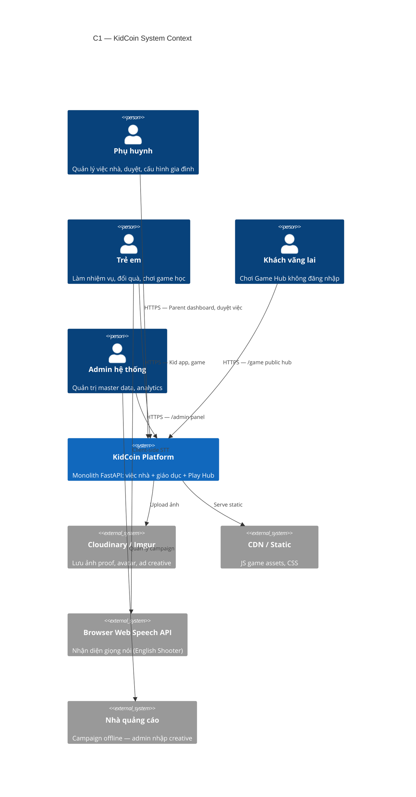

---

## 3. Sơ đồ C2 — Container / Module Map

Mức **Container**: các module logic trong monolith (≈ microservice boundary).

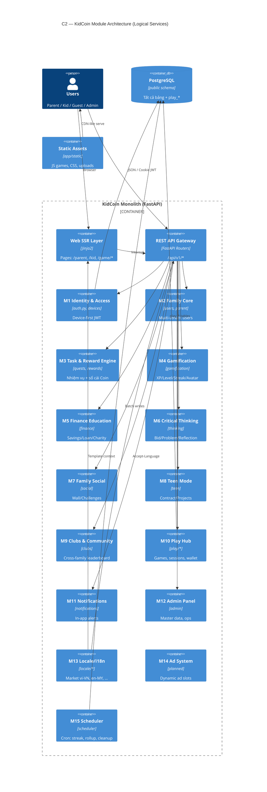

### 3.1. Bảng ánh xạ Module → Code → API

| Module | Service layer | Router prefix | Trạng thái |
|--------|---------------|---------------|------------|
| **M1 Identity** | — | `/api/v1/auth` | ✅ Live |
| **M2 Family** | — | `/api/v1/users`, `/api/v1/parent` | ✅ Live |
| **M3 Task/Reward** | audit | `/api/v1/quests`, `/api/v1/rewards` | ✅ Live |
| **M4 Gamification** | gamification, streak | `/api/v1/gamification` | ✅ Live |
| **M5 Finance** | finance | `/api/v1/finance` | ✅ Live (cron TODO) |
| **M6 Thinking** | thinking | `/api/v1/thinking` | ✅ Live |
| **M7 Social** | social | `/api/v1/social` | ✅ Live |
| **M8 Teen** | teen | `/api/v1/teen` | ✅ Live |
| **M9 Clubs** | — | `/api/v1/clubs` | ✅ Live |
| **M10 Play Hub** | play_*, english_* | `/api/v1/play` | ✅ Live |
| **M11 Notifications** | — | `/api/v1/notifications` | ✅ Live |
| **M12 Admin** | admin, analytics | `/admin`, `/api/v1/admin` | ✅ Live |
| **M13 Locale** | locale/* | `/api/v1/system/locale` | ✅ Live |
| **M14 Ads** | — | `/api/v1/ads` (planned) | 📋 Design |
| **M15 Scheduler** | streak, rollup, cleanup | internal | ⚙️ Partial |

### 3.2. Hai "thế giới" nghiệp vụ

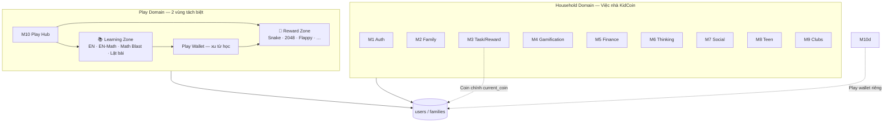

**Nguyên tắc tách biệt Play Hub:**
- API namespace riêng `/api/v1/play/**`
- Model riêng `app/models/play/` — prefix bảng `play_*`
- Chỉ FK tới `users.id` / `families.id` — không coupling ngược vào `User` model
- Batch-first + idempotency cho session/event

### 3.3. Luồng request chính

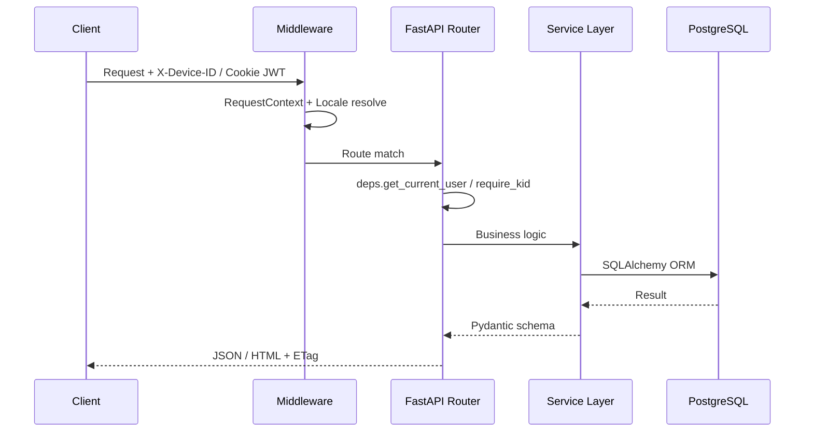

---

## 4. ERD — Mô hình dữ liệu tổng hợp

### 4.1. Cụm Identity & Ledger (Core)

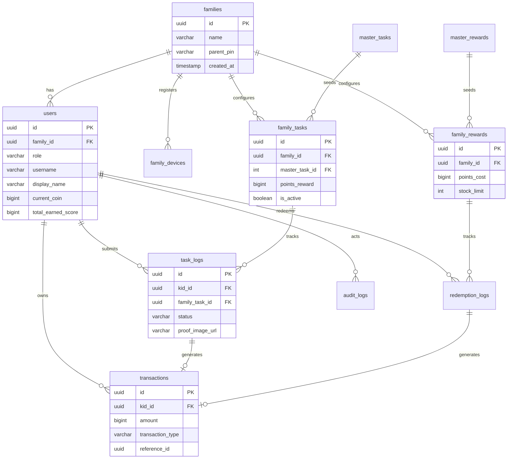

### 4.2. Cụm Expansion (Gamification · Finance · Thinking · Social · Teen)

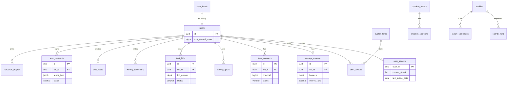

### 4.3. Cụm Clubs (Cross-family)

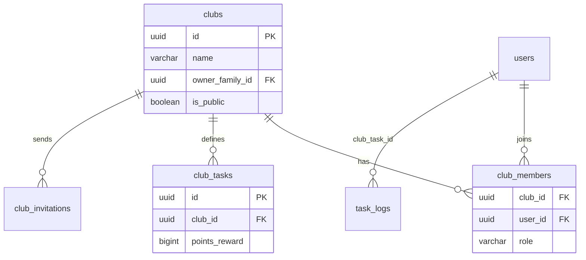

### 4.4. Cụm Play Hub

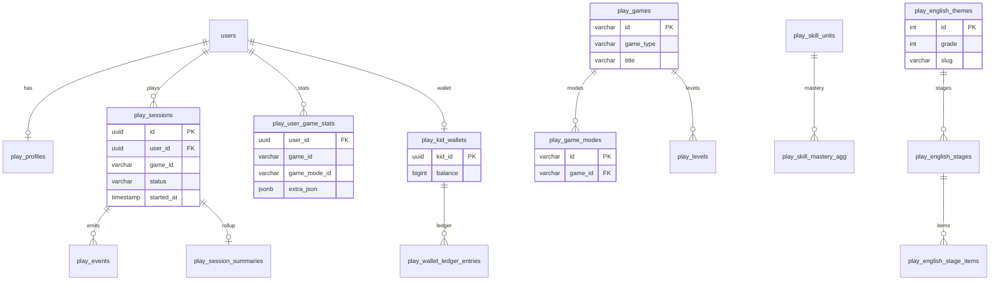

---

## 5. API Contract — Tổng hợp theo Module

> Base URL: `/api/v1` · Auth: Cookie `access_token` (JWT) hoặc Bearer · Device: header `X-Device-ID`  
> Play batch endpoints hỗ trợ `Idempotency-Key` header

### 5.1. M1 — Identity & Access (`/auth`)

| Method | Path | Mô tả | Auth |
|--------|------|-------|------|
| GET | `/auth/device-status` | Kiểm tra thiết bị đã đăng ký | Device ID |
| POST | `/auth/register-device` | Kích hoạt thiết bị mới | Parent creds |
| POST | `/auth/register-family` | Tạo gia đình mới | — |
| POST | `/auth/quick-login` | Chọn avatar + PIN | Device |
| GET | `/auth/me` | Context user hiện tại | JWT |
| POST | `/auth/register-kid` | Thêm bé | Parent |
| POST | `/auth/logout` | Xóa session | JWT |

### 5.2. M2 — Family Core

| Method | Path | Mô tả | Role |
|--------|------|-------|------|
| GET/PUT | `/users/me` | Profile cá nhân | Any |
| GET | `/users/search` | Tìm user trong family | Parent |
| GET/PUT | `/parent/family` | Thông tin gia đình | Parent |
| CRUD | `/parent/kids/*` | Quản lý bé | Parent |
| GET | `/parent/audit-logs` | Nhật ký gia đình | Parent |

### 5.3. M3 — Task & Reward Engine

| Method | Path | Mô tả | Role |
|--------|------|-------|------|
| GET | `/quests/daily` | Nhiệm vụ hôm nay | Kid |
| POST | `/quests/{task_id}/submit` | Nộp việc (+ proof) | Kid |
| GET/POST | `/quests/master`, `/pick-master` | Chọn từ catalog | Parent/Kid |
| GET | `/rewards/` | Cửa hàng quà | Kid |
| POST | `/rewards/{id}/redeem` | Đổi quà | Kid |
| GET | `/parent/pending-tasks` | Chờ duyệt | Parent |
| POST | `/parent/tasks/{log_id}/approve` | Duyệt/từ chối | Parent |
| POST | `/parent/rewards/{id}/confirm` | Xác nhận đã giao quà | Parent |
| CRUD | `/parent/tasks/*`, `/parent/rewards/*` | Cấu hình | Parent |

### 5.4. M4 — Gamification

| Method | Path | Mô tả |
|--------|------|-------|
| GET | `/gamification/me/level` | Level + title từ XP |
| GET | `/gamification/me/streak` | Chuỗi ngày |
| GET | `/gamification/shop` | Avatar shop |
| POST | `/gamification/shop/buy/{item_id}` | Mua bằng Coin |
| GET/POST | `/gamification/inventory/*` | Trang bị avatar |

### 5.5. M5 — Finance Education

| Method | Path | Mô tả |
|--------|------|-------|
| GET | `/finance/status` | Tổng quan tài chính bé |
| GET | `/finance/savings` | Tài khoản tiết kiệm |
| GET/POST | `/finance/loans`, `/loans/repay` | Vay & trả |
| GET | `/finance/charity` | Quỹ từ thiện gia đình |
| POST | `/parent/finance/loans` | Phụ huynh cấp vay |

### 5.6. M6 — Critical Thinking

| Method | Path | Role |
|--------|------|------|
| POST/GET | `/thinking/bids` | Kid đấu thầu việc |
| GET/POST | `/thinking/problems/*` | Bảng vấn đề |
| GET/PUT | `/thinking/reflections/*` | Phản tư tuần |
| POST | `/parent/thinking/bids/{id}/respond` | Parent |
| POST | `/parent/thinking/problems` | Parent tạo bài toán |

### 5.7. M7 — Family Social

| Method | Path | Mô tả |
|--------|------|-------|
| GET/POST | `/social/wall` | Bảng vinh danh |
| POST | `/social/wall/{id}/like` | Like |
| GET/POST | `/social/challenges/*` | Thử thách gia đình |
| POST | `/parent/social/wall`, `/challenges` | Parent tạo |

### 5.8. M8 — Teen Mode

| Method | Path | Mô tả |
|--------|------|-------|
| GET/POST | `/teen/contracts/*` | Hợp đồng teen |
| GET/POST | `/teen/projects/*` | Dự án cá nhân |
| PUT | `/parent/kids/{id}/teen-mode` | Bật teen mode |

### 5.9. M9 — Clubs

| Method | Path | Mô tả |
|--------|------|-------|
| POST/GET | `/clubs/` | Tạo / danh sách |
| GET | `/clubs/{id}/leaderboard` | BXH club |
| POST | `/clubs/join`, `/request-join` | Tham gia |
| CRUD | `/clubs/{id}/tasks/*` | Nhiệm vụ club |
| POST | `/clubs/{id}/invite` | Mời thành viên |

### 5.10. M10 — Play Hub (`/play`)

| Method | Path | Mô tả |
|--------|------|-------|
| GET | `/play/games` | Catalog game |
| GET | `/play/bootstrap` | State khi vào game (ETag) |
| GET | `/play/levels` | Level map theo mode |
| POST | `/play/sessions/batch` | Start/end phiên (idempotent) |
| POST | `/play/events/batch` | Sync event in-game |
| GET | `/play/history` | Lịch sử phiên |
| GET | `/play/leaderboard` | BXH family |
| GET | `/play/parent/dashboard` | Báo cáo phụ huynh (ETag) |
| GET | `/play/english/themes` | English Shooter catalog |
| GET | `/play/english/themes/{id}/stages/{type}` | Câu hỏi theo stage |
| GET | `/play/rewards` | Reward Playground catalog |
| GET | `/play/wallet` | Play wallet (tách Coin chính) |
| POST | `/play/wallet/spend-reward-play` | Mở game arcade trả phí |

**Game catalog hiện có:**

| game_id | Loại | Modes |
|---------|------|-------|
| `math_blast` | learning | candy, flappy, arcade_class, arcade_free |
| `english_shooter` | learning | prairie, city, boss |
| `snake`, `2048`, `memory`, `flappy_classic` | arcade | — |

### 5.11. M11 — Notifications

| Method | Path | Mô tả |
|--------|------|-------|
| GET | `/notifications/` | Danh sách |
| PUT | `/notifications/{id}/read` | Đánh dấu đọc |
| PUT | `/notifications/read-all` | Đọc tất cả |

### 5.12. M12 — Admin

| Method | Path | Mô tả |
|--------|------|-------|
| POST | `/admin/auth/login` | Admin JWT |
| CRUD | `/admin/master-tasks`, `/master-rewards` | Seed catalog |
| CRUD | `/admin/avatar-items`, `/user-levels` | Gamification config |
| PUT | `/admin/users/{id}/adjust-coins` | Điều chỉnh số dư |
| GET | `/admin/analytics/dashboard` | Ops metrics |
| GET | `/admin/system/health` | Health check |

### 5.13. M13 — Locale

| Method | Path | Mô tả |
|--------|------|-------|
| GET | `/system/locale` | Locale hiện tại + message bundle keys |

Markets: `vn` (vi-VN), `en`, `my` (ms-MY), `ph` (en-PH)

### 5.14. M14 — Ads (Planned)

| Method | Path | Mô tả |
|--------|------|-------|
| GET | `/ads/{slot_key}` | Creative theo slot (cached) |
| POST | `/ads/{slot_key}/impression` | Ghi nhận hiển thị |
| POST | `/ads/{slot_key}/click` | Ghi nhận click |

---

## 6. Web Routes (SSR) — Bản đồ trang

| Path | Module | Ghi chú |
|------|--------|---------|
| `/`, `/login` | M1 | Redirect theo role |
| `/parent`, `/kid` | M2/M3 | Dashboard chính |
| `/game` | M10 | Game Hub public (guest OK) |
| `/game/math-blast/*` | M10 | Math Blast v2 modes |
| `/game/english-shooter/*` | M10 | English Shooter modes |
| `/game/reward-playground` | M10 | Arcade trả Play wallet |
| `/admin/*` | M12 | Admin UI |

---

## 7. Đánh giá rủi ro

### 7.1. Bảo mật

| Rủi ro | Mức | Giảm thiểu |
|--------|-----|------------|
| Cross-family data leak | Cao | Mọi query filter `family_id`; audit log |
| JWT trong cookie XSS | Trung bình | HttpOnly cookie; CSP headers (TODO prod) |
| Play batch replay | Trung bình | Idempotency-Key + client_seq |
| Admin panel exposure | Cao | Tách `/admin`; ENV ẩn `/docs` prod |
| Guest game hub abuse | Thấp | Rate limit (TODO); không ghi DB |

### 7.2. Vận hành

| Rủi ro | Giảm thiểu |
|--------|------------|
| 1 GB RAM OOM | Batch rollup async; play_rollup cron; index `(kid_id, created_at)` |
| Migration drift | Alembic entrypoint trước uvicorn; không double-run startup |
| Upload disk full | Cloudinary migration; task_proof_cleanup job |
| Scheduler single-point | APScheduler background; idempotent jobs |

### 7.3. Chịu tải & mở rộng

| Giai đoạn | Chiến lược |
|-----------|------------|
| **Hiện tại** | Modular monolith — đủ cho ~10K families |
| **Tách Play Hub** | Module M10 → service riêng; shared `users` read replica |
| **Tách Auth** | M1 → OIDC provider; các module trust JWT |
| **Scale DB** | Partition `play_events` theo tháng; archive `audit_logs` |

---

## 8. Lộ trình kiến trúc đề xuất

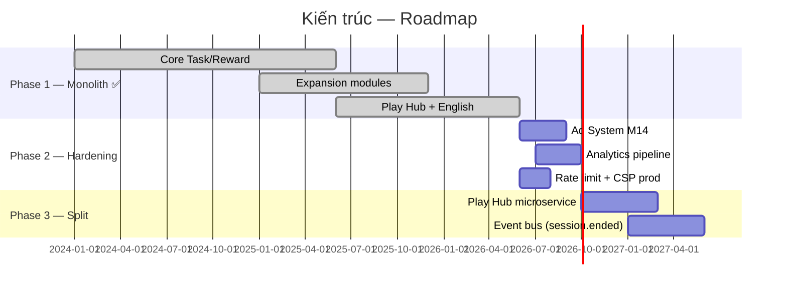

---

## 9. Phụ lục — Cấu trúc thư mục code

```
kid-coin/
├── main.py                 # App entry, SSR routes, router mount
├── app/
│   ├── api/v1/             # REST routers theo module
│   │   └── play/           # M10 sub-routers (english, wallet, rewards)
│   ├── models/             # SQLAlchemy ORM
│   │   └── play/           # play_* entities
│   ├── services/           # Business logic
│   ├── schemas/            # Pydantic DTO
│   ├── core/               # config, db, security, scheduler
│   ├── locale/             # M13 i18n
│   ├── static/js/          # Game clients
│   └── templates/          # Jinja2 SSR
├── alembic/versions/       # DB migrations
└── docs/blueprints/        # ← Tài liệu này
```

---

## 10. Đánh giá tổng thể & Phản biện kiến trúc

> Mục tiêu: trả lời **"Thiết kế đã ổn chưa?"** và **"Cần sửa/bổ sung gì để mở rộng nhanh mà không phá sản phẩm đang chạy?"**

### 10.1. Kết luận nhanh

| Tiêu chí | Điểm (1–5) | Nhận xét |
|----------|:----------:|----------|
| Tách domain nghiệp vụ | **4** | Play Hub tách namespace/DB prefix tốt; Household vẫn gom nhiều module |
| Khả năng mở rộng module mới | **3** | Thiếu feature flag, event contract, plugin game route |
| An toàn multi-tenant | **3.5** | Có `family_id` nhưng chưa có guard tập trung; phụ thuộc dev tự filter |
| Tính nhất quán dữ liệu tài chính | **3** | Hai ví (Coin vs Play wallet); mutation Coin rải rác ở API layer |
| Vận hành lean (1 GB) | **4** | Batch-first Play, ETag, cron — phù hợp ràng buộc |
| Khả năng tách microservice | **3.5** | Boundary module rõ trên giấy; code còn coupling thực tế |

**Verdict:** Thiết kế **đủ ổn cho giai đoạn MVP → 10K families**, **chưa ổn cho mở rộng song song nhiều product line** nếu không bổ sung 6 hạ tầng nền (mục 10.4). Ưu tiên **củng cố nền tảng** trước khi thêm game/module mới.

---

### 10.2. Điểm mạnh — Giữ nguyên, không refactor vội

| # | Quyết định kiến trúc | Vì sao đúng |
|---|---------------------|-------------|
| ✅ | **Modular monolith** thay vì microservice sớm | Phù hợp team nhỏ, 1 DB, deploy đơn; tránh distributed complexity |
| ✅ | **Play namespace `/api/v1/play/**` + bảng `play_*`** | Thêm game mới không đụng schema Task/Reward; có thể tách service sau |
| ✅ | **Chỉ FK `users.id` từ Play → Core** | Tránh circular dependency ORM; ranh giới data rõ |
| ✅ | **Batch + Idempotency-Key** cho session/event | Giảm tải server; an toàn mạng mobile VN |
| ✅ | **Device-first auth** | UX trẻ em tốt; phù hợp shared tablet gia đình |
| ✅ | **Immutable `transactions` ledger** (thiết kế) | Nền tảng audit & đối soát Coin gia đình |
| ✅ | **Locale module tách riêng (M13)** | Mở MY/PH không chạm logic nghiệp vụ |
| ✅ | **Guest Game Hub `/game` tách auth** | Marketing funnel không rủi ro leak data gia đình |

---

### 10.3. Phản biện — Vấn đề cần nhìn thẳng

#### A. Coupling thực tế vs boundary trên giấy

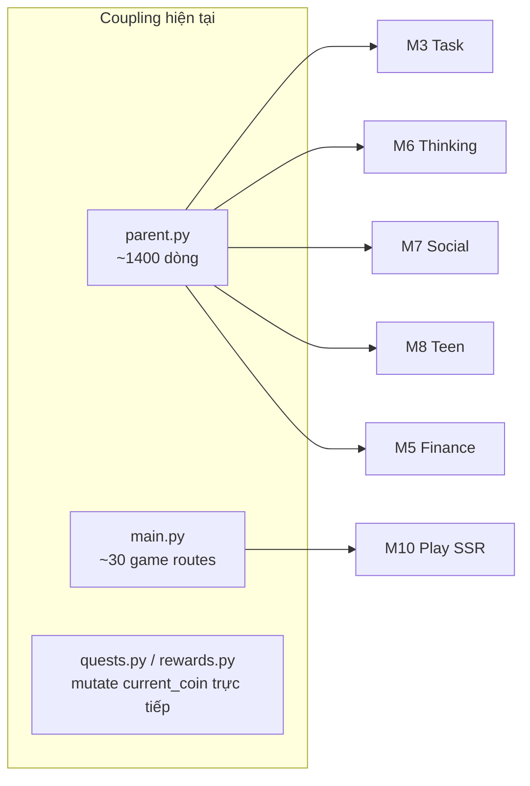

| Vấn đề | Biểu hiện | Rủi ro khi mở rộng |
|--------|-----------|-------------------|
| **God router `parent.py`** | Endpoint Thinking/Social/Teen/Finance nằm trong router Parent | Sửa Teen có thể regression Parent dashboard; khó tách team |
| **`main.py` đăng ký route game thủ công** | Mỗi game/mode = 1 `@app.get` | Thêm game = sửa entrypoint → deploy toàn app, tăng conflict |
| **Coin mutation ở API layer** | `quests.py`, `rewards.py`, `gamification.py` trực tiếp `current_coin ±=` | Không atomic cross-module; khó thêm ví mới, khó audit |
| **Hai hệ thống ví song song** | `users.current_coin` (Household) vs `play_kid_wallets` (Play) | User/parent confused; không có quy tắc quy đổi chính thức |
| **Không có Feature Flag** | Chỉ `PLAY_TEST_UNLOCK_ALL` env | Bật tính năng mới = deploy; không rollback từng module |
| **Không có Domain Event** | Module gọi trực tiếp service nhau | Thêm Ad/Analytics phải sửa code nguồn Task/Reward |
| **Multi-tenant guard không bắt buộc** | Filter `family_id` do từng dev tự thêm | 1 query thiếu filter = data leak cross-family |
| **Expansion DB chung schema `public`** | Gamification, Finance, Teen… cùng DB Task | Migration module mới có thể lock bảng core |
| **Scheduler monolith** | APScheduler trong process uvicorn | Job Play rollup nặng có thể ảnh hưởng API latency |
| **Thiếu API versioning** | Chỉ `/api/v1` | Breaking change game client = vỡ app cũ cùng lúc |
| **Guest hub vs auth play chưa có bridge rõ** | Guest chơi free; login mới sync progress | Mất cơ hội conversion; duplicate logic client |

#### B. Đánh giá theo nguyên tắc mở rộng an toàn

| Nguyên tắc | Hiện trạng | Đạt? |
|------------|------------|:----:|
| **Open/Closed** — mở rộng bằng thêm, không sửa core | Play catalog seed OK; route game phải sửa `main.py` | ⚠️ |
| **Strangler Fig** — module mới có thể thay dần | Play Hub đã strangler tốt; Expansion modules chưa | ⚠️ |
| **Blast radius nhỏ** | 1 bug Finance có thể ảnh hưởng cùng process Parent | ❌ |
| **Backward compatible API** | Chưa có deprecation policy | ❌ |
| **Idempotent side-effect** | Play có; Task approve/redeem chưa đủ idempotency key | ⚠️ |

---

### 10.4. Khuyến nghị bổ sung — 6 hạ tầng nền (ưu tiên)

> Nguyên tắc: **bổ sung lớp nền**, không rewrite module đang chạy. Mỗi hạng mục có thể triển khai **incremental**, feature cũ giữ nguyên behavior.

#### H1. Feature Flag & Module Toggle (P0 — 1 tuần)

**Mục đích:** Bật/tắt module mới (M14 Ads, game beta, Teen Mode) **không deploy**.

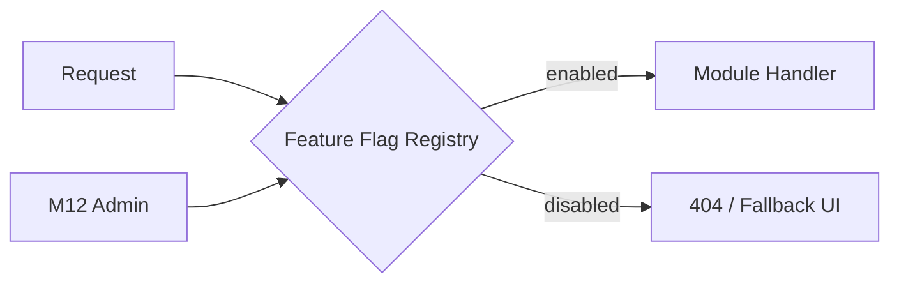

| Thiết kế | Chi tiết |
|----------|----------|
| Bảng `feature_flags` | `key`, `enabled`, `scope` (global / family / market), `metadata_json` |
| API | `GET /api/v1/system/features` — client biết module nào bật |
| Default | Module cũ = `enabled: true` cố định; module mới = `false` đến khi QA xong |
| Liên quan | Thay `PLAY_TEST_UNLOCK_ALL` → flag `play.test_unlock_all` |

**Không ảnh hưởng SP đang chạy:** Flag default `true` cho M1–M11; zero behavior change.

---

#### H2. Ledger Service tập trung (P0 — 2 tuần)

**Mục đích:** Mọi biến động Coin Household qua **một service**; Play wallet giữ riêng nhưng có **contract rõ**.

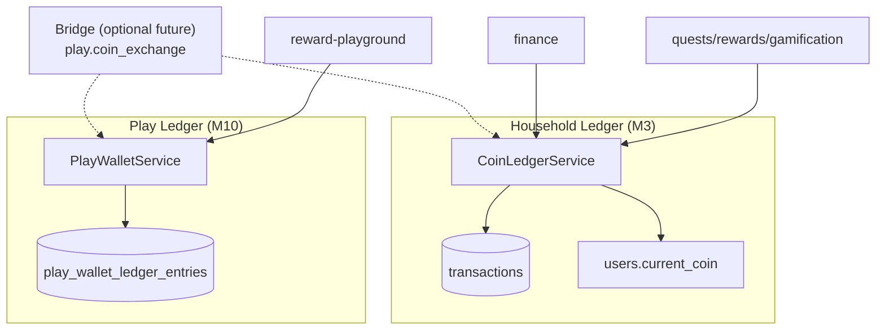

| Quy tắc bắt buộc ghi vào blueprint | Mô tả |
|-----------------------------------|--------|
| **R1** | Cấm `current_coin ±=` ngoài `CoinLedgerService` |
| **R2** | Mọi giao dịch Household phải có `transaction_type` + `reference_id` |
| **R3** | Play wallet **không** auto-sync sang Household trừ khi có API `bridge` explicit |
| **R4** | UI hiển thị 2 số dư với label rõ: "Coin nhà" vs "Xu sân chơi" |

**Migration an toàn:** Wrap existing logic trong service; API response giữ nguyên.

---

#### H3. Tenant Guard middleware (P0 — 3 ngày)

**Mục đích:** Bắt buộc mọi query có `family_id` filter.

| Thiết kế | Chi tiết |
|----------|----------|
| `TenantContext` | Set `family_id` từ JWT sau auth |
| `TenantScopedRepository` mixin | `.for_family(q, family_id)` — helper bắt buộc |
| Lint/test rule | Integration test: Parent A không đọc được kid B |

---

#### H4. Game Plugin Registry (P1 — 1 tuần)

**Mục đích:** Thêm game **không sửa `main.py`**.

| Thành phần | Contract |
|------------|----------|
| `play_games` (đã có) | `id`, `game_type`, `ssr_template`, `is_public`, `min_client_version` |
| `GameRouteRegistry` | Startup đọc DB/catalog → mount SSR routes động |
| Client | `GET /api/v1/play/games` trả `launch_url` — hub không hardcode link |

**Không ảnh hưởng SP cũ:** Game hiện tại đăng ký qua seed; route cũ redirect 301 nếu đổi URL.

---

#### H5. Domain Event Outbox (P1 — 2 tuần)

**Mục đích:** Module mới (Ads, Analytics, Notification) **subscribe** sự kiện, không sửa code Task.

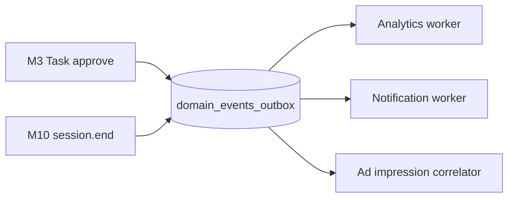

| Event chuẩn | Payload tối thiểu |
|-------------|-------------------|
| `task.approved` | `kid_id`, `family_id`, `coins`, `task_log_id` |
| `reward.redeemed` | `kid_id`, `family_id`, `cost`, `reward_id` |
| `play.session.completed` | `kid_id`, `game_id`, `mode_id`, `score`, `duration` |
| `user.level_up` | `kid_id`, `new_level` |

**Triển khai lean:** Bảng outbox + cron poll 30s; chưa cần Kafka.

---

#### H6. API Compatibility Layer (P1 — ongoing)

| Quy tắc | Chi tiết |
|---------|----------|
| Play client gửi `X-Client-Version` | Server trả schema tương thích hoặc 426 Upgrade Required |
| Breaking change | Route mới `/api/v2/play/...`; v1 giữ 12 tháng |
| Deprecation header | `Sunset: 2027-01-01` trên endpoint cũ |

---

### 10.5. Ma trận ưu tiên sửa đổi

| ID | Hạng mục | Effort | Impact | Phá SP hiện tại? | Làm trước khi… |
|----|----------|:------:|:------:|:----------------:|----------------|
| **H1** | Feature flags | S | Cao | Không | Thêm M14 Ads, game mới |
| **H2** | Ledger service | M | Cao | Không (wrap) | Bridge Coin ↔ Play wallet |
| **H3** | Tenant guard | S | Cao | Không | Mở Clubs public / scale |
| **H4** | Game plugin registry | M | Trung bình | Không | Game thứ 5+ |
| **H5** | Domain event outbox | M | Cao | Không | Analytics + Ads |
| **H6** | API versioning | S | Trung bình | Không | Breaking change client |
| **R1** | Tách endpoint khỏi `parent.py` → router module riêng | M | Trung bình | Thấp | Team > 2 dev |
| **R2** | Partition `play_events` theo tháng | M | Trung bình | Không | >100K sessions/tháng |
| **R3** | Job worker tách process | M | Trung bình | Không | Rollup lag > 5 phút |
| **R4** | Document dual-wallet UX | S | Trung bình | Không | Release Reward Playground |

**Effort:** S = ≤1 tuần · M = 2–3 tuần · L = >1 tháng

---

### 10.6. Quy tắc mở rộng module mới (Playbook)

Áp dụng cho **mọi module M16+** (ví dụ: Science Quest, Parent Coaching, School integration):

```
1. Namespace API riêng     → /api/v1/{module}/**
2. Bảng DB prefix riêng    → {module}_*  (hoặc schema riêng nếu lớn)
3. FK chỉ tới users/families
4. Không import service module khác — chỉ emit Domain Event
5. Feature flag default OFF → QA → bật theo market/family
6. Migration Alembic tách file, không ALTER bảng core
7. SSR route đăng ký qua registry, không thêm vào main.py
8. Test: tenant isolation + idempotency + flag OFF = 404
```

**Ví dụ thêm game `science_lab`:**

| Bước | Việc làm | Chạm module cũ? |
|------|----------|:----------------:|
| 1 | Seed `play_games` + catalog | Không |
| 2 | JS client `app/static/js/science_lab/` | Không |
| 3 | API sub-router `play/science.py` nếu cần endpoint đặc thù | Không (chỉ M10) |
| 4 | Migration `play_science_*` | Không |
| 5 | Flag `play.science_lab.enabled` | Không |
| 6 | Event `play.session.completed` | Không (outbox) |

---

### 10.7. Sơ đồ trạng thái mục tiêu (Target Architecture)

```mermaid
C4Container
    title Target — Sau bổ sung H1–H6 (vẫn monolith)

    Container(api, "API Gateway", "FastAPI")
    Container(ff, "H1 Feature Flags")
    Container(tg, "H3 Tenant Guard")
    Container(ls, "H2 Coin Ledger")
    Container(pw, "H2 Play Wallet")
    Container(reg, "H4 Game Registry")
    Container(out, "H5 Event Outbox")
    ContainerDb(db, "PostgreSQL")

    Container(mod_old, "M1–M11 Existing Modules")
    Container(mod_new, "M16+ New Modules")

    api --> tg --> mod_old
    api --> tg --> mod_new
    mod_old --> ff
    mod_new --> ff
    mod_old --> ls
    mod_new --> out
    reg --> api
    out --> db
    ls --> db
    pw --> db
```

---

### 10.8. Checklist "Go/No-Go" trước mỗi release mở rộng

| # | Câu hỏi | Bắt buộc Go |
|---|---------|:-----------:|
| 1 | Module mới có feature flag default OFF? | ✅ |
| 2 | Migration có ALTER bảng `users`/`transactions`/`family_*`? | ❌ (cấm) |
| 3 | Có test tenant isolation? | ✅ |
| 4 | Coin/play wallet có đi qua ledger service? | ✅ |
| 5 | API cũ response schema unchanged? | ✅ |
| 6 | Rollback = tắt flag, không cần rollback DB? | ✅ |
| 7 | `play_events` volume ước tính + index mới? | ✅ |
| 8 | Domain event mới có trong outbox catalog? | ✅ |

---

### 10.9. Cập nhật lộ trình (điều chỉnh §8)

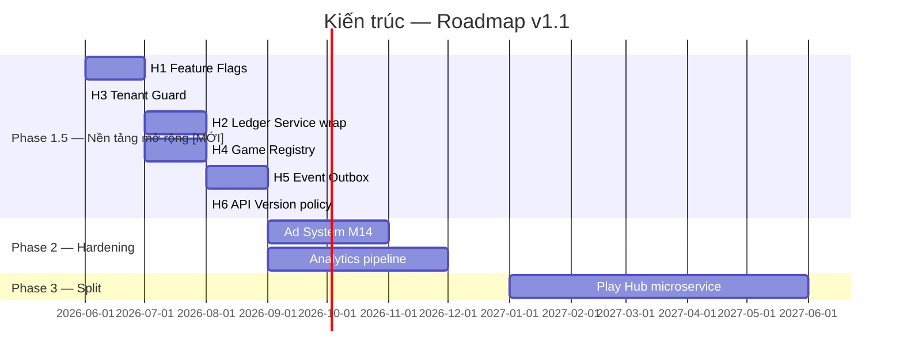

**Thay đổi so v1.0:** Phase 1.5 **bắt buộc** trước Ad System và game thứ 5+. Không split microservice trước khi H2 + H5 xong.

---

---

## 11. Play Hub — Phân nhóm Game (v1.2)

> **Chi tiết:** [`play-hub-game-taxonomy.md`](play-hub-game-taxonomy.md)

### 11.1. Kết luận review

| Tiêu chí | Đạt? | Ghi chú |
|----------|:----:|---------|
| Tách **Học tập** vs **Giải trí** | ❌ | Arcade vẫn trong `play_games` + hub learning |
| Phân biệt **Product / Mode / Theme** | ❌ | Theme EN + mode Math hiện như game riêng |
| Reward cuối trang, trả xu | ⚠️ | Có Reward Playground nhưng arcade vẫn free trên hub |
| L1–5 học không áp lực | ⚠️ | Thiết kế GDD có; hub chưa phản ánh |
| Tránh trùng lặp UI | ❌ | Static + dynamic API |

### 11.2. Mô hình chuẩn (ghi nhớ)

- **Vùng Học tập:** `english_shooter`, `english_math`, `math_blast` (V2), `memory_learn` — free, có progress, **1 product = 1 thẻ**
- **Vùng Reward:** snake, 2048, flappy, block_breaker — **cuối trang**, debit `play_kid_wallets`
- **Xu kiếm được từ:** game học (rollup) + nhiệm vụ việc nhà (bridge tùy chọn)
- **Không hiển thị trên hub:** `play_english_themes`, `play_game_modes` (chọn **trong** game)

### 11.3. API cần chỉnh (contract)

| Endpoint | Thay đổi |
|----------|----------|
| `GET /system/public-games` | Thêm `?zone=learning`; loại arcade |
| `GET /play/rewards` | Chỉ `hub_zone=reward` |
| `play_games` | Thêm `hub_zone`, `requires_wallet`, `grade_min/max` |

---

*Tài liệu do `/architect` sinh — chỉ thiết kế, không chứa code thực thi. v1.3 bổ sung §9 policy (consent, G1-first, Gà brand, mastery KPI, screen-time).*

