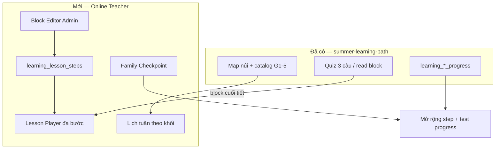
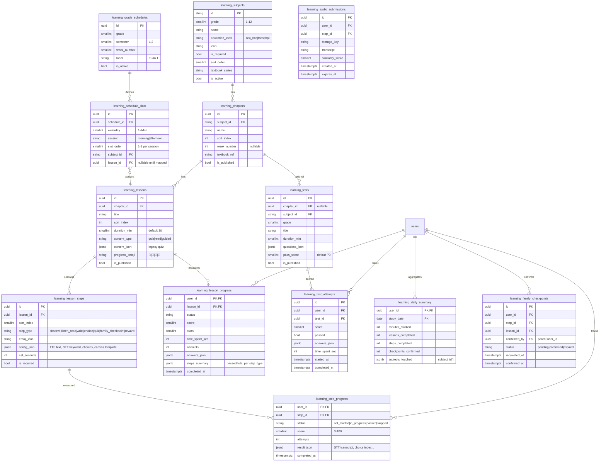

# Nền tảng Giáo viên Online — Blueprint

> **Phiên bản:** 1.0 · **Ngày:** 2026-06-15  
> **Tham chiếu:** `learn_struct/` (khung GDPT 2018, `giaovienonline.md`, kịch bản L1–L5), `docs/blueprints/summer-learning-path.md`  
> **Phạm vi:** Tự học lớp **1–12** (MVP deep **G1–2**), tích hợp `/learning`, mở rộng nghe/nói sau

---

## 1. Tổng quan

### 1.1. Tầm nhìn sản phẩm

Xây dựng **trang tự học** tương tác như giáo viên online thật: máy đọc – bé nghe/đọc – chấm tự động – viết tay – checkpoint phụ huynh – quiz kiểm tra. Nội dung bám **Chương trình GDPT 2018** và khung lịch 30 phút/tiết, 4 môn/ngày (`learn_struct/KHUNG YÊU CẦU CẦN ĐẠT.md`), ví dụ minh họa **sáng tạo mới** (không copy SGK).

| Vai trò | Trang | Chức năng chính |
|---------|-------|-----------------|
| **Bé (KID)** | `/learning` | Lịch ngày → Player 30 phút (emoji progress) → hoàn tiết |
| **Phụ huynh** | `/parent` tab *Học tập* | Tiến độ ngày/tuần, xác nhận checkpoint, kết quả quiz/test |
| **Admin/GV** | `/admin/learning` | Soạn block giảng dạy, lịch tuần, publish, preview player |
| **Bạn bè** *(Phase 3)* | `/learning/social` | Học nhóm async, chia tiến độ tuần (không realtime video) |

### 1.2. Quan hệ với `/learning` hiện tại



**Nguyên tắc tích hợp:**
- Giữ `learning_subjects/chapters/lessons` + map núi.
- `content_type`: `quiz` | `read` | **`guided`** (player đa bước 30 phút).
- Quiz 3 câu hiện có = **block `quiz`** cuối tiết; không thay thế toàn bộ player.
- `grade` mở rộng 1→12; seed theo phase (G1–5 trước, G6–12 sau).

### 1.3. Lesson Player — 3 vùng UI (theo `giaovienonline.md`)

| Vùng | Mô tả |
|------|--------|
| **ProgressBar** | Chuỗi emoji tiết: 🍏 → 🍋 → 🍇 → 🎁; sáng khi hoàn bước |
| **Core Content** | Block HTML + emoji UTF-8; TTS karaoke highlight `.highlight` |
| **Assist Panel** | 🔊 TTS, 🎙️ STT, ✏️ canvas / bàn phím ảo |

**Loại bước (`step_type`):**

| Type | Emoji | Tương tác | Chấm điểm |
|------|-------|-----------|-----------|
| `observe` | 👀 | Xem + TTS | Auto sau TTS |
| `listen_read` | 👂 | STT | Levenshtein ≥80% hoặc keyword (G1 tuần 1–4) |
| `write` | ✏️ | Canvas / virtual keyboard | Overlap nét / click đúng |
| `choice` | 🎯 | Click đáp án | Đúng/sai |
| `quiz` | 📝 | 1–N câu MCQ | 100% đúng (rule hiện tại) |
| `family_checkpoint` | 👨‍👩‍👦 | Nút phụ huynh xác nhận | Parent tap |
| `reward` | 🎁 | Animation + sao | Auto |

**Rẽ nhánh STT:** đạt → tiếp; chưa đạt → đọc mẫu lại, tối đa 5 lần → nút skip phụ huynh / auto động viên.

### 1.4. Rủi ro kiến trúc & giảm thiểu

| Rủi ro | Mức | Giảm thiểu |
|--------|-----|------------|
| STT tiếng Việt sai oan | Cao | Keyword mode G1; skip sau 5 lần; Phase 2: ghi âm cho PH nghe, không auto-grade |
| Chi phí TTS/STT API | Cao | Web Speech API MVP; cache audio TTS theo `step_id` |
| CMS phức tạp | Cao | Chỉ 7 block type cố định; không HTML tự do |
| Ghi âm trẻ em (PDPA) | Cao | Consent PH; retention 30 ngày; không public URL |
| Bản quyền SGK | Cao | Nội dung gốc; `textbook_ref` chỉ tham chiếu mục chuẩn |
| Quiz ≠ tiết 30 phút | Trung bình | `guided` là lesson chính; quiz là block con |

### 1.5. Phased rollout (đồng thuận Advisor + PO)

| Phase | Phạm vi | Thời gian ước tính |
|-------|---------|-------------------|
| **MVP** | G1, player guided, 4 block type (observe/choice/quiz/checkpoint), admin editor, parent dashboard mở rộng | 6–8 tuần |
| **P2** | G2–5, STT + canvas, lịch tuần auto, import `lop*_chitiet` | 8–10 tuần |
| **P3** | G6–12 catalog, học nhóm async, listening module | 12+ tuần |

---

## 2. ERD



**`config_json` mẫu theo `step_type`:**

```json
// observe
{"tts_text": "Bé ơi, hãy nhìn...", "display_blocks": [{"emoji": "🐟", "text": "Cá"}], "auto_advance_sec": 8}

// listen_read
{"tts_text": "Con đọc to âm này!", "display_text": "A", "stt_keywords": ["a"], "pass_threshold": 80, "max_attempts": 5}

// family_checkpoint
{"tts_text": "Con hãy chào bố mẹ...", "parent_button_label": "Bố/Mẹ xác nhận 👍", "notify_parent": true}

// quiz (reuse existing)
{"questions": [{"prompt": "...", "choices": [], "answer_index": 0}], "pass_score": 100}
```

---

## 3. API Contract

Base kid/parent: `/api/v1/learning` · Admin: `/api/v1/admin/learning` · Auth như blueprint hiện tại.

### 3.1. Catalog & Lịch (mở rộng)

**GET `/grades`** — thêm `education_level`, hỗ trợ grade 1–12.

**GET `/schedule/today?grade=1`**

```json
{
  "date": "2026-06-15",
  "weekday": 1,
  "week_label": "Tuần 3",
  "slots": [
    {
      "slot_id": "uuid",
      "session": "morning",
      "subject": {"id": "tieng-viet-g1", "name": "Tiếng Việt", "icon": "📖"},
      "lesson": {
        "id": "uuid",
        "title": "Âm a",
        "duration_min": 30,
        "content_type": "guided",
        "progress_emoji": "🍏",
        "status": "not_started",
        "steps_total": 4,
        "steps_passed": 0
      }
    }
  ],
  "daily_goal": {"target_lessons": 4, "completed": 1}
}
```

**GET `/lessons/{lesson_id}/player`** — payload đầy đủ cho Online Teacher Player.

```json
{
  "lesson": {
    "id": "uuid",
    "title": "Âm a",
    "subject": "Tiếng Việt",
    "duration_min": 30,
    "progress_emojis": ["🍏", "🍋", "🍇", "🎁"]
  },
  "steps": [
    {
      "id": "uuid",
      "sort_index": 0,
      "step_type": "observe",
      "emoji_icon": "👀",
      "config": {"tts_text": "...", "display_blocks": []},
      "status": "not_started"
    },
    {
      "id": "uuid",
      "sort_index": 1,
      "step_type": "listen_read",
      "emoji_icon": "👂",
      "config": {"tts_text": "...", "display_text": "A", "stt_keywords": ["a"]},
      "status": "not_started"
    }
  ],
  "resume_at_step_index": 0
}
```

### 3.2. Tiến trình bước & tiết

**POST `/lessons/{lesson_id}/steps/{step_id}/submit`**

```json
// Request
{
  "interaction": "stt|choice|write|checkpoint_request|skip",
  "payload": {
    "transcript": "a",
    "similarity": 85,
    "selected_index": 2,
    "stroke_data": null
  },
  "time_spent_sec": 45
}

// Response 200
{
  "step": {"id": "uuid", "status": "passed", "score": 85},
  "feedback": {"type": "success", "tts_text": "Xuất sắc quá!", "emoji_burst": ["🎉", "⭐"]},
  "next_step_index": 2,
  "lesson_complete": false
}
```

**POST `/lessons/{lesson_id}/complete`** — giữ contract hiện tại; bổ sung `steps_summary` khi `content_type=guided`.

**POST `/family-checkpoints/{checkpoint_id}/confirm`** *(PARENT auth)*

```json
{"confirmed": true}
// → step passed, notify kid session (poll hoặc WS phase sau)
```

### 3.3. Bài test

**GET `/tests?grade=1&subject_id=toan-g1`**

**POST `/tests/{test_id}/submit`**

```json
{
  "answers": [{"question_index": 0, "selected": 1}],
  "time_spent_sec": 600
}
// Response: score, passed, weak_topics[]
```

### 3.4. Parent dashboard (mở rộng)

**GET `/parent/overview?kid_id=`** — bổ sung:

```json
{
  "today": {
    "schedule_completion": "2/4",
    "minutes_studied": 55,
    "pending_checkpoints": [{"checkpoint_id": "uuid", "lesson_title": "Đạo đức", "requested_at": "..."}]
  },
  "week": {"lessons_completed": 12, "tests_passed": 1, "avg_quiz_score": 88},
  "by_subject": [{"subject_id": "toan-g1", "name": "Toán", "progress_pct": 35}],
  "recent_activity": [
    {"type": "lesson", "title": "Âm a", "score": 100, "stars": 3, "at": "..."},
    {"type": "test", "title": "Kiểm tra tuần 1", "score": 80, "passed": true}
  ]
}
```

### 3.5. Admin — Soạn nội dung giảng dạy

**GET/POST/PATCH `/admin/learning/lessons/{id}/steps`** — CRUD bước, validate `config_json` theo `step_type`.

**POST `/admin/learning/lessons/{id}/preview`** — render player payload không lưu progress.

**GET/POST `/admin/learning/schedules`** — CRUD lịch tuần theo khối.

**POST `/admin/learning/import-script`** — import markdown `lop*_chitiet_online_teacher.md` → draft steps.

**POST `/admin/learning/publish`** — publish lesson + steps atomically.

**Validation rules (admin):**
- `guided` lesson: ≥2 steps, có `reward` hoặc `quiz` cuối.
- `family_checkpoint`: tối đa 2/tiết.
- STT step: bắt buộc `stt_keywords` hoặc `expected_text`.
- Không publish nếu `audit_duplicates` fail (quiz prompts).

### 3.6. Cross-review Backend ↔ Frontend

| Backend | Frontend (`/learning`) |
|---------|------------------------|
| `GET /schedule/today` | Màn *Hôm nay* trước map (optional shortcut) |
| `GET .../player` | `lesson_player.js` — state machine theo step |
| `POST .../steps/.../submit` | TTS/STT/canvas adapters per step_type |
| `family-checkpoints` pending | Banner PH trên `/parent` + deep link |
| `content_type=quiz` legacy | Giữ `app.js` player cũ |
| `progress_emojis` | ProgressBar component |

---

## 4. Kế hoạch Dev — Test

### 4.1. Sprint breakdown

| Sprint | Deliverable | Files chính |
|--------|-------------|-------------|
| **S1** | Migration `024_online_teacher_steps`; models; seed G1 tuần 1 mẫu | `models/learning.py`, alembic |
| **S2** | API player + step submit; service state machine | `learning_service.py`, `api/v1/learning.py` |
| **S3** | FE Player guided (observe, choice, quiz block) | `static/js/learning/player.js`, CSS |
| **S4** | Family checkpoint flow PH + TTS karaoke | `parent` tab, Web Speech |
| **S5** | Admin step editor + preview | `admin/learning`, `learning_admin.py` |
| **S6** | Schedule today + parent dashboard v2 | API + parent JS |
| **S7** | STT + canvas (G1) | STT adapter, canvas overlap scorer |
| **S8** | Tests G2–5 import + `learning_tests` | migrations, seed scripts |

### 4.2. Ma trận test

| Layer | Loại | Case tiêu biểu |
|-------|------|----------------|
| **Unit** | Step validator | Mỗi `step_type` config hợp/lỗi |
| **Unit** | STT scorer | Levenshtein 80% boundary; keyword mode |
| **Unit** | Lesson complete | Guided: all required steps passed |
| **API** | Player flow | Resume giữa chừng → đúng `resume_at_step_index` |
| **API** | Checkpoint | Kid request → parent confirm → step passed |
| **API** | Auth | PH không confirm checkpoint family khác |
| **API** | Legacy | `content_type=quiz` vẫn pass test cũ |
| **E2E** | G1 tiết TV | 👀→👂→✏️→🎁 hoàn thành |
| **E2E** | Parent | Thấy 2/4 tiết + 1 pending checkpoint |
| **E2E** | Admin | Tạo lesson guided → preview → publish |
| **Load** | TTS cache | 100 concurrent `/player` < 500ms p95 |
| **Security** | Audio | URL submission hết hạn; không leak cross-family |
| **Content** | Dedup | 0 prompt trùng toàn hệ thống (rule hiện có) |
| **A11y** | G1 | Emoji + TTS khi chưa biết chữ |

### 4.3. Definition of Done (MVP G1)

- [ ] 1 tuần G1 (20 tiết) playable end-to-end
- [ ] Parent dashboard: lịch ngày + checkpoint + kết quả tiết
- [ ] Admin: CRUD steps + publish + preview
- [ ] 0 regression `tests/test_learning_api.py`
- [ ] PDPA: consent banner trước STT; audio TTL 30 ngày
- [ ] Không scrape vietjack; nội dung từ `learn_struct` đã biên soạn

### 4.4. North Star & guardrails (PO)

| Metric | Mục tiêu MVP |
|--------|--------------|
| % bé hoàn ≥3/4 tiết/ngày (7 ngày) | ≥40% cohort pilot |
| Checkpoint completion | ≥70% |
| STT skip rate | <40% |
| Session duration/tiết | 25–35 phút |

---

## 5. Phụ lục — Mapping `learn_struct` → DB

| Nguồn | Ánh xạ |
|-------|--------|
| `lop1_khung_3thang.md` | `learning_grade_schedules` + slots |
| `lop1_chitiet_online_teacher.md` | `learning_lessons` + `learning_lesson_steps` |
| `giaovienonline.md` | Player UX spec + STT/TTS rules |
| `lesson_reader_ui.html` | Tham chiếu UI read mode (tiết Ngữ văn THCS sau) |
| `KHUNG YÊU CẦU CẦN ĐẠT.md` | `education_level`, môn theo khối, lịch 4 môn/ngày |

---

## 6. Tóm tắt đa stakeholder

**Advisor:** Mở G1–12 + STT + social cùng lúc = over-scope; neo MVP G1 guided player; hoãn auto-grade phát âm; PDPA ghi âm bắt buộc.

**PO/UX:** Quiz ≠ tiết 30 phút; checkpoint phải visible cả bé lẫn PH; giảm emoji/density theo lớp; không ranking shame trên dashboard.

**Architect:** Mở rộng schema bằng `learning_lesson_steps` + schedule + checkpoint + test tables; API player step-based; tích hợp backward-compatible với quiz hiện có.
