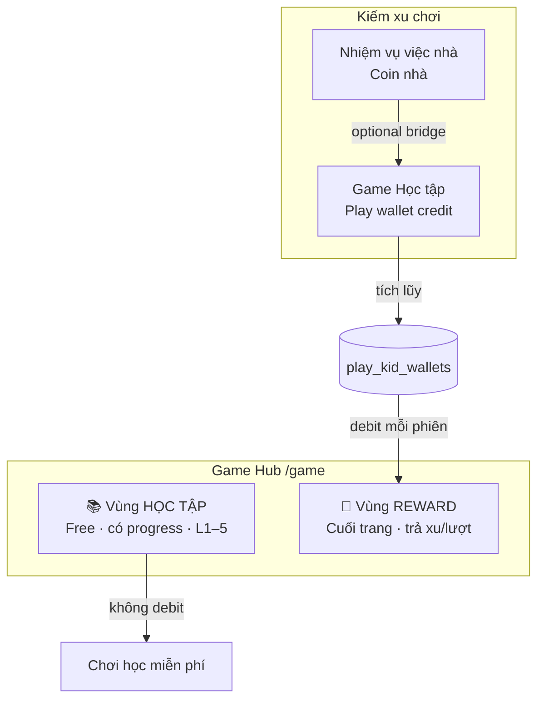
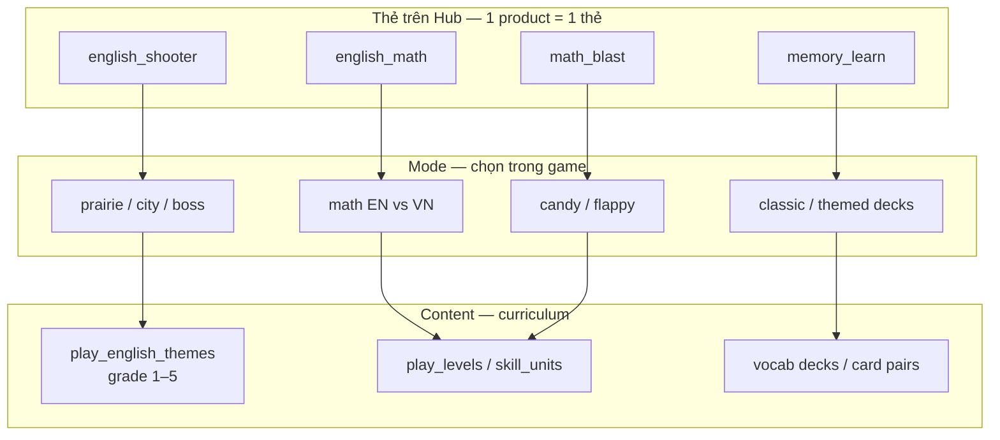
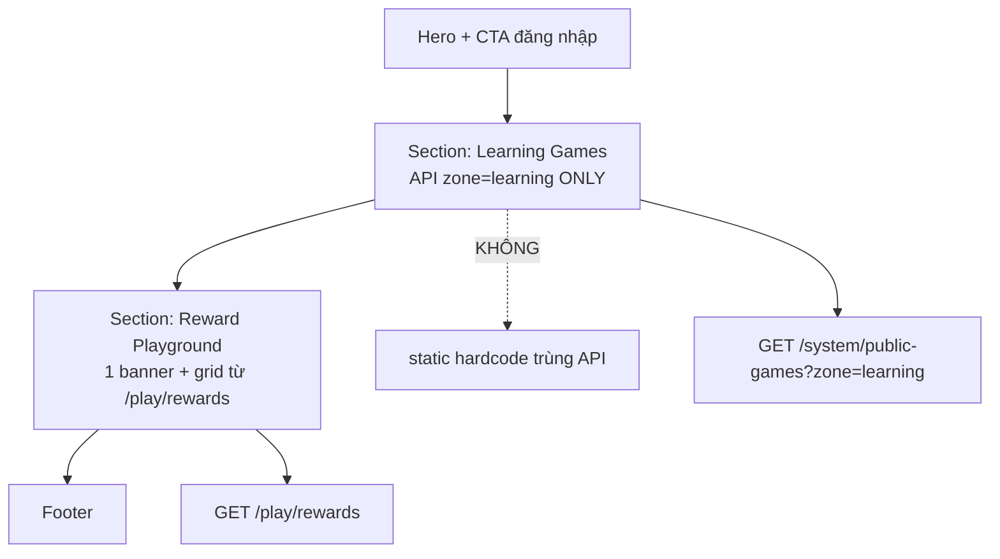
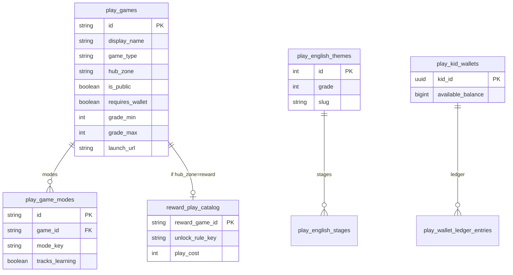

# Play Hub — Phân nhóm Game Học tập vs Giải trí (Blueprint)

> **Phiên bản:** 1.0 · **Ngày:** 2026-06-05  
> **Đối tượng:** Bé lớp **1–5** (6–11 tuổi) · học **không áp lực**, vừa học vừa chơi  
> **Mục đích ghi nhớ:** Game Hub có **đúng 2 vùng** — **Học tập** (miễn phí, có kiến thức) và **Reward** (giải trí, trả xu kiếm được)

---

## 1. Tổng quan

### 1.1. Vấn đề hiện trạng (gap)

| Vấn đề | Biểu hiện code/UI | Hậu quả |
|--------|-------------------|---------|
| **Nhầm Chủ đề ↔ Game** | English *theme* (My Family, Colors…) có thể hiểu nhầm là game riêng | Hub trùng lặp, bé/parent bối rối |
| **Nhầm Mode ↔ Game** | Math Blast v1 + v2 + candy/flappy/arcade hiện nhiều thẻ | Cùng 1 sản phẩm hiện 3–4 lần |
| **Arcade lẫn Learning** | `snake`, `2048`, `memory`, `flappy` trong `play_games` **và** Reward Playground | Arcade free trên hub, phá mô hình “đổi xu chơi” |
| **Dynamic + Static trùng** | `game_hub.html` static cards + `/system/public-games` render grid | Màn hình duplicate |
| **`memory` sai zone** | DB `game_type=arcade` | Lật bài có kiến thức nhưng bị xếp giải trí |

### 1.2. Định hướng sản phẩm (north star)



**Nguyên tắc L1–5 — học không áp lực:**
- Không hết giờ “game over” gây stress; ưu tiên **thử lại**, **sao**, **mở khóa từ từ**
- Không leaderboard cross-family cho bé nhỏ trên hub public
- Phụ huynh thấy progress; bé thấy **vui + tiến bộ**, không bị so sánh

---

## 2. Mô hình 3 tầng — Product · Mode · Content

> **Chỉ `Product` được hiển thị thẻ trên Hub.** Mode và Content là **bên trong** game.



| Tầng | Bảng DB | Ví dụ | Hiển thị Hub? |
|------|---------|-------|:-------------:|
| **Product** | `play_games` | `english_shooter`, `math_blast` | ✅ 1 thẻ |
| **Mode** | `play_game_modes` | `english_shooter:prairie`, `math_blast:candy` | ❌ trong game |
| **Content** | `play_english_themes`, `play_levels`, … | My Family G1, L001… | ❌ trong game |

---

## 3. Hai vùng Game Hub (IA)

### 3.1. Vùng A — 📚 Học tập (Learning Zone)

| `game_id` | Tên hiển thị | Môn | Ghi chú |
|-----------|--------------|-----|---------|
| `english_shooter` | Xạ thủ Tiếng Anh | Tiếng Anh | 3 mode: prairie/city/boss — **1 thẻ hub** |
| `english_math` | English Math | Toán + EN | Hub riêng hoặc sub của math — **không trùng math_blast** |
| `math_blast` | Math Blast | Toán | **Chỉ V2** trên hub; v1 deprecated → redirect |
| `memory_learn` | Lật bài học | Từ vựng/Ghi nhớ | Có `content_pack` (cặp từ theo lớp) — **learning** |

**Quy tắc hub:**
- `hub_zone = 'learning'`
- `is_public = true` (guest chơi thử giới hạn)
- `requires_wallet = false`
- Mỗi product **đúng 1 thẻ**; không listing mode/theme

### 3.2. Vùng B — 🎁 Reward (cuối trang)

| `game_id` | Loại | Nguồn catalog |
|-----------|------|---------------|
| `snake` | Arcade gốc | `reward_playground_catalog` |
| `2048` | Arcade gốc | idem |
| `flappy_classic` | Arcade gốc | idem |
| `block_breaker` | Arcade gốc | idem |

**Quy tắc hub:**
- `hub_zone = 'reward'`
- **Không** xuất hiện trong `/system/public-games?zone=learning`
- Chỉ list qua `GET /api/v1/play/rewards`
- `requires_wallet = true` — debit `play_kid_wallets` mỗi phiên (`POST /play/wallet/spend-reward-play`)
- Unlock rule: đạt mốc học (từ `learning_metrics`) **hoặc** đủ xu

**Loại bỏ khỏi `play_games` learning list:** `snake`, `2048`, `flappy_classic` — chỉ giữ bản reward (có thể `play_games.id` giữ nguyên nhưng `hub_zone=reward`, `is_public=false` trên learning API)

### 3.3. Sơ đồ trang `/game`



---

## 4. ERD — Catalog & Phân vùng



**Cột mới đề xuất `play_games`:**

| Cột | Giá trị | Mô tả |
|-----|---------|-------|
| `hub_zone` | `learning` \| `reward` \| `hidden` | Vị trí trên hub |
| `requires_wallet` | bool | Reward = true |
| `grade_min` / `grade_max` | 1–5 | Lọc theo lớp |
| `subject` | `math` \| `english` \| `memory` | Nhóm học |

---

## 5. API Contract (cập nhật)

### 5.1. Hub Learning — public

```
GET /api/v1/system/public-games?zone=learning&grade={1-5}
```

| Field response | Mô tả |
|----------------|-------|
| `id` | `play_games.id` |
| `display_name` | 1 product |
| `launch_url` | Vào hub con, **không** vào theme |
| `subject` | math / english / memory |
| `grade_min`, `grade_max` | Phạm vi lớp |

**Không trả:** snake, 2048, flappy, themes, modes.

### 5.2. Hub Reward — auth optional

```
GET /api/v1/play/rewards
```

| Field | Mô tả |
|-------|-------|
| `games[]` | Chỉ arcade reward |
| `games[].unlocked` | Rule học hoặc test flag |
| `games[].play_cost` | Xu/phiên |
| `wallet.available_balance` | Số dư xu sân chơi |

### 5.3. Vào game học

```
GET /api/v1/play/bootstrap?game_id=english_shooter&game_mode_id=english_shooter:prairie
GET /api/v1/play/english/themes?grade=1
GET /api/v1/play/english/themes/{id}/stages/vocab
```

**Phân tách:** bootstrap = progress; themes = **content**, không phải game mới.

### 5.4. Mua lượt Reward

```
POST /api/v1/play/wallet/spend-reward-play
Body: { "reward_game_id": "snake", "session_id": "uuid" }
→ 402 nếu thiếu xu
```

### 5.5. Nguồn xu (currency contract)

| Ví | Nguồn | Dùng cho |
|----|-------|----------|
| **Coin nhà** `users.current_coin` | Việc nhà, đổi quà gia đình | Reward shop gia đình |
| **Xu sân chơi** `play_kid_wallets` | Phiên game **học** hoàn thành (rollup) | **Chỉ** Reward zone |
| Bridge (future) | API explicit `play.coin_exchange` | Không auto-sync |

---

## 6. Ma trận chuẩn hóa (migration nội dung)

| Hiện tại | `hub_zone` mới | `game_type` | Hành động UI |
|----------|----------------|-------------|--------------|
| `english_shooter` | learning | learning | 1 thẻ |
| `english_math` | learning | learning | 1 thẻ |
| `math_blast` | learning | learning | **Gộp** v1+v2 → 1 thẻ → V2 hub |
| `memory` | learning | learning | Đổi id → `memory_learn`, có content pack |
| `snake`, `2048`, `flappy_classic` | reward | arcade | **Gỡ** khỏi learning API; chỉ Reward |
| `math_blast:arcade_*` modes | — | — | **Ẩn** khỏi hub; có thể chuyển vào reward sau |

---

## 7. Đánh giá rủi ro

| Rủi ro | Mức | Giảm thiểu |
|--------|-----|------------|
| Bé bypass reward paywall (URL trực tiếp `/game/snake`) | Cao | SSR gate + middleware check wallet khi `hub_zone=reward` |
| Hub vẫn duplicate sau refactor | Trung bình | **Xóa** static grid; chỉ 1 nguồn API/zone |
| Nhầm English theme = game mới | Trung bình | Blueprint + API không expose theme ở public-games |
| Áp lực học (timer, BXH) | Trung bình | Design guideline L1–5 trong GDD mỗi product |

---

## 8. Lộ trình chỉnh (không code — thứ tự triển khai)

1. **DB:** thêm `hub_zone`, migrate arcade → `reward`; `memory` → `learning`
2. **API:** filter `public-games?zone=learning`; reward API only arcade
3. **UI:** xóa static trùng; 2 section đúng nguồn
4. **Gate:** reward routes yêu cầu wallet debit
5. **Deprecated:** `/game/math-blast` → 301 V2; ẩn theme khỏi hub

---

## 9. Chính sách sản phẩm v1.3

- **Mic consent:** `GET/POST /play/consent/mic`, policy `/privacy-play`
- **G1-first:** `PLAY_MAX_GRADE=1` trên hub
- **Gà branding:** Gà Toán, Gà Nhớ bài (learning), Gà Bay (reward flappy)
- **Memory split:** `memory_learn` (learning) + `memory` (reward arcade)
- **Screen-time:** 60 phút/ngày, `play_daily_screen_time`
- **Unlock:** mastery KPI, không `total_learning_correct`
- **Monetize:** gói trường/gia đình; không ads trẻ em

---

*Ghi nhớ: **Học tập = miễn phí, có kiến thức, L1–5 không áp lực. Giải trí = Reward cuối trang, trả xu kiếm từ học + việc nhà.***
