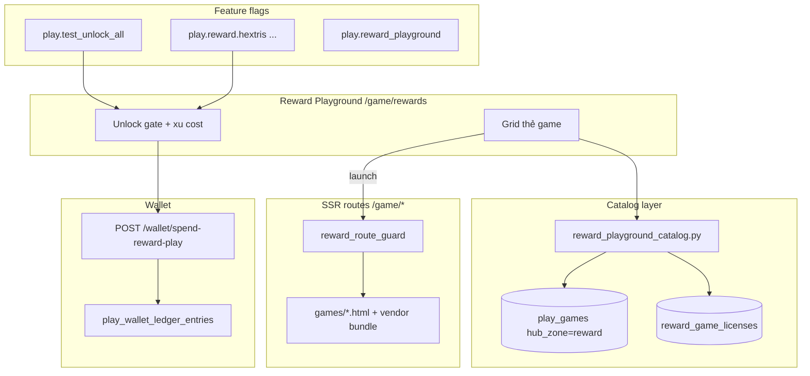
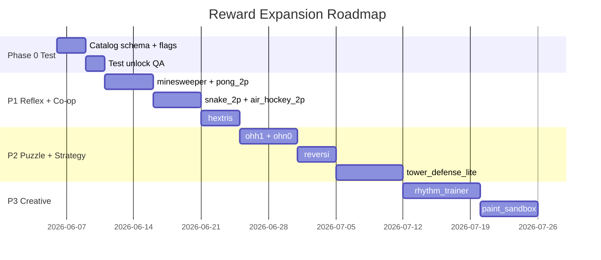

# Reward Playground Expansion — Blueprint

> **Phiên bản:** 1.0 · **Ngày:** 2026-06-05  
> **Phạm vi:** Mở rộng khu **Reward** (game giải trí) — P1/P2/P3  
> **Đối tượng:** Bé lớp 1–5 + phụ huynh · **mở khóa test trước**, rollout có kiểm soát  
> **Tiền đề:** [play-hub-game-taxonomy.md](./play-hub-game-taxonomy.md)

---

## 1. Tổng quan

### 1.1. Mục tiêu


| Mục tiêu                    | Mô tả                                                                               |
| --------------------------- | ----------------------------------------------------------------------------------- |
| **Đa dạng thể loại**        | 3 nhóm: Reflex nhanh · Puzzle/Logic · Co-op 1 màn hình                              |
| **OSS license sạch**        | Ưu tiên MIT/Apache/BSD; audit trước khi ship                                        |
| **Test trước**              | Bật `play.test_unlock_all` + feature flag từng game → QA nội bộ không cần grind học |
| **Không phá vùng Learning** | Reward chỉ list qua `/api/v1/play/rewards`, không lên `public-games?zone=learning`  |


### 1.2. Danh mục game theo phase


| Phase  | Game ID              | Thể loại     | Repo OSS gợi ý                                        | License        | Effort |
| ------ | -------------------- | ------------ | ----------------------------------------------------- | -------------- | ------ |
| **P1** | `hextris`            | Reflex       | [Hextris/hextris](https://github.com/Hextris/hextris) | MIT            | M      |
| **P1** | `pong_2p`            | Co-op 2P     | Phaser examples / pong clone MIT                      | MIT            | S      |
| **P1** | `snake_2p`           | Co-op 2P     | snake-game-javascript (chọn repo MIT)                 | MIT            | S      |
| **P1** | `minesweeper`        | Puzzle       | madewithpixels/minesweeper                            | MIT            | S      |
| **P1** | `air_hockey_2p`      | Co-op 2P     | Phaser examples                                       | MIT            | M      |
| **P2** | `ohh1`               | Puzzle       | Q42/0hh1                                              | MIT            | M      |
| **P2** | `ohn0`               | Puzzle       | Q42/0hn0                                              | MIT            | M      |
| **P2** | `reversi`            | Strategy nhẹ | k-takata/Othello (đổi tên UI)                         | MIT            | M      |
| **P2** | `tower_defense_lite` | Strategy nhẹ | phaserjs/examples (TD sample)                         | MIT            | L      |
| **P3** | `rhythm_trainer`     | Âm nhạc      | Tone.js + mini-game tự viết                           | MIT            | L      |
| **P3** | `paint_sandbox`      | Sáng tạo     | p5.js wrapper                                         | LGPL-2.1 (lib) | M      |


**Đã có (giữ nguyên):** `snake`, `2048`, `memory`, `flappy`, `block_breaker` — taxonomy reward hiện tại.

### 1.3. Kiến trúc tích hợp (high-level)




### 1.4. Chiến lược mở khóa test (Phase 0 — trước P1)


| Bước | Hành động                                                                             | Môi trường         |
| ---- | ------------------------------------------------------------------------------------- | ------------------ |
| 0.1  | `PLAY_TEST_UNLOCK_ALL=true` hoặc flag `play.test_unlock_all`                          | dev/staging        |
| 0.2  | Thêm flag per-game `play.reward.{game_id}` default **false** prod, **true** dev       | tất cả game mới    |
| 0.3  | Catalog mới có `status: draft | beta | live` — API chỉ trả `beta+live` khi không test | filter server-side |
| 0.4  | QA checklist: mobile Safari/Chrome, session cap, spend xu, gate redirect              | trước bật `live`   |


**Không ship prod** khi `test_unlock_all=true` — đã ghi nhận rủi ro trong advisor review.

### 1.5. Đánh giá rủi ro (Architect)


| Trụ            | Rủi ro                                     | Mức        | Giảm thiểu                                                  |
| -------------- | ------------------------------------------ | ---------- | ----------------------------------------------------------- |
| **Bảo mật**    | Game vendor JS chứa `eval`/tracking        | Trung bình | Audit bundle; CSP `script-src 'self'`; không CDN lạ         |
| **Bảo mật**    | Co-op 2P không cần auth nhưng vẫn debit xu | Thấp       | Spend chỉ khi kid đã login; guest = preview only            |
| **Vận hành**   | 11+ game = nhiều template/bundle           | Cao        | Vendor folder chuẩn; lazy-load JS; shared `game_shell.html` |
| **Vận hành**   | License GPL/LGPL lẫn MIT                   | Cao        | Bảng `reward_game_licenses`; legal sign-off P2/P3           |
| **Chịu tải**   | Canvas/WebGL nặng trên mobile VN           | Trung bình | FPS cap; pause khi tab hidden; bundle < 500KB/game          |
| **Pháp lý VN** | Clone tên/icon game nổi tiếng              | Cao        | Rebrand UI; không dùng Flappy/UNO/Othello trademark         |
| **Sản phẩm**   | Co-op cần 2 người — bé chơi một mình       | Trung bình | Mode 1P fallback + badge "chơi cùng bố mẹ"                  |


### 1.6. Cấu trúc thư mục đề xuất (không code — convention)

```
app/
  data/reward_playground_catalog.py    # mở rộng REWARD_GAMES + RULES
  templates/games/
    reward_shell.html                  # navbar + wallet bar chung
    hextris.html                       # extends shell
  static/games/vendor/
    hextris/                           # OSS snapshot + LICENSE file
    pong_2p/
  static/js/reward/
    reward_session.js                  # spend xu, telemetry, session cap
docs/blueprints/reward-playground-expansion.md
```

### 1.7. Lộ trình phát triển




---

## 2. ERD

### 2.1. Mở rộng catalog (đề xuất migrate dần từ Python dict → DB)

```mermaid
erDiagram
    play_games ||--o| reward_game_meta : "hub_zone=reward"
    play_games ||--o{ play_reward_sessions : sessions
    reward_game_meta ||--|| reward_game_licenses : compliance
    reward_game_meta ||--o{ reward_unlock_rules : rules
    play_kid_wallets ||--o{ play_wallet_ledger_entries : ledger

    play_games {
        string id PK
        string display_name
        string game_type
        string hub_zone
        boolean requires_wallet
        boolean is_public
        string launch_url
        string ssr_template
        int sort_order
        int grade_min
        int grade_max
    }

    reward_game_meta {
        string game_id PK_FK
        string genre
        string player_mode
        string rollout_status
        int play_cost
        int session_cap_seconds
        boolean co_op_parent
        json meta_json
    }

    reward_game_licenses {
        string game_id PK_FK
        string upstream_repo
        string license_spdx
        string attribution_text
        date audited_at
        string auditor
    }

    reward_unlock_rules {
        string id PK
        string game_id FK
        string rule_key
        string rule_expr
        string hint_vi
        int priority
    }

    play_reward_sessions {
        uuid id PK
        uuid user_id FK
        string game_id FK
        timestamptz started_at
        timestamptz ended_at
        int score
        json telemetry_json
    }

    play_kid_wallets {
        uuid user_id PK
        bigint available_balance
        json accounts_json
    }

    play_wallet_ledger_entries {
        uuid id PK
        uuid user_id FK
        string entry_type
        int amount
        string ref_reward_game_id
    }
```


### 2.2. Enum giá trị


| Bảng                  | Cột              | Giá trị                                                      |
| --------------------- | ---------------- | ------------------------------------------------------------ |
| `reward_game_meta`    | `genre`          | `reflex`, `puzzle`, `co_op`, `strategy`, `creative`, `music` |
| `reward_game_meta`    | `player_mode`    | `solo`, `local_2p`, `co_op_asymmetric`                       |
| `reward_game_meta`    | `rollout_status` | `draft`, `beta`, `live`, `deprecated`                        |
| `reward_unlock_rules` | `rule_expr`      | JSON logic tree trên `learning_metrics` / `mastery_metrics`  |


### 2.3. Unlock rules đề xuất (mastery-based — đồng bộ hiện tại)


| game_id              | rule_expr (tóm tắt)                                      | play_cost (xu) |
| -------------------- | -------------------------------------------------------- | -------------- |
| `hextris`            | `skills_mastered_count >= 2`                             | 6              |
| `pong_2p`            | `skills_mastered_count >= 1`                             | 4              |
| `snake_2p`           | `skills_mastered_count >= 1`                             | 5              |
| `minesweeper`        | `math_sessions_3star >= 1`                               | 7              |
| `air_hockey_2p`      | `english_themes_done >= 1`                               | 6              |
| `ohh1`               | `skills_mastered_count >= 3`                             | 8              |
| `ohn0`               | `skills_mastered_count >= 3`                             | 8              |
| `reversi`            | `avg_mastery_score >= 0.5`                               | 9              |
| `tower_defense_lite` | `english_themes_done >= 2`                               | 10             |
| `rhythm_trainer`     | `skills_mastered_count >= 5`                             | 8              |
| `paint_sandbox`      | `english_themes_done >= 1 OR skills_mastered_count >= 2` | 5              |


**Override test:** `play.test_unlock_all=true` → `unlocked=true` cho mọi game (đã có trong `build_reward_playground`).

### 2.4. Feature flags


| Flag key                 | Mặc định prod | Mô tả                                            |
| ------------------------ | ------------- | ------------------------------------------------ |
| `play.reward_playground` | true          | Master switch khu reward                         |
| `play.test_unlock_all`   | **false**     | Mở khóa tất cả để QA                             |
| `play.reward.hextris`    | false → beta  | Per-game gate                                    |
| `play.reward.pong_2p`    | false → beta  | …                                                |
| `play.reward.co_op_hub`  | false         | Section riêng "Chơi cùng bố mẹ" trên reward page |


---

## 3. API Contract

### 3.1. `GET /api/v1/play/rewards` (mở rộng response)

**Auth:** Optional (cookie/token). Guest nhận catalog nhưng `wallet=null`, `unlocked=false` (trừ khi test flag).

**Query mới (optional):**


| Param           | Type   | Mô tả                                             |
| --------------- | ------ | ------------------------------------------------- |
| `genre`         | string | Lọc: `reflex`, `puzzle`, `co_op`, …               |
| `include_draft` | bool   | Chỉ khi `play.test_unlock_all` — trả game `draft` |


**Response 200 — mở rộng `games[]` item:**

```json
{
  "test_unlock_all": true,
  "logged_in": true,
  "metrics": { "skills_mastered_count": 2, "english_themes_done": 1 },
  "wallet": { "available_balance": 42 },
  "games": [
    {
      "id": "hextris",
      "title": "Hextris",
      "title_vi": "Xoay khối",
      "emoji": "⬡",
      "route": "/game/hextris",
      "color": "purple",
      "genre": "reflex",
      "player_mode": "solo",
      "co_op_parent": false,
      "rollout_status": "beta",
      "unlocked": true,
      "unlock_hint": "2 kỹ năng mastery ≥70%",
      "play_cost": 6,
      "session_cap_seconds": 600,
      "desc_vi": "Xoay hex, ghép màu — phản xạ nhanh"
    }
  ],
  "sections": [
    { "key": "reflex", "title_vi": "Phản xạ", "game_ids": ["hextris", "flappy"] },
    { "key": "co_op", "title_vi": "Chơi cùng bố mẹ", "game_ids": ["pong_2p", "snake_2p", "air_hockey_2p"] },
    { "key": "puzzle", "title_vi": "Giải đố", "game_ids": ["minesweeper", "2048", "ohh1"] }
  ],
  "unlocked_count": 8,
  "total_count": 15
}
```

**Lỗi:** `404` nếu `play.reward_playground` tắt (giữ nguyên).

---

### 3.2. `POST /api/v1/play/wallet/spend-reward-play` (mở rộng validation)

**Request body (giữ + mở rộng):**

```json
{
  "reward_game_id": "pong_2p",
  "session_id": "uuid-optional",
  "player_mode": "local_2p"
}
```

**Validation mới:**


| Rule                                                                                     | HTTP |
| ---------------------------------------------------------------------------------------- | ---- |
| `reward_game_id` phải tồn tại trong catalog và `rollout_status != draft` (trừ test flag) | 400  |
| Game phải `unlocked` theo metrics hoặc test flag                                         | 403  |
| `available_balance >= play_cost`                                                         | 402  |
| Chưa vượt `session_cap_seconds` / ngày (anti-addiction)                                  | 429  |


**Response 200:**

```json
{
  "ok": true,
  "reward_game_id": "pong_2p",
  "debited": 4,
  "balance_after": 38,
  "session_id": "uuid",
  "session_cap_seconds": 600
}
```

---

### 3.3. `POST /api/v1/play/reward-sessions` (mới — telemetry nhẹ)

Ghi nhận kết thúc phiên reward (không PII, không audio).

**Request:**

```json
{
  "session_id": "uuid",
  "game_id": "minesweeper",
  "score": 120,
  "duration_seconds": 180,
  "player_mode": "solo",
  "ended_reason": "completed | quit | cap"
}
```

**Response:** `201` `{ "recorded": true }`

**Bảo mật:** Chỉ kid đã login; `session_id` phải match ledger entry vừa spend.

---

### 3.4. `GET /api/v1/system/public-games` — **không đổi**

Reward games **không** xuất hiện ở `zone=learning`. Co-op vẫn chỉ qua `/play/rewards`.

---

### 3.5. SSR routes (mới)


| Method | Path                   | Template                        | Guard                |
| ------ | ---------------------- | ------------------------------- | -------------------- |
| GET    | `/game/hextris`        | `games/hextris.html`            | `reward_route_guard` |
| GET    | `/game/pong-2p`        | `games/pong_2p.html`            | idem                 |
| GET    | `/game/snake-2p`       | `games/snake_2p.html`           | idem                 |
| GET    | `/game/minesweeper`    | `games/minesweeper.html`        | idem                 |
| GET    | `/game/air-hockey-2p`  | `games/air_hockey_2p.html`      | idem                 |
| GET    | `/game/ohh1`           | `games/ohh1.html`               | idem                 |
| GET    | `/game/ohn0`           | `games/ohn0.html`               | idem                 |
| GET    | `/game/reversi`        | `games/reversi.html`            | idem                 |
| GET    | `/game/tower-defense`  | `games/tower_defense_lite.html` | idem                 |
| GET    | `/game/rhythm-trainer` | `games/rhythm_trainer.html`     | idem                 |
| GET    | `/game/paint-sandbox`  | `games/paint_sandbox.html`      | idem                 |


`REWARD_GAME_PATHS` trong `reward_route_guard.py` cập nhật tương ứng.

---

### 3.6. Admin (tùy chọn P1 — có thể dùng seed trước)


| Method | Path                                          | Mô tả                               |
| ------ | --------------------------------------------- | ----------------------------------- |
| GET    | `/api/v1/admin/reward-games`                  | List catalog + license audit status |
| PATCH  | `/api/v1/admin/reward-games/{id}`             | Đổi `rollout_status`, `play_cost`   |
| POST   | `/api/v1/admin/reward-games/{id}/toggle-flag` | Bật `play.reward.{id}`              |


---

## 4. Tiêu chí hoàn thành (Definition of Done)


| #   | Tiêu chí                                                            |
| --- | ------------------------------------------------------------------- |
| 1   | Game xuất hiện trên `/game/rewards` khi flag `beta`+ và test unlock |
| 2   | Direct URL bị redirect về rewards khi chưa unlock (prod)            |
| 3   | Spend xu hoạt động; ledger có `ref_reward_game_id`                  |
| 4   | `LICENSE` file trong `static/games/vendor/{id}/`                    |
| 5   | Mobile playable ≥ 30fps trên máy tầm trung                          |
| 6   | Session cap hoạt động; không crash khi hết xu                       |
| 7   | Co-op 2P: 2 input scheme (WASD + arrows) documented trên UI         |


---

## 5. Thứ tự triển khai khuyến nghị (dev)

1. **Phase 0:** Mở rộng schema response + `rollout_status` + per-game flags; bật test unlock.
2. **P1 batch 1:** `minesweeper`, `pong_2p` (effort thấp, validate pipeline).
3. **P1 batch 2:** `snake_2p`, `air_hockey_2p`, `hextris`.
4. **P2:** Puzzle pair `ohh1`/`ohn0` → `reversi` → `tower_defense_lite`.
5. **P3:** `rhythm_trainer`, `paint_sandbox` sau legal review LGPL.

**Handoff:** Blueprint xong → đính kèm file này khi chạy `/backend` implement catalog + routes; `/frontend` reward grid sections + co-op UX.