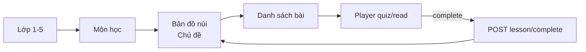
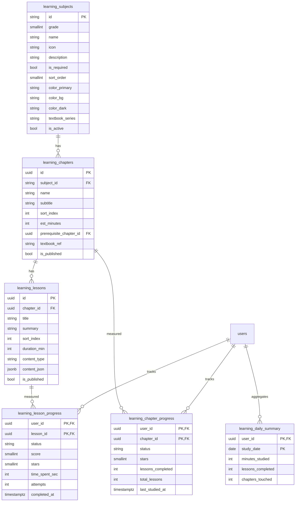

# Lộ trình Học Hè — `/learning` (Blueprint)

> **Phiên bản:** 1.0 · **Ngày:** 2026-06-15  
> **Đối tượng:** Bé lớp **1–5**, học thêm **15–60 phút/ngày** (nghỉ hè / tự học nhà)  
> **Chương trình tham chiếu:** Bộ sách *Kết nối tri thức với cuộc sống* (vietjack.com) — **không scrape**, admin nhập nội dung theo khung chương/mục.

---

## 1. Tổng quan

### 1.1. Mục tiêu

| Vai trò | Trang | Chức năng |
|---------|-------|-----------|
| **Bé (KID)** | `/learning` | Chọn lớp → môn → bản đồ chủ đề (núi) → bài micro (5–10 phút) |
| **Phụ huynh** | `/parent` tab *Học tập* | Xem tiến độ theo lớp/môn, phút học/ngày, sao chủ đề |
| **Admin** | `/admin/learning` | CRUD môn/chủ đề/bài; publish; gắn lớp 1–5 |

### 1.2. Luồng UX (4 màn + player)



### 1.3. Ràng buộc sản phẩm

- **Micro-lesson:** `duration_min` 5–10, mỗi chủ đề 3–6 bài (~20–40 phút nếu học hết chủ đề).
- **Không áp lực:** sao 0–3, trạng thái `empty | partial | done`, mascot + TTS (client).
- **Tách biệt Play Hub:** không debit xu; ghi `learning_*` tables riêng.
- **Parent scope:** chỉ xem con cùng `family_id`.

### 1.4. Rủi ro & giảm thiểu

| Rủi ro | Mức | Giảm thiểu |
|--------|-----|------------|
| Nội dung bản quyền vietjack | Cao | Admin nhập tay; field `textbook_ref` tham chiếu mục sách |
| Bé học quá lâu | Trung bình | `daily_minutes` + gợi ý mascot sau 45 phút (client) |
| Parent xem nhầm family | Cao | API filter `family_id` + kid ownership |
| Admin publish lỗi JSON | Trung bình | Pydantic validate `content_json` trước save |

### 1.5. Cross-review Backend ↔ Frontend

| Backend cam kết | Frontend map |
|-----------------|--------------|
| `GET /grades` trả màu UI | `grade-btn.gN` dùng `color_primary/bg/dark` |
| `GET .../map` trả `chapters[]` + progress | Screen 3 vẽ núi + `drawConnectors` |
| `status` enum 3 giá trị | badge + stroke màu giống mockup |
| `POST .../complete` trả chapter mới | Cập nhật map sau hoàn thành bài |
| Parent overview aggregate | Tab Học tập chart + bảng |

---

## 2. ERD



---

## 3. API Contract

Base: `/api/v1/learning` — auth cookie `access_token` (KID hoặc PARENT).

### 3.1. Kid — Catalog

**GET `/grades`**

```json
{
  "grades": [
    {"grade": 1, "label": "Lớp Một", "stars_hint": "⭐⭐⭐", "color_primary": "#E85D24", "color_bg": "#FAECE7", "color_dark": "#993C1D"}
  ]
}
```

**GET `/grades/{grade}/subjects`**

```json
{
  "grade": 1,
  "subjects": [
    {"id": "toan-g1", "name": "Toán", "icon": "📐", "description": "...", "is_required": true, "progress_pct": 40, "chapters_done": 2, "chapters_total": 5}
  ]
}
```

**GET `/subjects/{subject_id}/map?kid_id=`** (parent proxy optional)

```json
{
  "subject": {"id": "toan-g1", "name": "Toán", "icon": "📐", "grade": 1, "description": "..."},
  "overall": {"done": 2, "partial": 1, "total": 5, "progress_pct": 50},
  "chapters": [
    {"id": "uuid", "name": "Các số từ 1 đến 10", "subtitle": "...", "sort_index": 0, "status": "done", "stars": 3, "est_minutes": 25, "lesson_count": 4}
  ]
}
```

**GET `/chapters/{chapter_id}/lessons`**

```json
{
  "chapter": {"id": "uuid", "name": "...", "subject_id": "toan-g1"},
  "lessons": [
    {"id": "uuid", "title": "Bài 1: Đếm số", "duration_min": 5, "content_type": "quiz", "status": "completed", "stars": 3}
  ]
}
```

**GET `/lessons/{lesson_id}`** — nội dung player (published only)

```json
{
  "id": "uuid", "title": "...", "duration_min": 5, "content_type": "quiz",
  "content": {"pass_score": 60, "questions": [{"prompt": "2+3=?", "choices": ["4","5","6"], "answer_index": 1}]}
}
```

### 3.2. Kid — Progress

**POST `/lessons/{lesson_id}/complete`**

Request:
```json
{"score": 80, "time_spent_sec": 420, "answers": [{"question_index": 0, "selected": 1}]}
```

Response:
```json
{
  "lesson": {"status": "completed", "stars": 2, "score": 80},
  "chapter": {"status": "partial", "stars": 2, "lessons_completed": 2, "total_lessons": 4},
  "daily": {"study_date": "2026-06-15", "minutes_studied": 12, "lessons_completed": 1}
}
```

**GET `/me/today`** — tóm tắt hôm nay

```json
{"minutes_studied": 25, "lessons_completed": 3, "goal_min": 15, "goal_max": 60}
```

### 3.3. Parent

**GET `/parent/overview`** — all kids in family

```json
{
  "kids": [
    {
      "kid_id": "uuid", "display_name": "Bé An", "grade": 1,
      "today_minutes": 20, "week_minutes": 95,
      "subjects": [{"subject_id": "toan-g1", "name": "Toán", "progress_pct": 50, "stars_total": 8}]
    }
  ]
}
```

**GET `/parent/kids/{kid_id}/timeline?days=7`**

```json
{"days": [{"date": "2026-06-15", "minutes": 20, "lessons": 3}]}
```

### 3.4. Admin — `/api/v1/admin/learning/*`

Auth: `admin_token`. CRUD:

| Method | Path | Mô tả |
|--------|------|-------|
| GET | `/subjects?grade=` | List môn |
| POST | `/subjects` | Tạo môn |
| PUT | `/subjects/{id}` | Sửa môn |
| GET | `/subjects/{id}/chapters` | List chủ đề |
| POST | `/chapters` | Tạo chủ đề |
| PUT | `/chapters/{id}` | Sửa |
| GET | `/chapters/{id}/lessons` | List bài |
| POST | `/lessons` | Tạo bài + `content_json` |
| PUT | `/lessons/{id}` | Sửa |
| POST | `/chapters/{id}/publish` | Publish chapter + lessons |

---

## 4. Kế hoạch triển khai

| # | Layer | Deliverable |
|---|-------|-------------|
| 1 | DB | Migration `020` + seed L1 Toán + Tiếng Việt |
| 2 | API | `learning_service` + `/api/v1/learning` |
| 3 | Admin API + UI | `/admin/learning` |
| 4 | Kid UI | `/learning` 4 screen + player |
| 5 | Parent | Tab Học tập trên dashboard |
| 6 | Test | pytest API catalog + complete flow |
