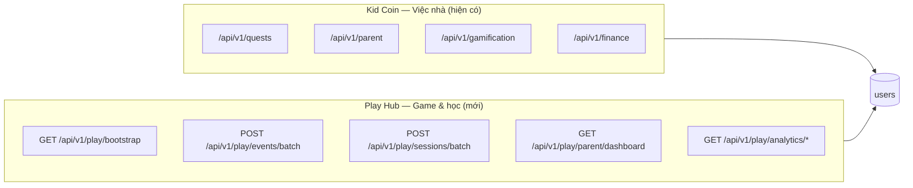
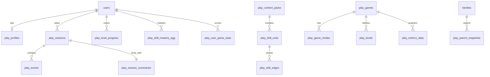
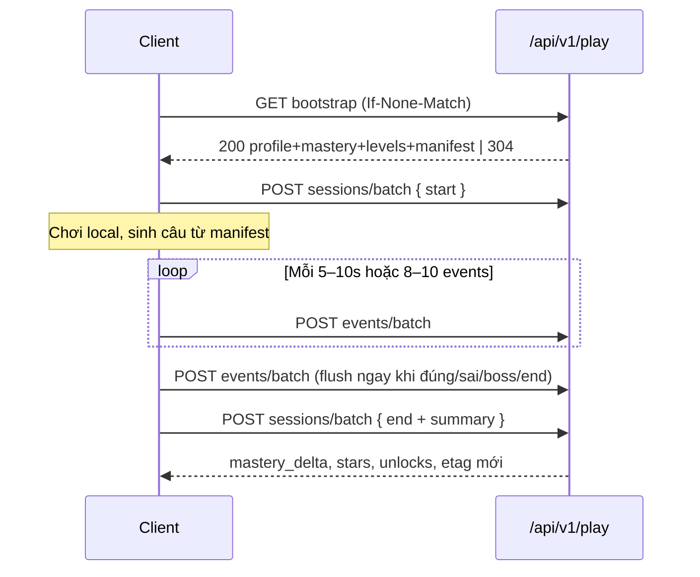

# Math Blast / Play Hub — Thiết kế DB & API (tách khỏi hệ thống việc nhà)

> Đặc tả kỹ thuật cho lưu trữ người chơi (4–10 tuổi), quản lý đa game, lịch sử/điểm theo từng game, lộ trình học theo level, báo cáo phụ huynh, và analytics phát hành.  
> Căn cứ: `math-blast-v2.md` (§5–§9), `math-blast-startup-plan.md` (hạ tầng 1 GB, batch-first).

---

## Mục lục

1. [Nguyên tắc kiến trúc](#1-nguyên-tắc-kiến-trúc)
2. [Phạm vi domain & tách biệt API](#2-phạm-vi-domain--tách-biệt-api)
3. [Mô hình dữ liệu tổng quan](#3-mô-hình-dữ-liệu-tổng-quan)
4. [Lược đồ cơ sở dữ liệu chi tiết](#4-lược-đồ-cơ-sở-dữ-liệu-chi-tiết)
5. [Luồng ghi/đọc batch](#5-luồng-ghiđọc-batch)
6. [Đặc tả API](#6-đặc-tả-api)
7. [Báo cáo phụ huynh & analytics thị trường](#7-báo-cáo-phụ-huynh--analytics-thị-trường)
8. [Bảo mật, quota & vận hành lean](#8-bảo-mật-quota--vận-hành-lean)
9. [Lộ trình triển khai DB/API](#9-lộ-trình-triển-khai-dbapi)
10. [Mốc nối repo](#10-mốc-nối-repo)

---

## 1. Nguyên tắc kiến trúc

| Nguyên tắc | Mô tả |
| --- | --- |
| **Tách namespace API** | Mọi endpoint game/play nằm dưới `/api/v1/play/**` — **không** gộp vào `quests`, `parent`, `gamification` của Kid Coin việc nhà. |
| **Chỉ FK tới `users`** | Bảng play tham chiếu `users.id` + `families.id` (phụ huynh đọc theo gia đình). **Không** thêm relationship play vào model `User` hiện tại (tránh coupling). |
| **Batch-first** | Client gom sự kiện; server trả `bootstrap` một lần khi vào game; rollup mastery **không** chạy đồng bộ trên mỗi event. |
| **Server là nguồn sự thật cho tiến độ học** | Điểm arcade có thể cache client, nhưng **stars / unlock level / mastery** chỉ tin server sau `sessions/end`. |
| **Idempotent replay** | Mọi batch ghi mang `idempotency_key` + `client_seq` — an toàn khi mạng chập chờn. |
| **Phân loại game** | `learning` (có skill graph + level) vs `arcade` (chỉ điểm cao + lịch sử phiên). |
| **ETag / If-None-Match** | Giảm băng thông bootstrap & báo cáo phụ huynh trên mobile VN. |

---

## 2. Phạm vi domain & tách biệt API

### 2.1. Hai “thế giới” trong cùng app Kid Coin



- **Auth dùng chung**: JWT/cookie `access_token` hiện có (`app/api/deps.py`).
- **Router riêng**: `app/api/v1/play/` — file mới, không sửa router quests/parent.
- **Model riêng**: `app/models/play/` — prefix bảng `play_*`.
- **Migration riêng**: `alembic/versions/0xx_play_*.py`.

### 2.2. Catalog game trên hệ thống

| `game_id` | Loại | Mô tả | Mode con (nếu có) |
| --- | --- | --- | --- |
| `math_blast` | `learning` | Math Blast v2 — engine chung | `candy`, `flappy`, `arcade_class`, `arcade_free` |
| `snake` | `arcade` | Snake mini game | — |
| `2048` | `arcade` | 2048 | — |
| `memory` | `arcade` | Memory cards | — |
| `flappy_classic` | `arcade` | Flappy không Toán (hub cũ) | — |

Math Blast là **một game** với **nhiều mode**; mỗi mode có bảng tiến độ/điểm riêng nhưng dùng chung `skill_units` khi là mode học.

---

## 3. Mô hình dữ liệu tổng quan



**Ba lớp dữ liệu:**

1. **Catalog (ít đổi)** — games, modes, content_packs, skill_units, levels, skill_edges.  
2. **Runtime (nóng)** — sessions, events (append-only), idempotency.  
3. **Aggregate (đọc nhanh)** — level_progress, mastery_agg, user_game_stats, session_summaries, metrics_daily, parent_snapshots.

---

## 4. Lược đồ cơ sở dữ liệu chi tiết

> Kiểu cột: PostgreSQL khi scale; MVP có thể SQLite với cùng schema (bỏ một số index partial).

### 4.1. Hồ sơ người chơi

#### `play_profiles`

Hồ sơ học/chơi **một bé = một row** (1:1 với `users` có `role=KID`).

| Cột | Kiểu | Mô tả |
| --- | --- | --- |
| `user_id` | UUID PK, FK → `users.id` | Bé |
| `family_id` | UUID FK → `families.id` | Denormalize để query phụ huynh nhanh |
| `target_grade` | SMALLINT NULL | 1–5, CT GDPT |
| `birth_year` | SMALLINT NULL | Từ `users.birth_date` hoặc parent nhập |
| `active_content_pack_id` | VARCHAR(64) | VD `vn_gdpt2018_candy_v1` |
| `preferences_json` | JSONB | `{ "tts": true, "reduce_motion": false, "modes_enabled": ["candy","flappy"] }` |
| `parental_soft_cap_sessions_day` | SMALLINT DEFAULT 6 | Flappy ethics §5.B.12 |
| `parental_hard_cap_sessions_day` | SMALLINT NULL | NULL = không siết |
| `created_at` | TIMESTAMPTZ | |
| `updated_at` | TIMESTAMPTZ | |

**Index:** `(family_id)`, `(active_content_pack_id)`.

---

### 4.2. Catalog nội dung & game

#### `play_games`

| Cột | Kiểu | Mô tả |
| --- | --- | --- |
| `id` | VARCHAR(32) PK | `math_blast`, `snake`, … |
| `display_name` | VARCHAR(100) | Hiển thị hub |
| `game_type` | ENUM | `learning` \| `arcade` |
| `is_active` | BOOLEAN | Ẩn game trên hub |
| `current_release_id` | VARCHAR(64) NULL | FK logic → `play_game_releases` |
| `sort_order` | SMALLINT | Thứ tự hub |
| `meta_json` | JSONB | Icon, route `/game/math-blast`, SKU tag |

#### `play_game_modes`

| Cột | Kiểu | Mô tả |
| --- | --- | --- |
| `id` | VARCHAR(32) PK | `math_blast:candy`, `math_blast:flappy` |
| `game_id` | VARCHAR(32) FK | |
| `mode_key` | VARCHAR(32) | `candy`, `flappy`, `arcade_class`, `arcade_free` |
| `display_name` | VARCHAR(100) | |
| `tracks_learning` | BOOLEAN | TRUE → ghi skill/level; FALSE → chỉ score |
| `content_pack_id` | VARCHAR(64) NULL | Chỉ mode học |
| `config_json` | JSONB | Tuning Flappy tier, v.v. |

#### `play_content_packs`

| Cột | Kiểu | Mô tả |
| --- | --- | --- |
| `id` | VARCHAR(64) PK | `vn_gdpt2018_candy_v1` |
| `locale` | VARCHAR(8) | `vi-VN` |
| `grade_min` | SMALLINT | 1 |
| `grade_max` | SMALLINT | 5 |
| `manifest_version` | VARCHAR(16) | Semver content |
| `manifest_hash` | CHAR(64) | SHA-256 file manifest — client verify |
| `published_at` | TIMESTAMPTZ | |

#### `play_skill_units`

| Cột | Kiểu | Mô tả |
| --- | --- | --- |
| `id` | VARCHAR(64) PK | `l1_add_within_10` |
| `content_pack_id` | VARCHAR(64) FK | |
| `grade` | SMALLINT | 1–5 |
| `title` | VARCHAR(200) | Tiếng Việt |
| `tags_json` | JSONB | `["fluent_friendly","add"]` |
| `description` | TEXT NULL | |

#### `play_skill_edges`

| Cột | Kiểu | Mô tả |
| --- | --- | --- |
| `from_skill_id` | VARCHAR(64) FK | |
| `to_skill_id` | VARCHAR(64) FK | |
| `edge_type` | ENUM | `hard` \| `soft` |
| PK | | `(from_skill_id, to_skill_id)` |

#### `play_levels`

Màn học (Candy L001–L300) hoặc level arcade tùy game.

| Cột | Kiểu | Mô tả |
| --- | --- | --- |
| `id` | VARCHAR(16) PK | `L001` … hoặc `snake:level_3` |
| `game_mode_id` | VARCHAR(32) FK | `math_blast:candy` |
| `skill_unit_id` | VARCHAR(64) FK NULL | |
| `grade` | SMALLINT NULL | |
| `chapter_id` | VARCHAR(16) NULL | `W1_CH3` |
| `title` | VARCHAR(200) | |
| `star_ref` | VARCHAR(8) | `G1`, `BOSS`, `CHAL` |
| `is_boss` | BOOLEAN | |
| `prerequisite_level_ids` | JSONB | `["L005"]` — mảng |
| `sort_index` | INT | Thứ tự hiển thị map |
| `objective` | VARCHAR(500) NULL | |

---

### 4.3. Tiến độ học & điểm theo game (per user)

#### `play_level_progress`

**Một row / user / level** — phục vụ map Candy & báo cáo bố mẹ.

| Cột | Kiểu | Mô tả |
| --- | --- | --- |
| `user_id` | UUID FK | |
| `level_id` | VARCHAR(16) FK | |
| `stars` | SMALLINT | 0–3 |
| `best_accuracy` | NUMERIC(5,4) NULL | |
| `best_avg_latency_ms` | INT NULL | |
| `attempts` | INT DEFAULT 0 | |
| `first_cleared_at` | TIMESTAMPTZ NULL | |
| `last_played_at` | TIMESTAMPTZ | |
| `is_unlocked` | BOOLEAN | Server tính từ prereq |
| PK | | `(user_id, level_id)` |

**Index:** `(user_id, last_played_at DESC)`.

#### `play_skill_mastery_agg`

Rollup đọc nhanh — cập nhật sau `sessions/end` hoặc job debounce.

| Cột | Kiểu | Mô tả |
| --- | --- | --- |
| `user_id` | UUID FK | |
| `skill_unit_id` | VARCHAR(64) FK | |
| `rolling_accuracy` | NUMERIC(5,4) | Cửa sổ 20–50 câu |
| `rolling_avg_latency_ms` | INT | Chỉ câu đúng |
| `mastery_score` | NUMERIC(5,4) | 0–1 |
| `practice_count` | INT | |
| `last_practiced_at` | TIMESTAMPTZ | |
| PK | | `(user_id, skill_unit_id)` |

#### `play_user_game_stats`

Điểm cao & tổng hợp **theo game hoặc game+mode** (arcade + Flappy leaderboard family).

| Cột | Kiểu | Mô tả |
| --- | --- | --- |
| `user_id` | UUID FK | |
| `game_id` | VARCHAR(32) FK | |
| `game_mode_id` | VARCHAR(32) FK NULL | NULL = cả game |
| `high_score` | BIGINT DEFAULT 0 | Ý nghĩa tùy game (rung_max, điểm 2048, …) |
| `high_score_at` | TIMESTAMPTZ NULL | |
| `total_sessions` | INT DEFAULT 0 | |
| `total_play_time_s` | INT DEFAULT 0 | |
| `total_questions` | INT DEFAULT 0 | Chỉ learning |
| `total_correct` | INT DEFAULT 0 | |
| `extra_json` | JSONB | Flappy: `{ "personal_best_by_tier": {...}, "skins_owned": [] }` |
| PK | | `(user_id, game_id, game_mode_id)` — dùng COALESCE mode trong unique index |

**Ghi chú:** Với PostgreSQL dùng unique index:
`UNIQUE (user_id, game_id, COALESCE(game_mode_id, ''))`.

#### `play_mode_progress` (Flappy / tier)

| Cột | Kiểu | Mô tả |
| --- | --- | --- |
| `user_id` | UUID FK | |
| `game_mode_id` | VARCHAR(32) | `math_blast:flappy` |
| `tier_key` | VARCHAR(8) | `T1`…`T5` |
| `mastery_status` | ENUM | `locked` \| `in_progress` \| `mastered` |
| `mastery_window_json` | JSONB | `{ "correct": 14, "window": 20, "diversity": 3 }` |
| `unlocked_at` | TIMESTAMPTZ NULL | |
| `mastered_at` | TIMESTAMPTZ NULL | |
| PK | | `(user_id, tier_key)` |

---

### 4.4. Phiên chơi & sự kiện (append-only)

#### `play_sessions`

| Cột | Kiểu | Mô tả |
| --- | --- | --- |
| `id` | UUID PK | Client hoặc server sinh |
| `user_id` | UUID FK | |
| `family_id` | UUID FK | Denormalize |
| `game_id` | VARCHAR(32) | |
| `game_mode_id` | VARCHAR(32) NULL | |
| `status` | ENUM | `active` \| `completed` \| `abandoned` |
| `started_at` | TIMESTAMPTZ | |
| `ended_at` | TIMESTAMPTZ NULL | |
| `client_device_id` | VARCHAR(64) NULL | Từ `FamilyDevice` hoặc fingerprint |
| `content_pack_id` | VARCHAR(64) NULL | Snapshot lúc chơi |
| `manifest_hash` | CHAR(64) NULL | |
| `release_id` | VARCHAR(64) NULL | Analytics |

**Index:** `(user_id, started_at DESC)`, `(game_id, started_at)`.

#### `play_events`

Lưu **batch insert**; partition theo tháng khi > 1M rows (v2).

| Cột | Kiểu | Mô tả |
| --- | --- | --- |
| `id` | BIGSERIAL PK | |
| `session_id` | UUID FK | |
| `user_id` | UUID FK | Denormalize |
| `occurred_at` | TIMESTAMPTZ | |
| `client_seq` | INT | Thứ tự trong phiên |
| `event_type` | VARCHAR(32) | `answer` \| `level_start` \| `level_end` \| `tier_up` |
| `skill_unit_id` | VARCHAR(64) NULL | |
| `level_id` | VARCHAR(16) NULL | |
| `item_id` | VARCHAR(128) NULL | Hash câu hỏi / template ref |
| `correct` | BOOLEAN NULL | |
| `latency_ms` | INT NULL | |
| `score_delta` | INT NULL | Arcade |
| `context_json` | JSONB | Flappy context §5.B.14 |

**Unique:** `(session_id, client_seq)` — chống trùng replay.

**Index:** `(session_id)`, `(user_id, occurred_at)`.

#### `play_session_summaries`

Tổng kết **một row / phiên** sau `sessions/end` — tránh đọc lại hàng nghìn events.

| Cột | Kiểu | Mô tả |
| --- | --- | --- |
| `session_id` | UUID PK FK | |
| `duration_s` | NUMERIC(8,2) | |
| `questions_count` | INT | |
| `correct_count` | INT | |
| `accuracy` | NUMERIC(5,4) NULL | |
| `score` | BIGINT NULL | Điểm/mức arcade hoặc rung_max |
| `stars_earned` | SMALLINT NULL | Candy 0–3 |
| `level_id` | VARCHAR(16) NULL | Màn vừa chơi (Candy) |
| `summary_json` | JSONB | Payload đầy đủ Flappy §5.B.14, skill_unit_summary |
| `created_at` | TIMESTAMPTZ | |

#### `play_idempotency_keys`

| Cột | Kiểu | Mô tả |
| --- | --- | --- |
| `key` | VARCHAR(128) PK | Header `Idempotency-Key` |
| `user_id` | UUID | |
| `endpoint` | VARCHAR(64) | |
| `request_hash` | CHAR(64) | |
| `response_json` | JSONB | Cache response 24h |
| `created_at` | TIMESTAMPTZ | |

---

### 4.5. Gợi ý & báo cáo phụ huynh

#### `play_daily_recommendations`

| Cột | Kiểu | Mô tả |
| --- | --- | --- |
| `user_id` | UUID | |
| `recommendation_date` | DATE | |
| `items_json` | JSONB | Max 3–5 gợi ý: skill/level ôn |
| `generated_at` | TIMESTAMPTZ | |
| PK | | `(user_id, recommendation_date)` |

#### `play_parent_weekly_snapshots`

Materialized báo cáo tuần — job Chủ nhật 19h (startup-plan §9.6).

| Cột | Kiểu | Mô tả |
| --- | --- | --- |
| `id` | UUID PK | |
| `family_id` | UUID | |
| `user_id` | UUID | Bé |
| `week_start` | DATE | |
| `report_json` | JSONB | Xem §7.1 |
| `created_at` | TIMESTAMPTZ | |

**Unique:** `(user_id, week_start)`.

---

### 4.6. Analytics phát hành & thị trường (ops)

Tách khỏi dữ liệu bé — chỉ role admin / founder.

#### `play_game_releases`

| Cột | Kiểu | Mô tả |
| --- | --- | --- |
| `id` | VARCHAR(64) PK | `math_blast@1.2.0` |
| `game_id` | VARCHAR(32) | |
| `version` | VARCHAR(32) | |
| `released_at` | TIMESTAMPTZ | |
| `changelog` | TEXT NULL | |
| `is_active` | BOOLEAN | |

#### `play_metrics_daily`

Rollup cron 1 lần/ngày — phục vụ “lan tỏa & phát triển khi phát hành”.

| Cột | Kiểu | Mô tả |
| --- | --- | --- |
| `metric_date` | DATE | |
| `game_id` | VARCHAR(32) | |
| `game_mode_id` | VARCHAR(32) NULL | |
| `release_id` | VARCHAR(64) NULL | |
| `dau` | INT | |
| `new_users` | INT | |
| `sessions_count` | INT | |
| `avg_session_duration_s` | NUMERIC | |
| `d1_retention` | NUMERIC(5,4) NULL | Cohort ngày trước |
| `d7_retention` | NUMERIC(5,4) NULL | |
| `avg_accuracy` | NUMERIC(5,4) NULL | Learning only |
| `paywall_views` | INT NULL | v2 |
| `trial_starts` | INT NULL | v2 |
| PK | | `(metric_date, game_id, COALESCE(game_mode_id,''), COALESCE(release_id,''))` |

#### `play_funnel_daily` (v2)

| Cột | Kiểu | Mô tả |
| --- | --- | --- |
| `metric_date` | DATE | |
| `game_id` | VARCHAR(32) | |
| `step` | VARCHAR(32) | `hub_view`, `game_start`, `session_complete`, `parent_report_open` |
| `count` | INT | |
| `unique_users` | INT | |

---

## 5. Luồng ghi/đọc batch

### 5.1. Chu kỳ client đề xuất (Math Blast learning)



**Flush ngay (không đợi 5s)** khi: đáp đúng/sai, mastery-check, tier-up, game-over, hoàn thành màn Candy.

### 5.2. Chu kỳ arcade đơn giản (Snake, 2048)

1. `GET bootstrap` — chỉ cần `user_game_stats.high_score`.
2. Chơi offline hoàn toàn có thể.
3. Kết thúc: **một** `POST sessions/batch` gồm `start+end+summary` (không cần events từng frame).

### 5.3. Rollup server (không nằm hot path)

| Job | Trigger | Việc làm |
| --- | --- | --- |
| `rollup_mastery` | Sau `sessions/end` hoặc debounce 30s | Cập nhật `play_skill_mastery_agg`, `play_level_progress` |
| `rollup_user_stats` | Cùng lúc | `play_user_game_stats`, Flappy `play_mode_progress` |
| `streak_hook` | Session hợp lệ ≥ 40s | Gọi nội bộ `UserStreak` (tùy chọn, không merge API) |
| `daily_recommendations` | Cron 05:00 | Sinh `play_daily_recommendations` |
| `metrics_daily` | Cron 02:00 | Sinh `play_metrics_daily` |
| `parent_weekly` | Cron CN 19:00 | Sinh `play_parent_weekly_snapshots` |

---

## 6. Đặc tả API

**Base URL:** `/api/v1/play`  
**Auth:** Bearer/cookie giống hệ thống hiện tại.  
**Headers chung:**

| Header | Mô tả |
| --- | --- |
| `Authorization` | Bearer JWT |
| `Idempotency-Key` | Bắt buộc với POST batch ghi |
| `If-None-Match` | Optional cho GET bootstrap/dashboard |
| `X-Client-Release` | `math_blast@1.0.0` — analytics |
| `X-Content-Manifest-Hash` | Client đang dùng manifest nào |

### 6.1. Đọc batch — Kid

#### `GET /api/v1/play/bootstrap`

**Một request thay cho 6–8 GET nhỏ.**

Query: `?game_id=math_blast&game_mode_id=math_blast:candy`

Response `200` (kèm `ETag: W/"..."`):

```json
{
  "profile": {
    "user_id": "uuid",
    "target_grade": 2,
    "active_content_pack_id": "vn_gdpt2018_candy_v1",
    "preferences": { "tts": true, "modes_enabled": ["candy", "flappy"] }
  },
  "content_pack": {
    "id": "vn_gdpt2018_candy_v1",
    "manifest_version": "1.0.0",
    "manifest_hash": "sha256...",
    "manifest_url": "/static/manifests/vn_gdpt2018_candy_v1.json"
  },
  "mastery": [
    { "skill_unit_id": "l2_add_table_2", "mastery_score": 0.72, "rolling_accuracy": 0.86 }
  ],
  "level_progress": [
    { "level_id": "L055", "stars": 3, "is_unlocked": true, "last_played_at": "2026-05-16T10:00:00Z" }
  ],
  "recommendations_today": [
    { "type": "review", "skill_unit_id": "l1_sub_within_10", "reason": "decay" }
  ],
  "game_stats": {
    "high_score": 41,
    "total_sessions": 12
  },
  "flappy": {
    "tier_unlocked": ["T1", "T2"],
    "tier_mastery_progress": { "T2": "14/20" },
    "personal_best": { "T1": 38, "T2": 45 },
    "daily_session_count": 2,
    "daily_session_soft_cap": 6
  },
  "streak": { "current": 3, "last_active_date": "2026-05-15" }
}
```

`304 Not Modified` — body rỗng, client dùng cache.

---

#### `GET /api/v1/play/games`

Catalog hub — cache 1h CDN/browser.

```json
{
  "games": [
    {
      "id": "math_blast",
      "display_name": "Math Blast",
      "game_type": "learning",
      "modes": [
        { "id": "math_blast:candy", "display_name": "Phiêu lưu 300 màn" },
        { "id": "math_blast:flappy", "display_name": "Sprint 60s" }
      ]
    },
    { "id": "snake", "display_name": "Rắn săn mồi", "game_type": "arcade" }
  ]
}
```

---

#### `GET /api/v1/play/history`

Lịch sử **gộp** theo game — phân trang.

Query: `?game_id=math_blast&game_mode_id=math_blast:candy&limit=20&cursor=...`

```json
{
  "items": [
    {
      "session_id": "uuid",
      "started_at": "...",
      "duration_s": 240,
      "mode": "candy",
      "level_id": "L055",
      "stars": 3,
      "accuracy": 0.92,
      "score": null
    }
  ],
  "next_cursor": "opaque"
}
```

---

### 6.2. Ghi batch — Kid

#### `POST /api/v1/play/sessions/batch`

Gom **start** và/hoặc **end** nhiều phiên trong một payload (tối đa 5).

```json
{
  "sessions": [
    {
      "op": "start",
      "session_id": "client-uuid-1",
      "game_id": "math_blast",
      "game_mode_id": "math_blast:candy",
      "started_at": "2026-05-16T14:00:00Z",
      "content_pack_id": "vn_gdpt2018_candy_v1",
      "manifest_hash": "abc..."
    },
    {
      "op": "end",
      "session_id": "client-uuid-1",
      "ended_at": "2026-05-16T14:04:00Z",
      "summary": {
        "duration_s": 240,
        "level_id": "L055",
        "stars": 3,
        "accuracy": 0.92,
        "questions_count": 10,
        "correct_count": 9,
        "summary_json": {}
      }
    }
  ]
}
```

Response:

```json
{
  "results": [
    {
      "session_id": "client-uuid-1",
      "status": "completed",
      "level_progress": { "level_id": "L055", "stars": 3, "unlocked_next": ["L056"] },
      "mastery_updated": ["l2_add_no_carry_100"],
      "new_high_score": false
    }
  ],
  "bootstrap_etag": "W/\"new\""
}
```

---

#### `POST /api/v1/play/events/batch`

**Workhorse endpoint** — tối đa **100 events** / request, body ≤ **512 KB**.

```json
{
  "session_id": "client-uuid-1",
  "events": [
    {
      "client_seq": 1,
      "occurred_at": "2026-05-16T14:00:05Z",
      "event_type": "answer",
      "skill_unit_id": "l2_add_no_carry_100",
      "level_id": "L055",
      "item_id": "candy_q_12_34_v1",
      "correct": true,
      "latency_ms": 2100,
      "context": { "input_method": "tap_choice_4" }
    }
  ]
}
```

Response:

```json
{
  "accepted": 8,
  "duplicates": 0,
  "rejected": 0,
  "server_seq_max": 8
}
```

Idempotent: gửi lại cùng `(session_id, client_seq)` → `duplicates++`, không double-count.

---

#### `POST /api/v1/play/sync` (tùy chọn gộp — MVP+)

**Một call** khi mạng yếu: `sessions` + `events` trong cùng body (tối đa 1 active session). Giảm round-trip từ 3 xuống 1 ở cuối phiên.

---

### 6.3. Phụ huynh — đọc batch

> Prefix `/api/v1/play/parent/` — role `PARENT` only; chỉ `family_id` của mình.

#### `GET /api/v1/play/parent/dashboard`

**Một request** — tất cả con trong gia đình.

Query: `?period=7d` (7d | 30d | week)

```json
{
  "family_id": "uuid",
  "period": "7d",
  "children": [
    {
      "user_id": "uuid",
      "display_name": "Bé An",
      "target_grade": 2,
      "streak": { "current": 5 },
      "totals": {
        "sessions": 14,
        "play_time_minutes": 42,
        "learning_sessions": 10
      },
      "by_game": [
        {
          "game_id": "math_blast",
          "game_mode_id": "math_blast:candy",
          "sessions": 8,
          "levels_cleared": 3,
          "avg_accuracy": 0.88,
          "weak_skills": [
            { "skill_unit_id": "l2_sub_borrow_once_100", "mastery_score": 0.45, "title": "Trừ có mượn" }
          ],
          "recent_levels": [
            { "level_id": "L060", "title": "Boss: Cộng 100", "stars": 2, "played_at": "..." }
          ]
        },
        {
          "game_id": "math_blast",
          "game_mode_id": "math_blast:flappy",
          "sessions": 4,
          "personal_best": 45,
          "daily_session_count": 2,
          "soft_cap": 6
        }
      ],
      "recommendations_today": [
        { "label": "Ôn 10 phút trừ có mượn", "skill_unit_id": "l2_sub_borrow_once_100" }
      ]
    }
  ],
  "etag": "W/\"parent-abc\""
}
```

---

#### `GET /api/v1/play/parent/child/{user_id}/report`

Báo cáo chi tiết một bé — PDF/PNG render phía client hoặc server (v2).

Query: `?week=2026-W20`

---

#### `GET /api/v1/play/parent/child/{user_id}/levels`

Toàn bộ tiến độ map (chỉ unlocked + stars) — phục vụ màn hình “Lộ trình con”.

---

### 6.4. Leaderboard (family scope — MVP)

#### `GET /api/v1/play/leaderboard`

Query: `?game_id=math_blast&game_mode_id=math_blast:flappy&tier=T2&scope=family&period=daily`

```json
{
  "period": "daily",
  "tier": "T2",
  "entries": [
    { "rank": 1, "display_name": "Bé An", "score": 45, "is_you": true },
    { "rank": 2, "display_name": "Bé Bình", "score": 38, "is_you": false }
  ],
  "your_rank": 1,
  "your_score": 45
}
```

Cache server 5 phút — key `(family_id, game_mode_id, tier, period)`.

---

### 6.5. Analytics & phát hành (Admin / founder)

> Prefix `/api/v1/play/analytics/` — `get_current_admin` hoặc API key riêng.

| Method | Path | Mô tả |
| --- | --- | --- |
| `GET` | `/analytics/overview?from=&to=` | DAU, sessions, retention tổng |
| `GET` | `/analytics/games/{game_id}?from=&to=` | Theo từng game/mode |
| `GET` | `/analytics/releases/{release_id}` | So sánh trước/sau phát hành |
| `GET` | `/analytics/funnel?game_id=&from=&to=` | Hub → start → complete |
| `POST` | `/analytics/releases` | Đăng ký bản phát hành mới |

Ví dụ response release:

```json
{
  "release_id": "math_blast@1.1.0",
  "released_at": "2026-05-10",
  "metrics": {
    "dau_delta_7d": "+12%",
    "d7_retention_delta": "+0.03",
    "avg_session_duration_delta": "+8s",
    "candy_L055_clear_rate": 0.78
  },
  "cohort_compare": {
    "before": { "d7": 0.18 },
    "after": { "d7": 0.21 }
  }
}
```

---

### 6.6. Bảng tóm tắt endpoint

| Method | Path | Role | Batch? |
| --- | --- | --- | --- |
| `GET` | `/play/bootstrap` | KID | Read batch |
| `GET` | `/play/games` | KID/PARENT | Catalog |
| `GET` | `/play/history` | KID | Paginated |
| `POST` | `/play/sessions/batch` | KID | Write batch |
| `POST` | `/play/events/batch` | KID | Write batch |
| `POST` | `/play/sync` | KID | Write batch (optional) |
| `GET` | `/play/leaderboard` | KID | Cached |
| `GET` | `/play/parent/dashboard` | PARENT | Read batch |
| `GET` | `/play/parent/child/{id}/report` | PARENT | Read batch |
| `GET` | `/play/parent/child/{id}/levels` | PARENT | Read batch |
| `GET` | `/play/analytics/*` | ADMIN | Ops |

**Không có** endpoint CRUD từng event — chỉ batch.

---

## 7. Báo cáo phụ huynh & analytics thị trường

### 7.1. Cấu trúc `report_json` (tuần)

```json
{
  "week_start": "2026-05-12",
  "child": { "user_id": "uuid", "display_name": "Bé An", "grade": 2 },
  "headline": "Tuần này con luyện Toán 42 phút — tiến bộ ở cộng trong 100",
  "sessions_total": 14,
  "play_time_minutes": 42,
  "games": [
    {
      "game_id": "math_blast",
      "modes": [
        {
          "mode": "candy",
          "levels_attempted": 6,
          "levels_cleared_3_star": 2,
          "avg_accuracy": 0.88,
          "skills_improved": ["l2_add_no_carry_100"],
          "skills_need_review": ["l2_sub_borrow_once_100"]
        },
        {
          "mode": "flappy",
          "sessions": 4,
          "best_tier": "T2",
          "personal_best": 45
        }
      ]
    }
  ],
  "suggested_actions": [
    { "minutes": 10, "skill_unit_id": "l2_sub_borrow_once_100", "label": "Ôn trừ có mượn" }
  ],
  "streak": { "current": 5, "message": "Con đã học 5 ngày liên tiếp!" }
}
```

### 7.2. Chỉ số “lan tỏa & phát triển” khi phát hành

| Metric | Công thức | Nguồn |
| --- | --- | --- |
| **DAU** | distinct `user_id` có `play_sessions` trong ngày | `play_metrics_daily` |
| **D1/D7 retention** | cohort đăng ký / first_play | job cohort |
| **Activation** | % user có ≥1 `session completed` trong 24h sau first_open | `play_funnel_daily` |
| **Clear rate** | % user cleared level X sau release | `play_level_progress` |
| **Virality (Flappy)** | invites / DAU (v2) | optional |
| **Parent engagement** | % family mở parent dashboard / tuần | log + Umami |
| **Learning efficacy** | Δ `mastery_score` trung bình 7 ngày sau release | `play_skill_mastery_agg` |

So sánh **7 ngày trước vs 7 ngày sau** `released_at` trong `play_game_releases`.

---

## 8. Bảo mật, quota & vận hành lean

### 8.1. Phân quyền

| Role | Quyền |
| --- | --- |
| `KID` | Ghi events/sessions **chỉ `user_id` của mình**; đọc bootstrap/history/leaderboard family |
| `PARENT` | Đọc dashboard/report **con cùng `family_id`**; không ghi events thay con |
| `ADMIN` | Analytics only |

Kid token **không** đọc được dữ liệu anh chị em (filter `user_id` từ JWT, không nhận `user_id` query từ client).

### 8.2. Giới hạn (1 GB RAM)

| Tham số | Giá trị |
| --- | --- |
| Max events / batch | 100 |
| Max body size | 512 KB |
| Max sessions / batch | 5 |
| Rate limit `events/batch` | 30/phút/user |
| Rate limit `bootstrap` | 60/phút/user |
| Connection pool PG | min 2, max 5 |
| Event retention raw | 90 ngày → archive (v2) |

### 8.3. Anti-cheat (Flappy leaderboard)

- Server tái tính `score` từ chuỗi `play_events` khi `sessions/end`.
- `latency_ms < 250` × 3 liên tiếp → flag `suspicious`, không tính leaderboard.
- Client không gửi `high_score` trực tiếp — chỉ events.

### 8.4. Tích hợp `UserStreak` (tùy chọn, không merge API)

Sau `sessions/end` hợp lệ (learning, `duration_s ≥ 40s` hoặc `questions_count ≥ 8`):

```python
# app/services/play_streak_bridge.py — gọi nội bộ, KHÔNG expose endpoint mới
from app.services.gamification_service import touch_streak_for_user
touch_streak_for_user(db, user_id, session_date)
```

Giữ streak trên API gamification hiện có cho UI hub việc nhà; play API không duplicate.

---

## 9. Lộ trình triển khai DB/API

### MVP (P1 — khớp startup-plan)

**Bảng:** `play_profiles`, `play_games`, `play_game_modes`, `play_sessions`, `play_events`, `play_session_summaries`, `play_level_progress` (chỉ World 1), `play_skill_mastery_agg` (đơn giản), `play_user_game_stats`, `play_idempotency_keys`.

**API:** `bootstrap`, `events/batch`, `sessions/batch`, `parent/dashboard` (tối giản), `games`.

**DB:** SQLite WAL đủ 800 DAU.

### v1 (P2)

Thêm: full Candy levels, `play_mode_progress` (Flappy), `play_daily_recommendations`, `leaderboard`, `history`, `parent/child/{id}/levels`.

**DB:** Cân nhắc PostgreSQL khi > 500 DAU hoặc ghi concurrent.

### v2 (P3+)

Thêm: `play_metrics_daily`, `play_game_releases`, `play_funnel_daily`, `play_parent_weekly_snapshots`, partition `play_events`, HMAC client (§9 math-blast-v2).

---

## 10. Mốc nối repo

| Mục đích | Vị trí đề xuất (chưa tạo) |
| --- | --- |
| Router Play API | `app/api/v1/play/__init__.py`, `router.py` |
| Deps phụ huynh | `app/api/deps_play.py` — `require_parent_family_access(child_id)` |
| Models | `app/models/play/*.py` |
| Schemas Pydantic | `app/schemas/play/*.py` |
| Services rollup | `app/services/play_rollup_service.py` |
| Đăng ký main | `main.py` → `app.include_router(play_router, prefix="/api/v1/play", tags=["Play"])` |
| Migration | `alembic/versions/0xx_add_play_tables.py` |
| Manifest tĩnh | `app/static/manifests/vn_gdpt2018_candy_v1.json` |
| Game client | `app/static/js/games/math_blast_logic.js` — gọi `/api/v1/play/*` |

**Không sửa:** `app/api/v1/quests.py`, `parent.py`, `gamification.py` — chỉ import service streak nội bộ nếu cần.

---

## Phụ lục A — Ánh xạ mode Math Blast v2 → DB

| Khái niệm v2 | `game_mode_id` | Bảng tiến độ chính |
| --- | --- | --- |
| Candy 300 màn | `math_blast:candy` | `play_levels`, `play_level_progress` |
| Flappy Sprint 60s | `math_blast:flappy` | `play_mode_progress`, `play_user_game_stats.extra_json` |
| Arcade Class | `math_blast:arcade_class` | `play_sessions` + classroom extension (v2) |
| Arcade free (LEVELS cũ) | `math_blast:arcade_free` | `play_user_game_stats` only |

---

## Phụ lục B — Ước lượng dung lượng (45 GB disk)

| Bảng | Ước lượng 1 năm @ 500 DAU |
| --- | --- |
| `play_events` | ~15M rows × ~400 B ≈ **6 GB** (lớn nhất) |
| `play_session_summaries` | ~500K rows ≈ 200 MB |
| `play_level_progress` | 500 users × 300 levels ≈ 50 MB |
| Catalog + agg | < 100 MB |

→ Cần **archive/partition** `play_events` > 90 ngày hoặc chỉ giữ summary (startup-plan disk 45 GB).

---

*Đồng hành: `math-blast-v2.md` · `math-blast-startup-plan.md` · `math-blast-market-strategy.md`*
