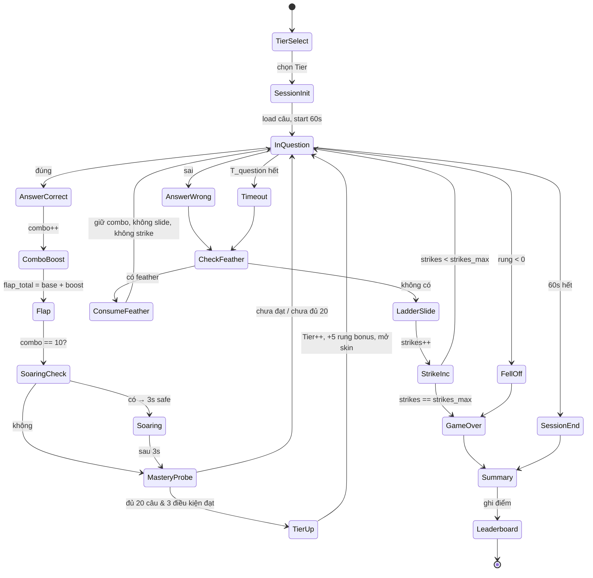

# Math Blast v2 — Đặc tả sản phẩm & kỹ thuật (PO)

Tài liệu tổng hợp các luồng thảo luận trong dự án **kid-coin**: hiện trạng v1, tầm nhìn v2, chương trình, lược đồ dữ liệu, API, bảo mật, lộ trình triển khai và mốc nối mã nguồn. Mục tiêu là **đủ để PO/đội dev triển khai sau**, không dán nguyên văn chat.

---

## Mục lục

1. [Tóm tắt điều hướng](#1-tóm-tắt-điều-hướng)
2. [Math Blast v1 (hiện tại)](#2-math-blast-v1-hiện-tại)
3. [Tầm nhìn sản phẩm v2](#3-tầm-nhìn-sản-phẩm-v2)
4. [Chương trình & đồ thị kỹ năng](#4-chương-trình--đồ-thị-kỹ-năng)
5. [Ba chế độ chơi](#5-ba-chế-độ-chơi) — gồm [§5.A Bản đồ Candy 300 màn](#5a-bản-đồ-candy-300-màn-learning-map), [§5.B Flappy Math Blast — Leo thang Tri thức](#5b-flappy-math-blast--leo-thang-tri-thức-sprint-60s)
6. [Mastery & gợi ý học](#6-mastery--gợi-ý-học)
7. [Lược đồ cơ sở dữ liệu](#7-lược-đồ-cơ-sở-dữ-liệu)
8. [API](#8-api)
9. [Bảo mật & chống lạm dụng (hạ tầng hạn chế)](#9-bảo-mật--chống-lạm-dụng-hạ-tầng-hạn-chế)
10. [Triển khai theo giai đoạn](#10-triển-khai-theo-giai-đoạn)
11. [Mốc nối trong repo](#11-mốc-nối-trong-repo)
12. [Gợi ý tùy chọn (file mới)](#12-gợi-ý-tùy-chọn-file-mới)

---

## 1. Tóm tắt điều hướng

- **v1**: game một trang, điểm cao `localStorage`, không backend trạng thái game.
- **v2**: đối tượng **học sinh Tiểu học Việt Nam Lớp 1–5**, bám **Chương trình GDPT 2018 / môn Toán** (Thông tư 32/2018), có **bản đồ kỹ năng**, **ba chế độ**, **lưu mastery & gợi ý ngày**, API batch, schema rõ ràng, thiết kế tiết kiệm tài nguyên server.

---

## 2. Math Blast v1 (hiện tại)

### 2.1. Luồng & file


| Thành phần                    | Vị trí                                                         |
| ----------------------------- | -------------------------------------------------------------- |
| Route HTTP                    | `GET /game/math-blast` — khai báo trong `main.py`              |
| Template                      | `app/templates/games/math_blast.html`                          |
| Logic client                  | `app/static/js/games/math_blast_logic.js`                      |
| Tiện ích TTS/STT & game chung | `app/static/js/game_utils.js` (được nạp từ template)           |
| Liên kết hub                  | `app/templates/game_hub.html` — thẻ trỏ tới `/game/math-blast` |


### 2.2. Hành vi nghiệp vụ (v1)

- **Domain lock**: chỉ chạy trên hostname cho phép (ví dụ production + localhost); nếu không khớp thì chuyển hướng về domain chính thức.
- **Cấp độ chơi (LEVELS)**: `KIDDY`, `STARTER`, `EXPLORER`, `MASTER`, `GENIUS` — mỗi cấp có tên hiển thị, thời gian, phạm vi số, tập phép toán (`+`, `-`, `×`, `÷` theo cấp), màu badge.
- **Điểm & timer**: đếm điểm khi trả lời đúng; đồng hồ đếm ngược theo cấu hình cấp.
- **Giọng nói**: tích hợp STT/TTS qua `game_utils.js` (lắng nghe, chống submit trùng, v.v.).
- **Điểm cao**: lưu **localStorage** trên trình duyệt — **không** đồng bộ server, không profile học tập backend.

### 2.3. Ghi chú sản phẩm / UX (lệch nhỏ)

- **UI vs cấp Kiddy**: trong HTML, giá trị hiển thị ban đầu của đồng hồ (ví dụ `30`) có thể **không khớp** thời gian thực tế của cấp `KIDDY` trong `LEVELS` (ví dụ `time: 45` giây) cho đến khi `startGame()` gán lại từ config. PO nên quyết định: (a) đồng bộ mặc định HTML với `LEVELS.KIDDY.time`, hoặc (b) chỉ hiển thị placeholder và luôn set từ JS khi vào game.

---

## 3. Tầm nhìn sản phẩm v2

### 3.1. Đối tượng

- **Trọng tâm**: học sinh **Lớp 1–5 (VN)** — không coi mẫu giáo 4–5 là đối tượng chính.
- Ngôn ngữ & bối cảnh văn hóa: phù hợp lứa tuổi tiểu học, khuyến khích tự luyện ngắn, có lộ trình rõ.

### 3.2. Căn cứ chương trình

- Căn cứ **CT GDPT 2018**, môn **Toán tiểu học**, hướng dẫn triển khai **Thông tư 32/2018/TT-BGDĐT** (định hướng nội dung, phân môn học, yêu cầu cần đạt theo cấp/lớp).
- **Giả định cần ghi nhận**: sách giáo khoa / bộ sách cụ thể (NXB, phiên bản) có thể **khác nhẹ** thứ tự chủ đề và cách diễn đạt; hệ thống nên: dung Bộ "Kết nối tri thức với cuộc sống" 
- - gắn **skill unit** với **chuẩn năng lực** (theo lớp/chủ đề) hơn là phụ thuộc tuyệt đối một SGK;
- cho phép **content pack** / phiên bản manifest theo bộ sách tùy chọn sau này.

---

## 4. Chương trình & đồ thị kỹ năng

### 4.1. Kỳ vọng số học theo lớp (tóm tắt hành động)


| Lớp | Trọng tâm số học (mức tổng quát)                                                           |
| --- | ------------------------------------------------------------------------------------------ |
| 1   | Đếm, cộng trừ trong phạm vi 10 → mở rộng 20, 100; quan hệ số; hình & đo đơn giản song song |
| 2   | Bảng cộng trừ; nhân chia sơ bộ trong bảng; bài toán có lời văn ngắn                        |
| 3   | Bảng nhân chia; phân số ban đầu; số học trong phạm vi lớn hơn                              |
| 4   | Phân số, số thập phân cơ bản; các phép tính hỗn hợp có điều kiện                           |
| 5   | Thập phân, tỉ số % ứng dụng; củng cố tư duy đa bước                                        |


*(PO chỉnh lại theo bảng ma trận nội dung nội bộ khi chốt SGK tham chiếu.)*

### 4.2. Định danh kỹ năng (skill unit IDs)

- Quy ước đề xuất: `{lớp}_{chủ đề}_{biến thể}` — ví dụ:
  - `l1_add_table_1` — Lớp 1, phép cộng (dải/bảng 1)
  - `l1_sub_within_10`, `l2_mul_table_2`, `l3_div_relationship`, …
- Mỗi unit có: **mô tả ngắn**, **lớp**, **tags** (phép toán, phạm vi, dạng bài), **ngưỡng thời gian sao** (nếu dùng chế độ map).

### 4.3. Đồ thị tiên quyết (prerequisites)

- Bảng cạnh **directed**: `skill_edges (from_skill_id → to_skill_id, edge_type: hard | soft)`.
- Ví dụ: `l1_add_within_10` → tiên quyết cho `l1_add_within_20`; `l2_mul_concept` → trước `l3_div_as_inverse`.

### 4.4. Ví dụ nút bản đồ L1 (3 sao theo thời gian)


| Node (skill)         | Mô tả ngắn                          | ⭐1        | ⭐2        | ⭐3 (thời gian mục tiêu)                     |
| -------------------- | ----------------------------------- | --------- | --------- | ------------------------------------------- |
| `l1_add_table_1`     | Cộng trong phạm vi cố định / bảng 1 | đúng ≥ X% | + latency | hoàn thành ≤ T₁ giây / câu (trung bình lăn) |
| `l1_sub_within_10`   | Trừ không âm trong 10               | …         | …         | ≤ T₂                                        |
| `l1_compare_numbers` | So sánh, thứ tự                     | …         | …         | ≤ T₃                                        |


*(Giá trị X%, T₁…T₃ do PO + chuyên môn Toán chốt sau thử nghiệm.)*

---

## 5. Ba chế độ chơi

### (A) Learning map (kiểu “Candy” / progression)

- Lưới hoặc đường đi theo **đồ thị skill**; mở khóa theo **prerequisite** và **mastery**.
- Mỗi ô: bài luyện ngắn, thưởng sao, có thể có “boss check” định kỳ.
- **Bản đồ 300 màn** (L001–L300) bám CT GDPT 2018 — môn Toán Lớp 1–5: xem [§5.A Bản đồ Candy 300 màn](#5a-bản-đồ-candy-300-màn-learning-map).

### (B) Flappy / ladder (leo thang độ khó)

- Vòng lặp: **siết thời gian** dần khi độ chính cao; sau khi **master** một dải kỹ năng, chuyển sang **random trong dải đã master** để duy trì fluency.
- Phù hợp session cực ngắn, dopamine + luyện tốc độ.
- **Flappy Math Blast — Leo thang Tri thức (Sprint 60s)** mượn pool kỹ năng từ §5.A; thiết kế đầy đủ ở [§5.B](#5b-flappy-math-blast--leo-thang-tri-thức-sprint-60s).

### (C) Free arcade

- Ánh xạ từ **LEVELS hiện tại** (Kiddy → Genius) sang **preset theo lớp** (ví dụ “L2 nhanh”, “L4 hỗn hợp”) — giữ cảm giác arcade cũ cho người chơi tự do, không bắt buộc đi map.

### 5.A Bản đồ Candy 300 màn (Learning map)

Bản đồ progression **Candy mode**: **300 màn** (`L001`–`L300`), **5 World** (Lớp 1–5), **45 chương** curriculum + **5 chương Thử thách** (chỉ L271–L300). Mỗi màn = **1 micro-skill**; mở khóa theo `prerequisite_level_id` và mastery (§6).

#### 5.A.1. Tổng quan phân bổ


| World | Tên World (kid-friendly) | Lớp | `level_id`    | Chương | Số màn | Boss cuối chương                                         |
| ----- | ------------------------ | --- | ------------- | ------ | ------ | -------------------------------------------------------- |
| W1    | Vương quốc Số Nhỏ        | 1   | L001–L054     | 9      | 54     | L006, L012, L018, L024, L030, L036, L042, L048, **L054** |
| W2    | Đảo Bảng Cộng Trừ        | 2   | L055–L108     | 9      | 54     | L060, L066, L072, L078, L084, L090, L096, L102, **L108** |
| W3    | Rừng Nhân Chia           | 3   | L109–L162     | 9      | 54     | L114, L120, L126, L132, L138, L144, L150, L156, **L162** |
| W4    | Hang Phân Số & Thập Phân | 4   | L163–L216     | 9      | 54     | L168, L174, L180, L186, L192, L198, L204, L210, **L216** |
| W5    | Đỉnh Núi Lớp 5           | 5   | L217–L270     | 9      | 54     | L222, L228, L234, L240, L246, L252, L258, L264, **L270** |
| W5⚡   | **Thử thách Lớp 5**      | 5   | **L271–L300** | 5      | **30** | L276, L282, L288, L294, **L300**                         |


**Tổng:** 300 màn · 50 chương (45 curriculum + 5 challenge) · **15 boss** curriculum/W5 + **5 boss** challenge = **20 boss** đánh dấu `is_boss: true` trong manifest.

#### 5.A.2. Quy ước metadata màn


| Cột             | Ý nghĩa                                                                         |
| --------------- | ------------------------------------------------------------------------------- |
| `level_id`      | `L001`…`L300` (zero-pad 3 chữ số)                                               |
| `title`         | Tiêu đề tiếng Việt, thân thiện trẻ em                                           |
| `skill_id`      | `{grade}_{topic}_{variant}` — khớp `skill_units` (§4.2)                         |
| `grade`         | 1–5                                                                             |
| `topic_cluster` | Nhóm chủ đề CT GDPT 2018 (tiếng Việt)                                           |
| `objective`     | Mục tiêu ngắn (1 câu)                                                           |
| `star_ref`      | Tham chiếu ngưỡng sao theo lớp (§5.A.2.1)                                       |
| `prereq`        | `level_id` trước đó; chuỗi trong chương = màn liền kề; boss = màn 5 cùng chương |


**Luồng mở khóa:** màn đầu chương (`×01`) yêu cầu **boss chương trước** (hoặc `—` nếu L001 / L271). Trong chương: `L00n` → prereq `L00(n-1)`.

##### 5.A.2.1. Ngưỡng sao (`star_ref`)


| `star_ref` | ⭐1                | ⭐2                | ⭐3                            |
| ---------- | ----------------- | ----------------- | ----------------------------- |
| `G1`       | ≥80% đúng / 8 câu | + avg latency ≤5s | ≤3.5s/câu                     |
| `G2`       | ≥82% / 10 câu     | ≤4.5s             | ≤3.2s                         |
| `G3`       | ≥85% / 10 câu     | ≤4.2s             | ≤3.0s                         |
| `G4`       | ≥85% / 12 câu     | ≤4.0s             | ≤2.8s                         |
| `G5`       | ≥88% / 12 câu     | ≤3.8s             | ≤2.6s                         |
| `BOSS`     | ≥90% / 12–15 câu  | ≤3.5s             | ≤2.5s + không sai 2 liên tiếp |
| `CHAL`     | ≥92% / 15 câu     | ≤3.0s             | ≤2.2s (L271–L300)             |


*(PO hiệu chỉnh sau pilot; logic giống §4.4.)*

#### 5.A.3. Bảng tóm tắt theo chương


| World | Ch  | `level_id` | Chủ đề chương                 | Màn |
| ----- | --- | ---------- | ----------------------------- | --- |
| W1    | 1   | L001–L006  | Đếm & nhận biết số            | 6   |
| W1    | 2   | L007–L012  | Cộng trong 5                  | 6   |
| W1    | 3   | L013–L018  | Trừ trong 5                   | 6   |
| W1    | 4   | L019–L024  | Cộng trừ trong 10             | 6   |
| W1    | 5   | L025–L030  | So sánh & thứ tự số           | 6   |
| W1    | 6   | L031–L036  | Cộng trừ trong 20             | 6   |
| W1    | 7   | L037–L042  | Hình học cơ bản               | 6   |
| W1    | 8   | L043–L048  | Đo, thời gian, tiền           | 6   |
| W1    | 9   | L049–L054  | Bài toán & tổng kết L1        | 6   |
| W2    | 1   | L055–L060  | Cộng trong 100                | 6   |
| W2    | 2   | L061–L066  | Trừ trong 100                 | 6   |
| W2    | 3   | L067–L072  | Bảng cộng 2–5                 | 6   |
| W2    | 4   | L073–L078  | Bảng cộng 6–9 & trừ           | 6   |
| W2    | 5   | L079–L084  | Nhân như cộng lặp             | 6   |
| W2    | 6   | L085–L090  | Chia nhóm đều                 | 6   |
| W2    | 7   | L091–L096  | Hình & chu vi                 | 6   |
| W2    | 8   | L097–L102  | Đo cm, kg, lít                | 6   |
| W2    | 9   | L103–L108  | Bài toán 2 bước L2            | 6   |
| W3    | 1   | L109–L114  | Bảng nhân 2, 3                | 6   |
| W3    | 2   | L115–L120  | Bảng nhân 4, 5, 6             | 6   |
| W3    | 3   | L121–L126  | Bảng nhân 7, 8, 9             | 6   |
| W3    | 4   | L127–L132  | Bảng chia 2–5                 | 6   |
| W3    | 5   | L133–L138  | Bảng chia 6–9                 | 6   |
| W3    | 6   | L139–L144  | Phân số mô hình               | 6   |
| W3    | 7   | L145–L150  | Chu vi & diện tích HCN        | 6   |
| W3    | 8   | L151–L156  | Số đến 10 000                 | 6   |
| W3    | 9   | L157–L162  | Bài toán L3                   | 6   |
| W4    | 1   | L163–L168  | Phân số tương đương           | 6   |
| W4    | 2   | L169–L174  | Cộng trừ PS cùng mẫu          | 6   |
| W4    | 3   | L175–L180  | Số thập phân (phần mười)      | 6   |
| W4    | 4   | L181–L186  | Cộng trừ thập phân            | 6   |
| W4    | 5   | L187–L192  | Nhân số 4 chữ số              | 6   |
| W4    | 6   | L193–L198  | Chia có dư & 2 chữ số         | 6   |
| W4    | 7   | L199–L204  | Góc & tam giác                | 6   |
| W4    | 8   | L205–L210  | Bài toán 3 bước L4            | 6   |
| W4    | 9   | L211–L216  | Ôn tổng hợp L4                | 6   |
| W5    | 1   | L217–L222  | Nhân chia thập phân           | 6   |
| W5    | 2   | L223–L228  | Phần trăm cơ bản              | 6   |
| W5    | 3   | L229–L234  | Tỉ số & tỉ lệ đơn             | 6   |
| W5    | 4   | L235–L240  | Hình lập thể & thể tích       | 6   |
| W5    | 5   | L241–L246  | Diện tích tam giác, HT        | 6   |
| W5    | 6   | L247–L252  | Trung bình & biểu đồ          | 6   |
| W5    | 7   | L253–L258  | Đơn vị đo & quy đổi           | 6   |
| W5    | 8   | L259–L264  | Bài toán hỗn hợp L5           | 6   |
| W5    | 9   | L265–L270  | Tổng kết L5 (trước Thử thách) | 6   |
| ⚡     | 1   | L271–L276  | Bài toán đa bước              | 6   |
| ⚡     | 2   | L277–L282  | PS & thập phân nâng cao       | 6   |
| ⚡     | 3   | L283–L288  | % & tỉ lệ thực tế             | 6   |
| ⚡     | 4   | L289–L294  | Hình học nâng cao             | 6   |
| ⚡     | 5   | L295–L300  | Tốc độ & Siêu Boss            | 6   |


#### 5.A.4. Chi tiết theo chương (World 1–3)

*Cột: `id` · `title` · `skill_id` · `topic_cluster` · `objective` · `star_ref` · `prereq`*

##### World 1 — Vương quốc Số Nhỏ (L001–L054)

**Ch1 — Đếm & nhận biết số (L001–L006)**


| id   | title                    | skill_id               | topic_cluster       | objective                      | star | prereq |
| ---- | ------------------------ | ---------------------- | ------------------- | ------------------------------ | ---- | ------ |
| L001 | Đếm đến 5                | `l1_count_to_5`        | Số học · Đếm        | Đếm đúng số đồ vật 1–5         | G1   | —      |
| L002 | Đếm đến 10               | `l1_count_to_10`       | Số học · Đếm        | Đếm thuận/nghịch đến 10        | G1   | L001   |
| L003 | Nhận chữ số 0–9          | `l1_digit_recognition` | Số học · Đếm        | Ghép chữ số với số lượng       | G1   | L002   |
| L004 | Số liền trước/sau        | `l1_before_after_10`   | Số học · Quan hệ số | Tìm số liền trước/sau trong 10 | G1   | L003   |
| L005 | Ghép số và nhóm          | `l1_quantity_match`    | Số học · Đếm        | Khớp số với tập hợp đồ vật     | G1   | L004   |
| L006 | **Boss: Thành thạo đếm** | `l1_boss_counting`     | Số học · Đếm        | Ôn 5 kỹ năng chương 1          | BOSS | L005   |


**Ch2 — Cộng trong 5 (L007–L012)**


| id   | title                  | skill_id                  | topic_cluster | objective                   | star | prereq |
| ---- | ---------------------- | ------------------------- | ------------- | --------------------------- | ---- | ------ |
| L007 | Cộng hai số ≤3         | `l1_add_sum_to_3`         | Phép cộng     | Tính tổng không vượt 5      | G1   | L006   |
| L008 | Tìm số hạng thiếu      | `l1_add_missing_addend_5` | Phép cộng     | Tìm số hạng trong phạm vi 5 | G1   | L007   |
| L009 | Cộng dọc trong 5       | `l1_add_vertical_5`       | Phép cộng     | Đặt tính cộng dọc ≤5        | G1   | L008   |
| L010 | Cộng ba số nhỏ         | `l1_add_three_numbers_5`  | Phép cộng     | Cộng 3 số, tổng ≤5          | G1   | L009   |
| L011 | Bài toán cộng 5        | `l1_word_add_5`           | Bài toán      | Giải bài toán cộng trong 5  | G1   | L010   |
| L012 | **Boss: Cộng trong 5** | `l1_boss_add_5`           | Phép cộng     | Kiểm tra cộng trong 5       | BOSS | L011   |


**Ch3 — Trừ trong 5 (L013–L018)**


| id   | title                 | skill_id                | topic_cluster | objective                  | star | prereq |
| ---- | --------------------- | ----------------------- | ------------- | -------------------------- | ---- | ------ |
| L013 | Trừ hai số ≤5         | `l1_sub_within_5`       | Phép trừ      | Hiệu không âm, trong 5     | G1   | L012   |
| L014 | Tìm số bị trừ/số trừ  | `l1_sub_missing_5`      | Phép trừ      | Tìm thành phần thiếu       | G1   | L013   |
| L015 | Trừ dọc trong 5       | `l1_sub_vertical_5`     | Phép trừ      | Đặt tính trừ dọc           | G1   | L014   |
| L016 | Cộng hay trừ?         | `l1_choose_operation_5` | Phép tính     | Chọn phép phù hợp ngữ cảnh | G1   | L015   |
| L017 | Bài toán trừ 5        | `l1_word_sub_5`         | Bài toán      | Giải bài toán trừ trong 5  | G1   | L016   |
| L018 | **Boss: Trừ trong 5** | `l1_boss_sub_5`         | Phép trừ      | Kiểm tra trừ trong 5       | BOSS | L017   |


**Ch4 — Cộng trừ trong 10 (L019–L024)**


| id   | title                     | skill_id              | topic_cluster | objective            | star | prereq |
| ---- | ------------------------- | --------------------- | ------------- | -------------------- | ---- | ------ |
| L019 | Cộng trong 10 (không nhớ) | `l1_add_no_carry_10`  | Phép cộng     | Cộng không qua 10    | G1   | L018   |
| L020 | Trừ trong 10 (không mượn) | `l1_sub_no_borrow_10` | Phép trừ      | Trừ không mượn       | G1   | L019   |
| L021 | Cộng có nhớ trong 10      | `l1_add_carry_10`     | Phép cộng     | Cộng có nhớ 1 chữ số | G1   | L020   |
| L022 | Trừ có mượn trong 10      | `l1_sub_borrow_10`    | Phép trừ      | Trừ có mượn          | G1   | L021   |
| L023 | Cộng trừ hỗn hợp 10       | `l1_mixed_add_sub_10` | Phép tính     | Luân phiên cộng/trừ  | G1   | L022   |
| L024 | **Boss: Cộng trừ 10**     | `l1_boss_add_sub_10`  | Phép tính     | Kiểm tra phạm vi 10  | BOSS | L023   |


**Ch5 — So sánh & thứ tự (L025–L030)**


| id   | title                 | skill_id                 | topic_cluster | objective                | star | prereq |
| ---- | --------------------- | ------------------------ | ------------- | ------------------------ | ---- | ------ |
| L025 | So sánh hai số đến 20 | `l1_compare_to_20`       | Quan hệ số    | Dùng >, <, =             | G1   | L024   |
| L026 | Xếp thứ tự 3 số       | `l1_order_three_numbers` | Quan hệ số    | Sắp xếp tăng/giảm        | G1   | L025   |
| L027 | Thứ tự thứ mấy        | `l1_ordinal_1_10`        | Quan hệ số    | Đọc thứ tự 1–10          | G1   | L026   |
| L028 | Tia số đến 20         | `l1_number_line_20`      | Quan hệ số    | Định vị số trên tia số   | G1   | L027   |
| L029 | Số chẵn lẻ (mở đầu)   | `l1_even_odd_intro`      | Quan hệ số    | Nhận biết chẵn/lẻ đến 20 | G1   | L028   |
| L030 | **Boss: So sánh số**  | `l1_boss_compare`        | Quan hệ số    | Ôn so sánh & thứ tự      | BOSS | L029   |


**Ch6 — Cộng trừ trong 20 (L031–L036)**


| id   | title                 | skill_id               | topic_cluster | objective                | star | prereq |
| ---- | --------------------- | ---------------------- | ------------- | ------------------------ | ---- | ------ |
| L031 | Cộng trong 20         | `l1_add_within_20`     | Phép cộng     | Cộng có/không nhớ đến 20 | G1   | L030   |
| L032 | Trừ trong 20          | `l1_sub_within_20`     | Phép trừ      | Trừ trong 20             | G1   | L031   |
| L033 | Cộng ba số đến 20     | `l1_add_three_to_20`   | Phép cộng     | Cộng 3 số hạng           | G1   | L032   |
| L034 | Tìm số thiếu đến 20   | `l1_missing_number_20` | Phép tính     | Ô trống trong phép tính  | G1   | L033   |
| L035 | Bài toán đến 20       | `l1_word_problem_20`   | Bài toán      | Một bước, phạm vi 20     | G1   | L034   |
| L036 | **Boss: Cộng trừ 20** | `l1_boss_add_sub_20`   | Phép tính     | Kiểm tra phạm vi 20      | BOSS | L035   |


**Ch7 — Hình học cơ bản (L037–L042)**


| id   | title                 | skill_id                 | topic_cluster | objective                 | star | prereq |
| ---- | --------------------- | ------------------------ | ------------- | ------------------------- | ---- | ------ |
| L037 | Nhận hình cơ bản      | `l1_shape_recognition`   | Hình học      | Vuông, tròn, tam giác, CN | G1   | L036   |
| L038 | Đếm cạnh, góc         | `l1_count_sides_corners` | Hình học      | Đếm cạnh/góc hình         | G1   | L037   |
| L039 | Quy luật hình         | `l1_shape_patterns`      | Hình học      | Tiếp theo trong dãy hình  | G1   | L038   |
| L040 | Đối xứng đơn giản     | `l1_symmetry_basic`      | Hình học      | Nhận trục đối xứng        | G1   | L039   |
| L041 | Ghép hình             | `l1_compose_shapes`      | Hình học      | Ghép hình tạo hình mới    | G1   | L040   |
| L042 | **Boss: Hình học L1** | `l1_boss_geometry`       | Hình học      | Ôn nhận biết hình         | BOSS | L041   |


**Ch8 — Đo, thời gian, tiền (L043–L048)**


| id   | title                    | skill_id               | topic_cluster | objective              | star | prereq |
| ---- | ------------------------ | ---------------------- | ------------- | ---------------------- | ---- | ------ |
| L043 | So sánh độ dài           | `l1_compare_length`    | Đo lường      | Dài/ngắn, cao/thấp     | G1   | L042   |
| L044 | Đọc giờ đúng             | `l1_clock_hour`        | Đo lường      | Kim giờ trỏ số chẵn    | G1   | L043   |
| L045 | Thứ trong tuần           | `l1_days_of_week`      | Đo lường      | Thứ tự ngày trong tuần | G1   | L044   |
| L046 | Nhận tiền xu             | `l1_money_coins_vn`    | Đo lường      | Nhận mệnh giá cơ bản   | G1   | L045   |
| L047 | Lịch tháng đơn giản      | `l1_calendar_simple`   | Đo lường      | Ngày/tháng trên lịch   | G1   | L046   |
| L048 | **Boss: Đo & thời gian** | `l1_boss_measure_time` | Đo lường      | Ôn đo và thời gian     | BOSS | L047   |


**Ch9 — Bài toán & tổng kết L1 (L049–L054)**


| id   | title                   | skill_id                   | topic_cluster | objective                | star | prereq |
| ---- | ----------------------- | -------------------------- | ------------- | ------------------------ | ---- | ------ |
| L049 | Bài toán cộng trừ 10    | `l1_word_mixed_10`         | Bài toán      | Chọn phép, 1 bước        | G1   | L048   |
| L050 | Cặp số tạo 10           | `l1_number_bonds_10`       | Số học        | Tìm cặp cộng = 10        | G1   | L049   |
| L051 | Ôn nhanh L1             | `l1_review_mixed`          | Ôn tập        | Trộn 4 chủ đề đầu        | G1   | L050   |
| L052 | Luyện tốc độ L1         | `l1_speed_fluency`         | Ôn tập        | Phản xạ nhanh phạm vi 10 | G1   | L051   |
| L053 | Thử thách nhỏ L1        | `l1_mini_challenge`        | Ôn tập        | 12 câu hỗn hợp           | BOSS | L052   |
| L054 | **Boss: Tốt nghiệp L1** | `l1_boss_world_graduation` | Ôn tập        | Hoàn thành World 1       | BOSS | L053   |


##### World 2 — Đảo Bảng Cộng Trừ (L055–L108)

**Ch1 — Cộng trong 100 (L055–L060)** · prereq chương: L054


| id   | title                   | skill_id                   | topic_cluster | objective          | star | prereq |
| ---- | ----------------------- | -------------------------- | ------------- | ------------------ | ---- | ------ |
| L055 | Cộng không nhớ 2 chữ số | `l2_add_no_carry_100`      | Phép cộng     | Cộng 2 số ≤100     | G2   | L054   |
| L056 | Cộng có nhớ 1 lần       | `l2_add_carry_once_100`    | Phép cộng     | Nhớ sang hàng chục | G2   | L055   |
| L057 | Cộng có nhớ 2 lần       | `l2_add_carry_twice_100`   | Phép cộng     | Nhớ hàng chục/trăm | G2   | L056   |
| L058 | Cộng ba số              | `l2_add_three_numbers_100` | Phép cộng     | Tổng ≤100          | G2   | L057   |
| L059 | Bài toán cộng 100       | `l2_word_add_100`          | Bài toán      | Một bước, cộng     | G2   | L058   |
| L060 | **Boss: Cộng 100**      | `l2_boss_add_100`          | Phép cộng     | Kiểm tra cộng 100  | BOSS | L059   |


**Ch2 — Trừ trong 100 (L061–L066)**


| id   | title              | skill_id                  | topic_cluster | objective           | star | prereq |
| ---- | ------------------ | ------------------------- | ------------- | ------------------- | ---- | ------ |
| L061 | Trừ không mượn     | `l2_sub_no_borrow_100`    | Phép trừ      | Trừ 2 số ≤100       | G2   | L060   |
| L062 | Trừ mượn 1 lần     | `l2_sub_borrow_once_100`  | Phép trừ      | Mượn hàng chục      | G2   | L061   |
| L063 | Trừ mượn liên tiếp | `l2_sub_borrow_chain_100` | Phép trừ      | Mượn nhiều hàng     | G2   | L062   |
| L064 | Kiểm tra bằng cộng | `l2_check_sub_with_add`   | Phép trừ      | Cộng ngược kiểm tra | G2   | L063   |
| L065 | Bài toán trừ 100   | `l2_word_sub_100`         | Bài toán      | Một bước, trừ       | G2   | L064   |
| L066 | **Boss: Trừ 100**  | `l2_boss_sub_100`         | Phép trừ      | Kiểm tra trừ 100    | BOSS | L065   |


**Ch3 — Bảng cộng 2–5 (L067–L072)**


| id   | title                   | skill_id                 | topic_cluster | objective         | star | prereq |
| ---- | ----------------------- | ------------------------ | ------------- | ----------------- | ---- | ------ |
| L067 | Bảng cộng +2            | `l2_add_table_2`         | Bảng cộng     | Thuộc cộng +2     | G2   | L066   |
| L068 | Bảng cộng +3            | `l2_add_table_3`         | Bảng cộng     | Thuộc cộng +3     | G2   | L067   |
| L069 | Bảng cộng +4            | `l2_add_table_4`         | Bảng cộng     | Thuộc cộng +4     | G2   | L068   |
| L070 | Bảng cộng +5            | `l2_add_table_5`         | Bảng cộng     | Thuộc cộng +5     | G2   | L069   |
| L071 | Trộn bảng 2–5           | `l2_add_tables_2_5_mix`  | Bảng cộng     | Ngẫu nhiên +2…+5  | G2   | L070   |
| L072 | **Boss: Bảng cộng 2–5** | `l2_boss_add_tables_2_5` | Bảng cộng     | Kiểm tra bảng 2–5 | BOSS | L071   |


**Ch4 — Bảng cộng 6–9 & trừ (L073–L078)**


| id   | title                   | skill_id                 | topic_cluster | objective           | star | prereq |
| ---- | ----------------------- | ------------------------ | ------------- | ------------------- | ---- | ------ |
| L073 | Bảng cộng +6,+7         | `l2_add_table_6_7`       | Bảng cộng     | Thuộc +6, +7        | G2   | L072   |
| L074 | Bảng cộng +8,+9         | `l2_add_table_8_9`       | Bảng cộng     | Thuộc +8, +9        | G2   | L073   |
| L075 | Bảng trừ −2…−5          | `l2_sub_table_2_5`       | Bảng trừ      | Thuộc trừ 2–5       | G2   | L074   |
| L076 | Bảng trừ −6…−9          | `l2_sub_table_6_9`       | Bảng trừ      | Thuộc trừ 6–9       | G2   | L075   |
| L077 | Cộng trừ bảng hỗn hợp   | `l2_tables_mixed`        | Bảng tính     | Luân phiên cộng/trừ | G2   | L076   |
| L078 | **Boss: Bảng cộng trừ** | `l2_boss_add_sub_tables` | Bảng tính     | Kiểm tra toàn bảng  | BOSS | L077   |


**Ch5 — Nhân như cộng lặp (L079–L084)**


| id   | title                | skill_id                 | topic_cluster | objective          | star | prereq |
| ---- | -------------------- | ------------------------ | ------------- | ------------------ | ---- | ------ |
| L079 | Nhóm đều (×2)        | `l2_mul_as_repeated_2`   | Nhân chia     | Nhân = cộng lặp ×2 | G2   | L078   |
| L080 | Nhóm đều (×3,×4)     | `l2_mul_as_repeated_3_4` | Nhân chia     | Mô hình nhóm       | G2   | L079   |
| L081 | Nhân ×5,×10          | `l2_mul_5_10`            | Nhân chia     | Bảng 5 và 10       | G2   | L080   |
| L082 | Đếm nhảy 2,5,10      | `l2_skip_counting`       | Nhân chia     | Đếm cách 2/5/10    | G2   | L081   |
| L083 | Bài toán nhân mở đầu | `l2_word_mul_intro`      | Bài toán      | Nhóm đều, 1 bước   | G2   | L082   |
| L084 | **Boss: Nhân sơ bộ** | `l2_boss_mul_intro`      | Nhân chia     | Kiểm tra nhân lặp  | BOSS | L083   |


**Ch6 — Chia nhóm đều (L085–L090)**


| id   | title               | skill_id                  | topic_cluster | objective             | star | prereq |
| ---- | ------------------- | ------------------------- | ------------- | --------------------- | ---- | ------ |
| L085 | Chia đôi nhóm       | `l2_div_halve_groups`     | Nhân chia     | Chia 2 nhóm bằng nhau | G2   | L084   |
| L086 | Chia 3, 4 nhóm      | `l2_div_groups_3_4`       | Nhân chia     | Chia thành 3–4 phần   | G2   | L085   |
| L087 | Liên hệ × và ÷      | `l2_mul_div_relationship` | Nhân chia     | Cặp nhân–chia         | G2   | L086   |
| L088 | Bài toán chia đều   | `l2_word_div_equal`       | Bài toán      | Chia đều, 1 bước      | G2   | L087   |
| L089 | Trộn nhân chia đơn  | `l2_mul_div_mixed_simple` | Nhân chia     | ×2,×5,÷2              | G2   | L088   |
| L090 | **Boss: Chia nhóm** | `l2_boss_div_groups`      | Nhân chia     | Kiểm tra chia cơ bản  | BOSS | L089   |


**Ch7 — Hình & chu vi (L091–L096)**


| id   | title             | skill_id            | topic_cluster | objective                | star | prereq |
| ---- | ----------------- | ------------------- | ------------- | ------------------------ | ---- | ------ |
| L091 | Chu vi HCN        | `l2_perimeter_rect` | Hình học      | Chu vi = tổng cạnh       | G2   | L090   |
| L092 | Nhận góc vuông    | `l2_right_angle`    | Hình học      | Góc vuông vs không vuông | G2   | L091   |
| L093 | Đối xứng trục     | `l2_line_symmetry`  | Hình học      | Vẽ/khớp đối xứng         | G2   | L092   |
| L094 | Hình trên lưới    | `l2_shapes_on_grid` | Hình học      | Đếm ô vuông              | G2   | L093   |
| L095 | Bài toán chu vi   | `l2_word_perimeter` | Bài toán      | Tìm chu vi HCN           | G2   | L094   |
| L096 | **Boss: Hình L2** | `l2_boss_geometry`  | Hình học      | Ôn chu vi & hình         | BOSS | L095   |


**Ch8 — Đo cm, kg, lít (L097–L102)**


| id   | title                 | skill_id              | topic_cluster | objective              | star | prereq |
| ---- | --------------------- | --------------------- | ------------- | ---------------------- | ---- | ------ |
| L097 | Đo cm                 | `l2_measure_cm`       | Đo lường      | Đọc thước cm           | G2   | L096   |
| L098 | Cân kg                | `l2_measure_kg`       | Đo lường      | So sánh khối lượng     | G2   | L097   |
| L099 | Đong lít              | `l2_measure_liter`    | Đo lường      | Thể tích lỏng cơ bản   | G2   | L098   |
| L100 | Giờ, phút (mở đầu)    | `l2_time_hour_minute` | Đo lường      | Đọc đồng hồ đến 5 phút | G2   | L099   |
| L101 | Tiền VN (đếm)         | `l2_money_count_vn`   | Đo lường      | Cộng mệnh giá tiền     | G2   | L100   |
| L102 | **Boss: Đo lường L2** | `l2_boss_measurement` | Đo lường      | Ôn cm, kg, lít         | BOSS | L101   |


**Ch9 — Bài toán 2 bước L2 (L103–L108)**


| id   | title                   | skill_id                   | topic_cluster | objective                 | star | prereq |
| ---- | ----------------------- | -------------------------- | ------------- | ------------------------- | ---- | ------ |
| L103 | Hai phép cùng loại      | `l2_word_two_step_same`    | Bài toán      | 2 bước cộng hoặc trừ      | G2   | L102   |
| L104 | Hai phép khác loại      | `l2_word_two_step_mixed`   | Bài toán      | Cộng rồi trừ (hoặc ngược) | G2   | L103   |
| L105 | Tìm số hơn/kém          | `l2_word_compare_quantity` | Bài toán      | Nhiều hơn/ít hơn          | G2   | L104   |
| L106 | Ôn nhanh L2             | `l2_review_mixed`          | Ôn tập        | Trộn bảng + đo            | G2   | L105   |
| L107 | Thử thách nhỏ L2        | `l2_mini_challenge`        | Ôn tập        | 12 câu hỗn hợp            | BOSS | L106   |
| L108 | **Boss: Tốt nghiệp L2** | `l2_boss_world_graduation` | Ôn tập        | Hoàn thành World 2        | BOSS | L107   |


##### World 3 — Rừng Nhân Chia (L109–L162)

**Ch1 — Bảng nhân 2, 3 (L109–L114)** · prereq chương: L108


| id   | title                | skill_id                    | topic_cluster | objective           | star | prereq |
| ---- | -------------------- | --------------------------- | ------------- | ------------------- | ---- | ------ |
| L109 | Bảng ×2              | `l3_mul_table_2`            | Bảng nhân     | Thuộc bảng 2        | G3   | L108   |
| L110 | Bảng ×3              | `l3_mul_table_3`            | Bảng nhân     | Thuộc bảng 3        | G3   | L109   |
| L111 | ×2 và ×3 hỗn hợp     | `l3_mul_2_3_mix`            | Bảng nhân     | Luân phiên 2, 3     | G3   | L110   |
| L112 | Thiếu thừa số ×2,×3  | `l3_mul_missing_factor_2_3` | Bảng nhân     | Tìm thừa số         | G3   | L111   |
| L113 | Bài toán ×2,×3       | `l3_word_mul_2_3`           | Bài toán      | Nhân trong bài toán | G3   | L112   |
| L114 | **Boss: Bảng ×2,×3** | `l3_boss_mul_2_3`           | Bảng nhân     | Kiểm tra ×2, ×3     | BOSS | L113   |


**Ch2 — Bảng nhân 4, 5, 6 (L115–L120)**


| id   | title                   | skill_id          | topic_cluster | objective      | star | prereq |
| ---- | ----------------------- | ----------------- | ------------- | -------------- | ---- | ------ |
| L115 | Bảng ×4                 | `l3_mul_table_4`  | Bảng nhân     | Thuộc bảng 4   | G3   | L114   |
| L116 | Bảng ×5                 | `l3_mul_table_5`  | Bảng nhân     | Thuộc bảng 5   | G3   | L115   |
| L117 | Bảng ×6                 | `l3_mul_table_6`  | Bảng nhân     | Thuộc bảng 6   | G3   | L116   |
| L118 | Trộn ×4–×6              | `l3_mul_4_6_mix`  | Bảng nhân     | Ngẫu nhiên 4–6 | G3   | L117   |
| L119 | Nhân 2 chữ số ×1 chữ số | `l3_mul_2d_by_1d` | Nhân          | Nhân không nhớ | G3   | L118   |
| L120 | **Boss: Bảng ×4–×6**    | `l3_boss_mul_4_6` | Bảng nhân     | Kiểm tra ×4–×6 | BOSS | L119   |


**Ch3 — Bảng nhân 7, 8, 9 (L121–L126)**


| id   | title                | skill_id             | topic_cluster | objective            | star | prereq |
| ---- | -------------------- | -------------------- | ------------- | -------------------- | ---- | ------ |
| L121 | Bảng ×7              | `l3_mul_table_7`     | Bảng nhân     | Thuộc bảng 7         | G3   | L120   |
| L122 | Bảng ×8              | `l3_mul_table_8`     | Bảng nhân     | Thuộc bảng 8         | G3   | L121   |
| L123 | Bảng ×9              | `l3_mul_table_9`     | Bảng nhân     | Thuộc bảng 9         | G3   | L122   |
| L124 | Toàn bảng cửu chương | `l3_mul_full_table`  | Bảng nhân     | ×1…×9 hỗn hợp        | G3   | L123   |
| L125 | Nhân có nhớ 1 lần    | `l3_mul_carry_once`  | Nhân          | Nhân 2 chữ số có nhớ | G3   | L124   |
| L126 | **Boss: Cửu chương** | `l3_boss_mul_tables` | Bảng nhân     | Kiểm tra toàn bảng   | BOSS | L125   |


**Ch4 — Bảng chia 2–5 (L127–L132)**


| id   | title              | skill_id               | topic_cluster | objective         | star | prereq |
| ---- | ------------------ | ---------------------- | ------------- | ----------------- | ---- | ------ |
| L127 | Bảng ÷2            | `l3_div_table_2`       | Bảng chia     | Chia trong bảng 2 | G3   | L126   |
| L128 | Bảng ÷3, ÷4        | `l3_div_table_3_4`     | Bảng chia     | Chia 3, 4         | G3   | L127   |
| L129 | Bảng ÷5            | `l3_div_table_5`       | Bảng chia     | Chia 5            | G3   | L128   |
| L130 | Cặp ×÷ 2–5         | `l3_mul_div_pairs_2_5` | Bảng chia     | Liên hệ nhân–chia | G3   | L129   |
| L131 | Bài toán chia 2–5  | `l3_word_div_2_5`      | Bài toán      | Chia có dư 0      | G3   | L130   |
| L132 | **Boss: Chia 2–5** | `l3_boss_div_2_5`      | Bảng chia     | Kiểm tra ÷2–÷5    | BOSS | L131   |


**Ch5 — Bảng chia 6–9 (L133–L138)**


| id   | title              | skill_id                | topic_cluster | objective          | star | prereq |
| ---- | ------------------ | ----------------------- | ------------- | ------------------ | ---- | ------ |
| L133 | Bảng ÷6, ÷7        | `l3_div_table_6_7`      | Bảng chia     | Chia 6, 7          | G3   | L132   |
| L134 | Bảng ÷8, ÷9        | `l3_div_table_8_9`      | Bảng chia     | Chia 8, 9          | G3   | L133   |
| L135 | Chia có dư         | `l3_div_with_remainder` | Bảng chia     | Đọc thương và dư   | G3   | L134   |
| L136 | Trộn ×÷ 6–9        | `l3_mul_div_6_9_mix`    | Bảng chia     | Hỗn hợp 6–9        | G3   | L135   |
| L137 | Bài toán chia dư   | `l3_word_div_remainder` | Bài toán      | Chia có dư thực tế | G3   | L136   |
| L138 | **Boss: Chia 6–9** | `l3_boss_div_6_9`       | Bảng chia     | Kiểm tra ÷6–÷9     | BOSS | L137   |


**Ch6 — Phân số mô hình (L139–L144)**


| id   | title                     | skill_id                            | topic_cluster | objective         | star | prereq |
| ---- | ------------------------- | ----------------------------------- | ------------- | ----------------- | ---- | ------ |
| L139 | Một nửa, một phần ba      | `l3_fraction_half_third`            | Phân số       | Mô hình hình/tròn | G3   | L138   |
| L140 | Tử số, mẫu số             | `l3_fraction_numerator_denominator` | Phân số       | Đọc phân số       | G3   | L139   |
| L141 | Phân số trên trục         | `l3_fraction_number_line`           | Phân số       | Định vị 0–1       | G3   | L140   |
| L142 | So sánh cùng mẫu          | `l3_fraction_compare_same_den`      | Phân số       | >, < cùng mẫu     | G3   | L141   |
| L143 | Tương đương đơn giản      | `l3_fraction_equivalent_intro`      | Phân số       | 1/2 = 2/4         | G3   | L142   |
| L144 | **Boss: Phân số mô hình** | `l3_boss_fraction_intro`            | Phân số       | Ôn PS trực quan   | BOSS | L143   |


**Ch7 — Chu vi & diện tích HCN (L145–L150)**


| id   | title                      | skill_id                    | topic_cluster | objective         | star | prereq |
| ---- | -------------------------- | --------------------------- | ------------- | ----------------- | ---- | ------ |
| L145 | Chu vi HCN (công thức)     | `l3_perimeter_rect_formula` | Hình học      | P = (a+b)×2       | G3   | L144   |
| L146 | Diện tích bằng ô vuông     | `l3_area_count_squares`     | Hình học      | Đếm ô trên lưới   | G3   | L145   |
| L147 | Diện tích HCN              | `l3_area_rect_formula`      | Hình học      | S = dài × rộng    | G3   | L146   |
| L148 | So sánh chu vi & diện tích | `l3_perimeter_vs_area`      | Hình học      | Không nhầm P và S | G3   | L147   |
| L149 | Bài toán diện tích         | `l3_word_area_rect`         | Bài toán      | Tính S HCN        | G3   | L148   |
| L150 | **Boss: P & S HCN**        | `l3_boss_perimeter_area`    | Hình học      | Kiểm tra P, S     | BOSS | L149   |


**Ch8 — Số đến 10 000 (L151–L156)**


| id   | title             | skill_id                   | topic_cluster | objective               | star | prereq |
| ---- | ----------------- | -------------------------- | ------------- | ----------------------- | ---- | ------ |
| L151 | Đọc số đến 1 000  | `l3_read_numbers_1000`     | Số học        | Hàng trăm, chục, đơn vị | G3   | L150   |
| L152 | Đọc số đến 10 000 | `l3_read_numbers_10000`    | Số học        | Hàng nghìn              | G3   | L151   |
| L153 | So sánh số lớn    | `l3_compare_numbers_10000` | Số học        | >, < đến 10 000         | G3   | L152   |
| L154 | Làm tròn đến trăm | `l3_round_to_hundred`      | Số học        | Ước lượng trăm          | G3   | L153   |
| L155 | Cộng trừ số lớn   | `l3_add_sub_large_numbers` | Số học        | Trong 10 000            | G3   | L154   |
| L156 | **Boss: Số lớn**  | `l3_boss_numbers_10000`    | Số học        | Kiểm tra đến 10 000     | BOSS | L155   |


**Ch9 — Bài toán L3 (L157–L162)**


| id   | title                   | skill_id                   | topic_cluster | objective          | star | prereq |
| ---- | ----------------------- | -------------------------- | ------------- | ------------------ | ---- | ------ |
| L157 | Bài toán 2 bước (×÷)    | `l3_word_two_step_mul_div` | Bài toán      | 2 phép nhân/chia   | G3   | L156   |
| L158 | Bài toán phân số        | `l3_word_fraction`         | Bài toán      | Mô hình 1/n        | G3   | L157   |
| L159 | Ôn nhanh L3             | `l3_review_mixed`          | Ôn tập        | Trộn bảng + PS     | G3   | L158   |
| L160 | Luyện tốc độ L3         | `l3_speed_fluency`         | Ôn tập        | Cửu chương nhanh   | G3   | L159   |
| L161 | Thử thách nhỏ L3        | `l3_mini_challenge`        | Ôn tập        | 12 câu hỗn hợp     | BOSS | L160   |
| L162 | **Boss: Tốt nghiệp L3** | `l3_boss_world_graduation` | Ôn tập        | Hoàn thành World 3 | BOSS | L161   |


#### 5.A.5. Chi tiết theo chương (World 4–5)

##### World 4 — Hang Phân Số & Thập Phân (L163–L216)

**Ch1 — Phân số tương đương (L163–L168)** · prereq chương: L162


| id   | title                    | skill_id                         | topic_cluster | objective            | star | prereq |
| ---- | ------------------------ | -------------------------------- | ------------- | -------------------- | ---- | ------ |
| L163 | PS tương đương hình ảnh  | `l4_fraction_equivalent_visual`  | Phân số       | Nhận 1/2 = 2/4 = 4/8 | G4   | L162   |
| L164 | Rút gọn PS đơn giản      | `l4_fraction_simplify`           | Phân số       | Chia tử/mẫu cùng số  | G4   | L163   |
| L165 | Quy đồng mẫu             | `l4_fraction_common_denominator` | Phân số       | MSC bé nhất          | G4   | L164   |
| L166 | So sánh PS khác mẫu      | `l4_fraction_compare_diff_den`   | Phân số       | Quy đồng rồi so      | G4   | L165   |
| L167 | PS và số tự nhiên        | `l4_fraction_mixed_number_intro` | Phân số       | Hỗn số đơn giản      | G4   | L166   |
| L168 | **Boss: PS tương đương** | `l4_boss_fraction_equivalent`    | Phân số       | Kiểm tra tương đương | BOSS | L167   |


**Ch2 — Cộng trừ PS cùng mẫu (L169–L174)**


| id   | title                  | skill_id                   | topic_cluster | objective        | star | prereq |
| ---- | ---------------------- | -------------------------- | ------------- | ---------------- | ---- | ------ |
| L169 | Cộng PS cùng mẫu       | `l4_fraction_add_same_den` | Phân số       | Cộng tử, giữ mẫu | G4   | L168   |
| L170 | Trừ PS cùng mẫu        | `l4_fraction_sub_same_den` | Phân số       | Trừ tử, mẫu giữ  | G4   | L169   |
| L171 | Cộng PS khác mẫu (đơn) | `l4_fraction_add_diff_den` | Phân số       | MSC đơn giản     | G4   | L170   |
| L172 | Trừ PS khác mẫu        | `l4_fraction_sub_diff_den` | Phân số       | Quy đồng rồi trừ | G4   | L171   |
| L173 | Bài toán PS            | `l4_word_fraction`         | Bài toán      | Thực tế với PS   | G4   | L172   |
| L174 | **Boss: Cộng trừ PS**  | `l4_boss_fraction_add_sub` | Phân số       | Kiểm tra ± PS    | BOSS | L173   |


**Ch3 — Số thập phân phần mười (L175–L180)**


| id   | title                      | skill_id                       | topic_cluster | objective         | star | prereq |
| ---- | -------------------------- | ------------------------------ | ------------- | ----------------- | ---- | ------ |
| L175 | Phần mười, trăm            | `l4_decimal_tenths_hundredths` | Thập phân     | 0,1 · 0,01        | G4   | L174   |
| L176 | Đọc–viết thập phân         | `l4_decimal_read_write`        | Thập phân     | Dấu phẩy VN       | G4   | L175   |
| L177 | PS ↔ thập phân             | `l4_fraction_decimal_convert`  | Thập phân     | 1/10 = 0,1        | G4   | L176   |
| L178 | So sánh thập phân          | `l4_decimal_compare`           | Thập phân     | So hàng phần mười | G4   | L177   |
| L179 | Thập phân trên trục        | `l4_decimal_number_line`       | Thập phân     | 0–1 chia 10       | G4   | L178   |
| L180 | **Boss: Thập phân cơ bản** | `l4_boss_decimal_intro`        | Thập phân     | Ôn phần mười      | BOSS | L179   |


**Ch4 — Cộng trừ thập phân (L181–L186)**


| id   | title                   | skill_id                  | topic_cluster | objective            | star | prereq |
| ---- | ----------------------- | ------------------------- | ------------- | -------------------- | ---- | ------ |
| L181 | Cộng thập phân 1 chữ số | `l4_decimal_add_1dp`      | Thập phân     | Căn dấu phẩy         | G4   | L180   |
| L182 | Trừ thập phân 1 chữ số  | `l4_decimal_sub_1dp`      | Thập phân     | Trừ có nhớ phần mười | G4   | L181   |
| L183 | Cộng trừ 2 chữ số TP    | `l4_decimal_add_sub_2dp`  | Thập phân     | Đến phần trăm        | G4   | L182   |
| L184 | Làm tròn thập phân      | `l4_decimal_round`        | Thập phân     | Làm tròn 1 chữ số    | G4   | L183   |
| L185 | Bài toán thập phân      | `l4_word_decimal`         | Bài toán      | Tiền, đo với TP      | G4   | L184   |
| L186 | **Boss: ± thập phân**   | `l4_boss_decimal_add_sub` | Thập phân     | Kiểm tra ± TP        | BOSS | L185   |


**Ch5 — Nhân số 4 chữ số (L187–L192)**


| id   | title              | skill_id              | topic_cluster | objective              | star | prereq |
| ---- | ------------------ | --------------------- | ------------- | ---------------------- | ---- | ------ |
| L187 | Nhân ×10, ×100     | `l4_mul_powers_of_10` | Nhân          | Dịch chữ số            | G4   | L186   |
| L188 | Nhân 3 chữ số ×1   | `l4_mul_3d_by_1d`     | Nhân          | Có nhớ                 | G4   | L187   |
| L189 | Nhân 4 chữ số ×1   | `l4_mul_4d_by_1d`     | Nhân          | Nhân từng hàng         | G4   | L188   |
| L190 | Nhân 2 chữ số ×2   | `l4_mul_2d_by_2d`     | Nhân          | Đặt tính dọc           | G4   | L189   |
| L191 | Bài toán nhân lớn  | `l4_word_mul_large`   | Bài toán      | Nhân trong bối cảnh    | G4   | L190   |
| L192 | **Boss: Nhân lớn** | `l4_boss_mul_large`   | Nhân          | Kiểm tra nhân 4 chữ số | BOSS | L191   |


**Ch6 — Chia có dư & 2 chữ số (L193–L198)**


| id   | title                   | skill_id                 | topic_cluster | objective     | star | prereq |
| ---- | ----------------------- | ------------------------ | ------------- | ------------- | ---- | ------ |
| L193 | Chia 3–4 chữ số ÷1      | `l4_div_3_4d_by_1d`      | Chia          | Chia dài      | G4   | L192   |
| L194 | Chia có dư (số lớn)     | `l4_div_remainder_large` | Chia          | Diễn giải dư  | G4   | L193   |
| L195 | Chia cho 10, 100        | `l4_div_powers_of_10`    | Chia          | Dịch phẩy     | G4   | L194   |
| L196 | Chia 2 chữ số ÷1        | `l4_div_2d_by_1d`        | Chia          | Ước thử       | G4   | L195   |
| L197 | Bài toán chia lớn       | `l4_word_div_large`      | Bài toán      | Chia thực tế  | G4   | L196   |
| L198 | **Boss: Chia nâng cao** | `l4_boss_div_large`      | Chia          | Kiểm tra chia | BOSS | L197   |


**Ch7 — Góc & tam giác (L199–L204)**


| id   | title                    | skill_id                  | topic_cluster | objective         | star | prereq |
| ---- | ------------------------ | ------------------------- | ------------- | ----------------- | ---- | ------ |
| L199 | Đo góc bằng độ           | `l4_angle_measure_degree` | Hình học      | Góc nhọn/vuông/tù | G4   | L198   |
| L200 | Tổng góc tam giác        | `l4_triangle_angle_sum`   | Hình học      | 180° (mở đầu)     | G4   | L199   |
| L201 | Loại tam giác            | `l4_triangle_types`       | Hình học      | Đều, cân, vuông   | G4   | L200   |
| L202 | Đối xứng & quay          | `l4_symmetry_rotation`    | Hình học      | Nhận biến đổi     | G4   | L201   |
| L203 | Bài toán hình L4         | `l4_word_geometry`        | Bài toán      | Góc, chu vi       | G4   | L202   |
| L204 | **Boss: Góc & tam giác** | `l4_boss_geometry_angles` | Hình học      | Kiểm tra góc      | BOSS | L203   |


**Ch8 — Bài toán 3 bước L4 (L205–L210)**


| id   | title                     | skill_id                     | topic_cluster | objective            | star | prereq |
| ---- | ------------------------- | ---------------------------- | ------------- | -------------------- | ---- | ------ |
| L205 | Ba bước cùng phép         | `l4_word_three_step_same`    | Bài toán      | 3 phép giống nhau    | G4   | L204   |
| L206 | Ba bước hỗn hợp           | `l4_word_three_step_mixed`   | Bài toán      | ±×÷ kết hợp          | G4   | L205   |
| L207 | Tìm số trung gian         | `l4_word_intermediate_value` | Bài toán      | Sơ đồ thanh          | G4   | L206   |
| L208 | Bài toán ngược            | `l4_word_work_backward`      | Bài toán      | Làm ngược từ kết quả | G4   | L207   |
| L209 | Ôn nhanh L4               | `l4_review_mixed`            | Ôn tập        | PS + TP + chia       | G4   | L208   |
| L210 | **Boss: Bài toán 3 bước** | `l4_boss_word_three_step`    | Bài toán      | Kiểm tra 3 bước      | BOSS | L209   |


**Ch9 — Ôn tổng hợp L4 (L211–L216)**


| id   | title                   | skill_id                     | topic_cluster | objective          | star | prereq |
| ---- | ----------------------- | ---------------------------- | ------------- | ------------------ | ---- | ------ |
| L211 | Trộn PS & TP            | `l4_review_fraction_decimal` | Ôn tập        | Chuyển đổi nhanh   | G4   | L210   |
| L212 | Trộn nhân chia lớn      | `l4_review_mul_div`          | Ôn tập        | Phép tính lớn      | G4   | L211   |
| L213 | Luyện tốc độ L4         | `l4_speed_fluency`           | Ôn tập        | Phản xạ nhanh      | G4   | L212   |
| L214 | Thử thách nhỏ L4        | `l4_mini_challenge`          | Ôn tập        | 14 câu hỗn hợp     | BOSS | L213   |
| L215 | Kiểm tra giữa kỳ L4     | `l4_midterm_check`           | Ôn tập        | Toàn World 4       | BOSS | L214   |
| L216 | **Boss: Tốt nghiệp L4** | `l4_boss_world_graduation`   | Ôn tập        | Hoàn thành World 4 | BOSS | L215   |


##### World 5 — Đỉnh Núi Lớp 5 (L217–L270)

**Ch1 — Nhân chia thập phân (L217–L222)** · prereq chương: L216


| id   | title                  | skill_id                  | topic_cluster | objective            | star | prereq |
| ---- | ---------------------- | ------------------------- | ------------- | -------------------- | ---- | ------ |
| L217 | Nhân TP × số tự nhiên  | `l5_decimal_mul_whole`    | Thập phân     | Nhân có dấu phẩy     | G5   | L216   |
| L218 | Nhân TP × TP           | `l5_decimal_mul_decimal`  | Thập phân     | Đếm chữ số thập phân | G5   | L217   |
| L219 | Chia TP ÷ số tự nhiên  | `l5_decimal_div_whole`    | Thập phân     | Chia, đặt phẩy       | G5   | L218   |
| L220 | Chia TP ÷ TP           | `l5_decimal_div_decimal`  | Thập phân     | Nhân mẫu số 10       | G5   | L219   |
| L221 | Bài toán TP nâng cao   | `l5_word_decimal_ops`     | Bài toán      | Tiền, khối lượng TP  | G5   | L220   |
| L222 | **Boss: ×÷ thập phân** | `l5_boss_decimal_mul_div` | Thập phân     | Kiểm tra ×÷ TP       | BOSS | L221   |


**Ch2 — Phần trăm cơ bản (L223–L228)**


| id   | title               | skill_id                       | topic_cluster | objective         | star | prereq |
| ---- | ------------------- | ------------------------------ | ------------- | ----------------- | ---- | ------ |
| L223 | Hiểu % = phần trăm  | `l5_percent_concept`           | Phần trăm     | % = /100          | G5   | L222   |
| L224 | Đổi PS ↔ %          | `l5_percent_fraction_convert`  | Phần trăm     | 50% = 1/2         | G5   | L223   |
| L225 | Tính % của số       | `l5_percent_of_number`         | Phần trăm     | 20% của 100       | G5   | L224   |
| L226 | Tăng/giảm %         | `l5_percent_increase_decrease` | Phần trăm     | Giảm 10%          | G5   | L225   |
| L227 | Bài toán %          | `l5_word_percent`              | Bài toán      | Giảm giá, lãi đơn | G5   | L226   |
| L228 | **Boss: Phần trăm** | `l5_boss_percent`              | Phần trăm     | Kiểm tra %        | BOSS | L227   |


**Ch3 — Tỉ số & tỉ lệ đơn (L229–L234)**


| id   | title                   | skill_id                 | topic_cluster | objective        | star | prereq |
| ---- | ----------------------- | ------------------------ | ------------- | ---------------- | ---- | ------ |
| L229 | Tỉ số hai đại lượng     | `l5_ratio_intro`         | Tỉ lệ         | a:b đơn giản     | G5   | L228   |
| L230 | Tỉ lệ bản đồ (mở đầu)   | `l5_scale_drawing_intro` | Tỉ lệ         | 1cm : 10m        | G5   | L229   |
| L231 | Chia theo tỉ            | `l5_share_in_ratio`      | Tỉ lệ         | Chia 2:3         | G5   | L230   |
| L232 | Tốc độ đơn giản         | `l5_speed_distance_time` | Tỉ lệ         | v = s/t cơ bản   | G5   | L231   |
| L233 | Bài toán tỉ lệ          | `l5_word_ratio`          | Bài toán      | Tỉ trong thực tế | G5   | L232   |
| L234 | **Boss: Tỉ số & tỉ lệ** | `l5_boss_ratio`          | Tỉ lệ         | Kiểm tra tỉ      | BOSS | L233   |


**Ch4 — Hình lập thể & thể tích (L235–L240)**


| id   | title              | skill_id               | topic_cluster | objective           | star | prereq |
| ---- | ------------------ | ---------------------- | ------------- | ------------------- | ---- | ------ |
| L235 | Nhận hình lập thể  | `l5_solid_recognition` | Hình học KK   | Hộp, cầu, trụ       | G5   | L234   |
| L236 | Mặt, cạnh, đỉnh    | `l5_solid_faces_edges` | Hình học KK   | Đếm yếu tố          | G5   | L235   |
| L237 | Thể tích bằng khối | `l5_volume_unit_cubes` | Hình học KK   | Đếm khối lập phương | G5   | L236   |
| L238 | Thể tích HCN       | `l5_volume_rect_prism` | Hình học KK   | V = d×r×c           | G5   | L237   |
| L239 | Bài toán thể tích  | `l5_word_volume`       | Bài toán      | Thùng, bể nước      | G5   | L238   |
| L240 | **Boss: Thể tích** | `l5_boss_volume`       | Hình học KK   | Kiểm tra V          | BOSS | L239   |


**Ch5 — Diện tích tam giác, HT (L241–L246)**


| id   | title                  | skill_id                | topic_cluster | objective           | star | prereq |
| ---- | ---------------------- | ----------------------- | ------------- | ------------------- | ---- | ------ |
| L241 | Diện tích tam giác     | `l5_area_triangle`      | Hình học      | S = ½×đáy×cao       | G5   | L240   |
| L242 | Diện tích hình thang   | `l5_area_trapezoid`     | Hình học      | S = (a+b)×h/2       | G5   | L241   |
| L243 | Hình ghép              | `l5_area_composite`     | Hình học      | Tách hình           | G5   | L242   |
| L244 | Chu vi đa giác         | `l5_perimeter_polygon`  | Hình học      | Tổng cạnh           | G5   | L243   |
| L245 | Bài toán diện tích L5  | `l5_word_area_advanced` | Bài toán      | S tam giác, HT      | G5   | L244   |
| L246 | **Boss: Diện tích L5** | `l5_boss_area_advanced` | Hình học      | Kiểm tra S nâng cao | BOSS | L245   |


**Ch6 — Trung bình & biểu đồ (L247–L252)**


| id   | title               | skill_id             | topic_cluster | objective             | star | prereq |
| ---- | ------------------- | -------------------- | ------------- | --------------------- | ---- | ------ |
| L247 | Trung bình cộng     | `l5_mean_average`    | Thống kê      | Tổng ÷ số lượng       | G5   | L246   |
| L248 | Đọc biểu đồ cột     | `l5_bar_chart_read`  | Thống kê      | Trích số liệu         | G5   | L247   |
| L249 | Đọc biểu đồ đường   | `l5_line_chart_read` | Thống kê      | Xu hướng tăng/giảm    | G5   | L248   |
| L250 | Tần suất đơn giản   | `l5_frequency_table` | Thống kê      | Bảng tần suất         | G5   | L249   |
| L251 | Bài toán trung bình | `l5_word_mean`       | Bài toán      | Điểm, sản lượng       | G5   | L250   |
| L252 | **Boss: Thống kê**  | `l5_boss_statistics` | Thống kê      | Kiểm tra TB & biểu đồ | BOSS | L251   |


**Ch7 — Đơn vị đo & quy đổi (L253–L258)**


| id   | title                    | skill_id               | topic_cluster | objective           | star | prereq |
| ---- | ------------------------ | ---------------------- | ------------- | ------------------- | ---- | ------ |
| L253 | Đổi đơn vị độ dài        | `l5_convert_length`    | Đo lường      | km, m, cm           | G5   | L252   |
| L254 | Đổi khối lượng           | `l5_convert_mass`      | Đo lường      | tấn, kg, g          | G5   | L253   |
| L255 | Đổi thể tích             | `l5_convert_volume`    | Đo lường      | m³, lít, ml         | G5   | L254   |
| L256 | Đổi thời gian            | `l5_convert_time`      | Đo lường      | giờ, phút, giây     | G5   | L255   |
| L257 | Bài toán quy đổi         | `l5_word_unit_convert` | Bài toán      | Hỗn hợp đơn vị      | G5   | L256   |
| L258 | **Boss: Quy đổi đơn vị** | `l5_boss_unit_convert` | Đo lường      | Kiểm tra đổi đơn vị | BOSS | L257   |


**Ch8 — Bài toán hỗn hợp L5 (L259–L264)**


| id   | title                        | skill_id                       | topic_cluster | objective         | star | prereq |
| ---- | ---------------------------- | ------------------------------ | ------------- | ----------------- | ---- | ------ |
| L259 | Bốn bước đơn giản            | `l5_word_four_step`            | Bài toán      | 4 phép có thứ tự  | G5   | L258   |
| L260 | PS + TP + %                  | `l5_word_fraction_percent_mix` | Bài toán      | Trộn dạng số      | G5   | L259   |
| L261 | Hình + số                    | `l5_word_geometry_number_mix`  | Bài toán      | S, V + phép tính  | G5   | L260   |
| L262 | Ôn nhanh L5                  | `l5_review_mixed`              | Ôn tập        | Toàn chủ đề W5    | G5   | L261   |
| L263 | Cổng vào Thử thách           | `l5_gate_to_challenge`         | Ôn tập        | Điều kiện mở L271 | G5   | L262   |
| L264 | **Boss: Sẵn sàng Thử thách** | `l5_boss_pre_challenge`        | Ôn tập        | ≥3⭐ L259–L262     | BOSS | L263   |


**Ch9 — Tổng kết L5 trước Thử thách (L265–L270)**


| id   | title                   | skill_id                     | topic_cluster | objective         | star | prereq |
| ---- | ----------------------- | ---------------------------- | ------------- | ----------------- | ---- | ------ |
| L265 | Ôn ×÷ TP & %            | `l5_review_decimal_percent`  | Ôn tập        | Trộn TP và %      | G5   | L264   |
| L266 | Ôn tỉ & tốc độ          | `l5_review_ratio_speed`      | Ôn tập        | Tỉ và v=s/t       | G5   | L265   |
| L267 | Ôn hình & đo            | `l5_review_geometry_measure` | Ôn tập        | S, V, quy đổi     | G5   | L266   |
| L268 | Luyện tốc độ L5         | `l5_speed_fluency`           | Ôn tập        | Phản xạ G5        | G5   | L267   |
| L269 | Kiểm tra tổng L5        | `l5_final_curriculum_check`  | Ôn tập        | 15 câu curriculum | BOSS | L268   |
| L270 | **Boss: Tốt nghiệp L5** | `l5_boss_world_graduation`   | Ôn tập        | Mở khóa L271–L300 | BOSS | L269   |


#### 5.A.6. Thử thách Lớp 5 — L271–L300 (`challenge_zone`)

**Điều kiện mở:** hoàn thành **L270** (Boss tốt nghiệp L5) với ≥2⭐; khuyến nghị mastery ≥0,7 các skill `l5_`* cốt lõi. **Độ khó:** `star_ref = CHAL` · 15 câu/màn · thời gian siết · trộn kỹ năng.

##### Ch⚡1 — Bài toán đa bước (L271–L276)


| id   | title              | skill_id                   | topic_cluster    | objective             | star | prereq |
| ---- | ------------------ | -------------------------- | ---------------- | --------------------- | ---- | ------ |
| L271 | Hai bước khó       | `l5_chal_word_2step_hard`  | Bài toán đa bước | 2 phép, dữ kiện ẩn    | CHAL | L270   |
| L272 | Ba bước hỗn hợp    | `l5_chal_word_3step_mixed` | Bài toán đa bước | ±×÷ xen kẽ            | CHAL | L271   |
| L273 | Bốn bước logic     | `l5_chal_word_4step_logic` | Bài toán đa bước | Sơ đồ, thứ tự phép    | CHAL | L272   |
| L274 | Bài toán ngược khó | `l5_chal_word_backward`    | Bài toán đa bước | Tìm điều kiện ban đầu | CHAL | L273   |
| L275 | Trộn văn + số      | `l5_chal_word_text_heavy`  | Bài toán đa bước | Đọc hiểu dài          | CHAL | L274   |
| L276 | **Boss: Đa bước**  | `l5_chal_boss_word_multi`  | Bài toán đa bước | 15 câu 3–4 bước       | CHAL | L275   |


##### Ch⚡2 — PS & thập phân nâng cao (L277–L282)


| id   | title               | skill_id                     | topic_cluster | objective           | star | prereq |
| ---- | ------------------- | ---------------------------- | ------------- | ------------------- | ---- | ------ |
| L277 | PS khác mẫu khó     | `l5_chal_fraction_hard`      | PS & TP       | MSC lớn, rút gọn    | CHAL | L276   |
| L278 | ± PS hỗn hợp        | `l5_chal_fraction_mixed_ops` | PS & TP       | Hỗn số + PS         | CHAL | L277   |
| L279 | ×÷ TP khó           | `l5_chal_decimal_ops_hard`   | PS & TP       | Nhiều chữ số TP     | CHAL | L278   |
| L280 | PS ↔ TP ↔ %         | `l5_chal_convert_all`        | PS & TP       | Chuyển đổi liên tục | CHAL | L279   |
| L281 | Bài toán PS/TP      | `l5_chal_word_frac_decimal`  | PS & TP       | Thực tế phức tạp    | CHAL | L280   |
| L282 | **Boss: Số hữu tỉ** | `l5_chal_boss_rational`      | PS & TP       | Kiểm tra PS+TP      | CHAL | L281   |


##### Ch⚡3 — % & tỉ lệ thực tế (L283–L288)


| id   | title             | skill_id                     | topic_cluster | objective           | star | prereq |
| ---- | ----------------- | ---------------------------- | ------------- | ------------------- | ---- | ------ |
| L283 | % tăng liên tiếp  | `l5_chal_percent_chain`      | % & tỉ lệ     | Giảm rồi tăng %     | CHAL | L282   |
| L284 | Tỉ ba thành phần  | `l5_chal_ratio_three_part`   | % & tỉ lệ     | a:b:c               | CHAL | L283   |
| L285 | Tốc độ hai chuyển | `l5_chal_speed_meet`         | % & tỉ lệ     | Gặp nhau, cùng/xuôi | CHAL | L284   |
| L286 | Tỉ lệ % kết hợp   | `l5_chal_percent_ratio_mix`  | % & tỉ lệ     | % trong tỉ          | CHAL | L285   |
| L287 | Bài toán kinh tế  | `l5_chal_word_money_hard`    | % & tỉ lệ     | Lãi, chiết khấu     | CHAL | L286   |
| L288 | **Boss: % & tỉ**  | `l5_chal_boss_percent_ratio` | % & tỉ lệ     | Kiểm tra %, tỉ      | CHAL | L287   |


##### Ch⚡4 — Hình học nâng cao (L289–L294)


| id   | title              | skill_id                      | topic_cluster | objective        | star | prereq |
| ---- | ------------------ | ----------------------------- | ------------- | ---------------- | ---- | ------ |
| L289 | Hình ghép khó      | `l5_chal_area_composite_hard` | Hình học      | Tách nhiều phần  | CHAL | L288   |
| L290 | Tam giác khó       | `l5_chal_triangle_hard`       | Hình học      | Cao ẩn, đơn vị   | CHAL | L289   |
| L291 | Thể tích ghép      | `l5_chal_volume_composite`    | Hình học      | Khối ghép        | CHAL | L290   |
| L292 | Góc & tỉ lệ cạnh   | `l5_chal_angle_ratio`         | Hình học      | Tỉ cạnh tam giác | CHAL | L291   |
| L293 | Bài toán hình dài  | `l5_chal_word_geometry_hard`  | Hình học      | Nhiều bước S/V   | CHAL | L292   |
| L294 | **Boss: Hình học** | `l5_chal_boss_geometry`       | Hình học      | 15 câu S,V,góc   | CHAL | L293   |


##### Ch⚡5 — Tốc độ & Siêu Boss (L295–L300)


| id   | title                            | skill_id                       | topic_cluster | objective            | star | prereq |
| ---- | -------------------------------- | ------------------------------ | ------------- | -------------------- | ---- | ------ |
| L295 | Sprint 60 giây                   | `l5_chal_speed_sprint_60`      | Tốc độ        | Nhanh, phạm vi G5    | CHAL | L294   |
| L296 | Sprint không lỗi                 | `l5_chal_speed_perfect_streak` | Tốc độ        | 10 đúng liên tiếp    | CHAL | L295   |
| L297 | Trộn toàn kỹ năng                | `l5_chal_mixed_marathon`       | Tốc độ        | 20 câu ngẫu nhiên G5 | CHAL | L296   |
| L298 | Đấu với đồng hồ                  | `l5_chal_time_attack`          | Tốc độ        | ≤2s/câu trung bình   | CHAL | L297   |
| L299 | Cửa ải cuối                      | `l5_chal_final_gate`           | Tốc độ        | 15 câu siêu khó      | CHAL | L298   |
| L300 | **Siêu Boss: Math Blast Master** | `l5_chal_boss_grand_master`    | Tốc độ        | Hoàn thành Candy 300 | CHAL | L299   |


#### 5.A.7. Ghi chú triển khai (manifest)

```json
{
  "content_pack_id": "vn_gdpt2018_candy_v1",
  "total_levels": 300,
  "worlds": 5,
  "challenge_from": "L271",
  "level_schema": ["level_id", "title", "skill_id", "grade", "topic_cluster", "objective", "star_ref", "prerequisite_level_ids", "is_boss", "world_id", "chapter_id"]
}
```

- **Export CSV/JSON:** mỗi hàng bảng trên = 1 record; `prerequisite_level_ids` = mảng (ví dụ `["L269"]`).
- `**skill_edges`:** sinh tự động từ cột `skill_id` + prereq; boss không tạo skill mới trừ khi `*_boss_*` cần rollup mastery.
- **Content pack:** có thể fork `vn_gdpt2018_candy_v1_sgk_connect` sau khi PO chốt SGK; `level_id` giữ nguyên, chỉ đổi generator params.
- **UI Candy:** World = hàng đảo; Chapter = cụm 6 ô; L271+ = vùng núi lửa / theme riêng, khóa cho đến L270.

---

### 5.B Flappy Math Blast — Leo thang Tri thức (Sprint 60s)

**Một câu mô tả:** *Trẻ chạm đáp án nhanh → chú chim **vỗ cánh** bay lên nấc kế tiếp trên một bậc thang tri thức; chậm/sai → trượt nhẹ. Mỗi phiên 60 giây, bay được càng nhiều nấc càng tốt. Vượt 20 câu ≥90% trong một bậc → mở bậc kế tiếp (Mastery Gate). Khi đã master cả bậc, câu hỏi trộn ngẫu nhiên trong pool đã master (Fluency Shuffle).*

> Mode **(B)** ở §3 / §5 nhắm vào **fluency** — phản xạ với những số quen — và tạo dopamine loop **ngắn, an toàn** cho trẻ 6–11. **Không** thay thế Candy (§5.A: học mới, bao phủ chương trình SGK), **không** thay thế Arcade (§5.C: tự do); **bổ trợ** giai đoạn ôn-luyện-tốc-độ.

#### 5.B.0 So sánh với 3 chế độ


| Yếu tố            | Candy (§5.A)            | **Flappy (§5.B)**                                      | Arcade (§5.C)   |
| ----------------- | ----------------------- | ------------------------------------------------------ | --------------- |
| Mục tiêu          | Học mới + mastery       | **Fluency / phản xạ**                                  | Chơi tự do      |
| Phiên             | 1 màn (~2–4 phút)       | **Sprint 60 giây**                                     | 30–60s preset   |
| Câu hỏi           | Có word problem         | **Chỉ fact-recall** (≤ 8 ký tự hiển thị)               | Theo preset cấp |
| Tiến trình        | Theo prereq L001–L300   | Theo Tier T1–T5 mở dần                                 | Không gating    |
| Kết thúc phiên    | Hết câu trong màn       | Hết 60s **hoặc** 3 strikes **hoặc** rơi xuống rung 0   | Hết giờ preset  |
| Phần thưởng chính | Sao + mở khóa màn       | **Rank bảng xếp hạng 60s** + huy hiệu Tier + skin chim | Điểm cá nhân    |
| Mastery           | Theo `star_ref` mỗi màn | 20 câu / Tier ≥ 90% (§5.B.6)                           | Không           |
| Streak            | Không hiển thị          | **Combo cộng dồn** trong phiên                         | Có sẵn          |


---

#### 5.B.1 Vòng lặp cốt lõi (game loop)

1. **Chọn Tier** T1–T5 trên màn Tier Select. Tier chưa mở: khoá + tooltip "Cần master T(n−1) hoặc hoàn thành Candy L{xxx}".
2. **Hệ thống** rút 1 câu từ **Pool của Tier** (§5.B.3) — hoặc từ **Fluency Pool** nếu Tier đã master (§5.B.7).
3. Đồng hồ câu chạy: `T_question` giây (theo Tier, §5.B.4); đồng thời đồng hồ phiên 60s vẫn đếm.
4. **Đáp đúng** → chim **vỗ cánh** bay lên `flap_total = flap_base + combo_boost` nấc (§5.B.5), sparkle + chuông nhẹ. Combo +1.
5. **Đáp sai** *hoặc* **hết `T_question`** → kiểm Magic Feather (§5.B.8). Nếu có → tiêu thụ, không bị trượt. Nếu không → **Ladder Slide**: tụt 2 nấc, timer câu kế reset về 5s, strike +1, combo về 0.
6. Lặp bước 2 cho đến khi: (a) hết 60s sprint, (b) đủ 3 strikes, **hoặc** (c) chim tụt dưới rung 0.
7. **Mỗi 20 câu trong cùng Tier**: kiểm Mastery Gate (§5.B.6). Đạt → **Tier-Up** ngay trong phiên (fanfare, +5 rung bonus, đổi background).
8. **Kết phiên**: gửi `learning_events` batch + `sessions/end` summary lên server (§5.B.14); show màn "Hạ cánh!" với 3 lời khen tích cực.

#### 5.B.2 Vật lý "Flappy" thân thiện trẻ em

- **Khung hình:** chú chim đứng yên ở **giữa màn hình theo phương ngang**; thế giới (bậc thang + nền mây) cuộn xuống khi chim bay lên.
- **Đơn vị "rung":** 1 nấc = `H_rung = 32 px` (mobile) / `48 px` (desktop). Bậc thang hiển thị **mốc số** mỗi 10 nấc; mỗi 50 nấc = "trạm nghỉ" có sticker.
- **Trọng lực mềm:** `gravity = g_T` rung/giây (theo Tier, §5.B.4) — **luôn nhẹ**, không có hiệu ứng "rơi tự do".
- **Vỗ cánh (flap):** khi đúng, chim **lập tức bật** lên `flap_total` nấc trong animation 0,25s.
- **Trượt (slide):** khi sai/timeout, chim trượt xuống 2 nấc trong 0,4s, có **lông vũ nhẹ** rơi (KHÔNG khói/cháy).
- **Không có pipe ngang** (khác Flappy Bird gốc): toàn bộ thử thách nằm ở **độ khó câu hỏi + thời gian**, không ở thao tác giữ nhịp tap né pipe.
- **Mặt đất (rung 0):** đường cỏ mềm. Tụt xuống rung 0 = kết phiên kiểu "hạ cánh an toàn".

> **Quyết định thiết kế:** Loại bỏ yếu tố "né pipe" gốc. Lý do: (i) trẻ 6–8 chưa quen multitask vận động + nhịp; (ii) độ khó phải đến từ **toán**, không từ controls. Tham khảo benchmark: Khan Academy Kids, Duolingo ABC, Prodigy Math.

#### 5.B.3 5 Bậc Tri thức ↔ Pool kỹ năng (cross-ref §5.A)

Mỗi Tier có **pool 6–10 `skill_id`** trích từ Candy map. **Chỉ chọn** các skill loại **fact-recall** (1 câu = 1 phép tính ngắn). Word problem dành cho Candy.


| Tier   | Lớp | Tên hiển thị                    | Pool `skill_id` (từ §5.A)                                                                                                                                                                                                                                              | Skin thưởng khi master |
| ------ | --- | ------------------------------- | ---------------------------------------------------------------------------------------------------------------------------------------------------------------------------------------------------------------------------------------------------------------------- | ---------------------- |
| **T1** | 1   | Mây Trắng (Cộng trừ 20)         | `l1_add_within_10`, `l1_sub_within_10`, `l1_add_within_20`, `l1_sub_within_20`, `l1_compare_to_20`, `l1_number_bonds_10`                                                                                                                                               | `bird_blue`            |
| **T2** | 2   | Bồ Câu (Cộng trừ 100 + Bảng)    | `l2_add_carry_once_100`, `l2_sub_borrow_once_100`, `l2_add_tables_2_5_mix`, `l2_add_table_6_7`, `l2_add_table_8_9`, `l2_sub_table_2_5`, `l2_sub_table_6_9`, `l2_mul_5_10`                                                                                              | `bird_yellow`          |
| **T3** | 3   | Đại Bàng Nhỏ (Cửu chương)       | `l3_mul_table_2`, `l3_mul_table_3`, `l3_mul_table_4`, `l3_mul_table_5`, `l3_mul_table_6`, `l3_mul_table_7`, `l3_mul_table_8`, `l3_mul_table_9`, `l3_div_table_2`, `l3_div_table_3_4`, `l3_div_table_5`, `l3_div_table_6_7`, `l3_div_table_8_9`, `l3_mul_div_pairs_2_5` | `bird_rainbow`         |
| **T4** | 4   | Phượng Hoàng (PS & TP)          | `l4_fraction_add_same_den`, `l4_fraction_sub_same_den`, `l4_decimal_add_1dp`, `l4_decimal_sub_1dp`, `l4_mul_powers_of_10`, `l4_div_powers_of_10`, `l4_decimal_compare`, `l4_fraction_decimal_convert`                                                                  | `phoenix`              |
| **T5** | 5   | Đại Bàng Vàng (TP, %, Tỉ nhanh) | `l5_decimal_mul_whole` *(fluent)*, `l5_percent_concept`, `l5_percent_fraction_convert`, `l5_percent_of_number` *(chỉ % chẵn)*, `l5_ratio_intro` *(a:b đơn giản)*, `l5_convert_length` *(đơn vị quen)*                                                                  | `golden_eagle`         |


**Quy ước "fluent variant":** một số `skill_id` ở Tier 4–5 cần **biến thể fluent** chỉ chứa câu tính nhanh. Thêm tag `tags: ["fluent_friendly"]` vào `skill_units` (§4.2); pool Flappy lọc theo tag này. Ví dụ:


| Skill (Candy)          | Variant Candy đầy đủ        | Variant Flappy `fluent_friendly`         |
| ---------------------- | --------------------------- | ---------------------------------------- |
| `l5_percent_of_number` | "30% của 245 là bao nhiêu?" | "20% của 50 = ?" *(% chẵn × số tròn 10)* |
| `l5_decimal_mul_whole` | "1,375 × 8 = ?"             | "0,1 × 7 = ?" *(1 chữ số TP × số nhỏ)*   |
| `l4_decimal_add_1dp`   | "12,7 + 8,5 = ?" *(có nhớ)* | "1,2 + 3,4 = ?" *(không nhớ)*            |
| `l5_ratio_intro`       | "Chia 35 thùng theo tỉ 2:3" | "Tỉ 2 trên 3 viết là …?"                 |


#### 5.B.4 Bảng tinh chỉnh số (numeric tuning)

> Giá trị khởi tạo cho pilot. PO + chuyên môn Toán hiệu chỉnh sau 200+ phiên thật.


| Tham số                          | T1      | T2      | T3      | T4      | T5      | Ghi chú                                                         |
| -------------------------------- | ------- | ------- | ------- | ------- | ------- | --------------------------------------------------------------- |
| `T_question` (s)                 | **7.0** | **6.5** | **6.0** | **5.5** | **5.0** | Thời gian / câu                                                 |
| `gravity` (rung/s)               | 0.5     | 0.6     | 0.7     | 0.8     | 1.0     | Tụt liên tục khi không vỗ                                       |
| `flap_base` (rung)               | +1      | +1      | +1      | +1      | +1      | Mặc định khi đúng                                               |
| `slide_drop` (rung)              | −2      | −2      | −2      | −2      | −2      | Khi sai/timeout, không có feather                               |
| `slide_timer_reset` (s)          | 5.0     | 5.0     | 5.0     | 5.0     | 5.0     | Câu kế tiếp giảm áp lực                                         |
| `combo_boost_3`                  | +1      | +1      | +1      | +1      | +1      | Cộng vào flap khi combo ≥ 3                                     |
| `combo_boost_5`                  | +2      | +2      | +2      | +2      | +2      | Cộng vào flap khi combo ≥ 5                                     |
| `combo_boost_10`                 | +3      | +3      | +3      | +3      | +3      | Cộng vào flap khi combo ≥ 10 (trần)                             |
| `strikes_max`                    | **4**   | 3       | 3       | 3       | 3       | T1 nới 1 buffer (xem §5.B.13)                                   |
| `magic_feather_every`            | 5       | 5       | 5       | 5       | 5       | Cứ 5 đúng liên tiếp → 1 feather                                 |
| `magic_feather_cap`              | 2       | 2       | 2       | 2       | 2       | Trần đồng thời mang trong phiên                                 |
| `session_length` (s)             | 60      | 60      | 60      | 60      | 60      | Sprint 60s leaderboard                                          |
| `mastery_window` (Q)             | 20      | 20      | 20      | 20      | 20      | Cửa sổ kiểm Mastery cross-session                               |
| `mastery_accuracy`               | 0.90    | 0.90    | 0.90    | 0.90    | 0.90    | Ngưỡng mở Tier kế                                               |
| `min_avg_latency_for_master` (s) | 4.5     | 4.0     | 3.5     | 3.5     | 3.0     | Tránh "đoán may" — bắt buộc avg latency câu đúng                |
| `daily_session_soft_cap`         | 6       | 6       | 6       | 6       | 6       | Sau 6 phiên (= 6 phút Flappy/ngày) → khuyến nghị nghỉ (§5.B.12) |


**Quy ước nhập đáp án theo Tier:**


| Tier | Phương thức mặc định           | Số phương án nếu trắc nghiệm | TTS đọc đề | STT trả lời    |
| ---- | ------------------------------ | ---------------------------- | ---------- | -------------- |
| T1   | **Trắc nghiệm 3 đáp án**       | 3                            | **Bật**    | Bật (tuỳ chọn) |
| T2   | Trắc nghiệm 4                  | 4                            | Bật        | Bật            |
| T3   | Trắc nghiệm 4 hoặc bàn phím số | 4                            | Tắt        | Tuỳ chọn       |
| T4   | Bàn phím số                    | —                            | Tắt        | Tắt            |
| T5   | Bàn phím số                    | —                            | Tắt        | Tắt            |


#### 5.B.5 Combo, Streak Boost & "Bay 3 nấc"

- **Combo counter** hiển thị bên cạnh chim, +1 mỗi câu đúng, reset 0 khi sai/timeout *trừ khi* tiêu Feather (giữ combo).
- **Mốc boost** (cộng vào `flap_base`):


| Combo | Hiệu ứng                                                    | Hình ảnh                  |
| ----- | ----------------------------------------------------------- | ------------------------- |
| 3     | flap +2 (thay vì +1)                                        | Lông vũ vàng 1 chiếc      |
| 5     | flap +3 — **"Bay 3 nấc"** chính thức                        | Hào quang nhẹ quanh chim  |
| 10    | flap +3 + **Soaring 3s**                                    | Cầu vồng + chim phát sáng |
| 15    | flap +3 + tự thưởng **Magic Feather +1** (nếu chưa đạt cap) | Pháo hoa nhỏ              |
| 20+   | giữ flap +3, đổi background                                 | Cảnh thưởng               |


**Soaring 3s** (combo 10): trong 3 giây, đồng hồ câu **không tính ngược** (đóng băng), và sai **không bị strike** — chỉ reset combo. Đây là phần thưởng nhân văn ở mốc cao, tránh trẻ "tuột mood" khi đang đỉnh.

> **"Bay 3 nấc"** (từ concept gốc của user) chính thức xảy ra ở combo ≥ 5. Trẻ nhìn thấy mình "vọt lên" — feedback rất mạnh. Có trần ở +3 để tránh điểm vô cực vô nghĩa.

#### 5.B.6 Cổng Mastery (Mastery Gate) — chi tiết

Tích luỹ **cross-session** (mặc định) để giảm áp lực phải đạt trong 1 phiên:

- Server đếm **20 câu gần nhất** của Tier hiện tại trong `learning_events` (mode = `flappy`, tier = T_x), sắp theo `occurred_at` DESC.
- Điều kiện đạt Tier-Up:
  1. **Accuracy ≥ 0.90** trong 20 câu đó.
  2. **Avg latency** (chỉ tính câu **đúng**) ≤ `min_avg_latency_for_master` (§5.B.4) — chống "đoán may bằng cách bấm vội nhiều lần".
  3. **Spread skill_id ≥ 4** (đa dạng ít nhất 4 skill khác nhau trong 20 câu) — chống ngồi luyện độc 1 skill rồi pass.
- **Khi đạt:** hiệu ứng Tier-Up *trong* phiên đang chạy (đổi background, fanfare 1.2s, +5 rung bonus, skin chim được mở khoá, tự động chuyển sang Tier kế nếu trẻ chọn "Tiếp tục").
- **Khi chưa đạt:** UI hiển thị tiến trình kiểu `Mastery: 14/18 đúng — diversity 3/4 skill`. Không gameover ép buộc, chỉ thông tin.
- **Persist:** ghi `tier_mastery_progress` (xem `bootstrap` payload §5.B.14) lên `skill_mastery_agg` rollup; event-level cờ `mastery_check: true` cho câu thứ 20 mỗi window.
- **Anti-grind:** sau 1 lần đạt Tier-Up, hệ thống **không** đánh giá Mastery Gate lại trong 24h cho Tier đó (đã unlocked, chuyển sang Fluency).

#### 5.B.7 Fluency Shuffle (sau mastery)

Khi `tier_mastery_progress[T_x] = "mastered"`:

- Chơi Tier đó → chuyển sang **Fluency Pool** = hợp các `skill_id` thuộc **mọi Tier ≤ T_x** đã master.
- Phân phối rút **decay-aware**:
  - Skill có `mastery_score < 0.7` → trọng số **×1.8**.
  - Skill có `mastery_score ∈ [0.7, 0.85]` → trọng số **×1.2**.
  - Skill `mastery_score ≥ 0.85` → trọng số **×1.0**.
  - Skill không luyện ≥ 7 ngày: thêm **×1.5**; ≥ 14 ngày: **×2.0** (spaced repetition).
- **UI**: label "🔀 Fluency — Đỉnh Tier {n}" thay tên Tier thường; chim giữ skin mastered.
- **Leaderboard riêng**: "Fluency T5 — All-Star" cho ai đã master T5 (xem §5.B.10).
- **Mục tiêu pedagogic**: interleaved practice (Roediger & Pyc) — chống "rỉ sét" và lộ skill yếu để Candy gợi ý ôn.

#### 5.B.8 Cơ chế phục hồi cho trẻ 6–11


| Cơ chế                    | Khi nào                                              | Hiệu ứng                                                                                                                    | Lý do thiết kế                            |
| ------------------------- | ---------------------------------------------------- | --------------------------------------------------------------------------------------------------------------------------- | ----------------------------------------- |
| **Ladder Slide**          | Sai / timeout, không có Feather                      | Tụt 2 nấc, timer câu kế = 5s                                                                                                | Trượt mềm thay vì "chết" → giảm rage-quit |
| **Magic Feather**         | Tự nhận khi 5 đúng liên tiếp (cap = 2)               | Tự động dùng vào lần sai **kế tiếp**: huỷ slide, **giữ combo**, **không cộng strike** (`flag: no_strike_on_feather = true`) | Cảm giác "được cứu" — dopamine an toàn    |
| **Soaring 3s**            | Combo = 10                                           | 3s không bị strike khi sai, không bị timeout                                                                                | Phần thưởng nhân văn ở mốc cao            |
| **3 strikes → kết phiên** | Sai/timeout cộng dồn 3 lần (T1: 4 lần)               | Màn "Hạ cánh!" với **rung đạt + 3 lời khen** ("Bạn vỗ cánh X lần — Giỏi quá!")                                              | Không shaming, luôn celebrate progress    |
| **Tự gợi ý giảm Tier**    | 2 phiên liên tiếp < 30% accuracy ở Tier hiện tại     | Đề xuất *(không ép)* về Tier (n−1) "Ôn nhanh" + nút "Chơi Candy luyện kỹ năng cụ thể"                                       | Tránh trẻ kẹt + nản                       |
| **Bird hug after rage**   | Trẻ chơi lại ngay sau gameover < 5s, 3 lần liên tiếp | Hiện màn "Mệt rồi nhỉ? Nghỉ xíu nhé!" + đếm 30s + đề xuất Candy / break                                                     | Đỡ vòng lặp tiêu cực                      |


> **Quy tắc đỏ:** **Không** animation khói/lửa/máu/X mặt buồn / red flash đậm. Wrong-feedback dùng âm "ò" nhẹ + lông vũ rơi. Tham khảo Khan Academy Kids, Duolingo ABC.

#### 5.B.9 State machine




#### 5.B.10 Scoring & Leaderboard 60s

- **Điểm chính** = `rung_max` (nấc cao nhất chạm trong phiên).
- **Phụ:** `combo_max`, `accuracy_session`, `tiers_played`, `flappy_xp` (gamification).
- **Bảng xếp hạng:**
  - **Daily Top 10** mỗi Tier (reset 0:00 GMT+7).
  - **Weekly Top 50** (reset thứ Hai 0:00).
  - **All-time Personal Best** mỗi Tier (luôn hiện).
  - **Fluency T_n — All-Star** riêng cho ai đã master T_n.
- **Phạm vi (scope):**
  - **MVP**: `family` (trong cùng `family_id`).
  - **v2**: mở **public anonymized** ("Chim Vui #4823" / "Phượng Hoàng Đỏ #112") — không tên thật, không avatar.
- **Anti-cheat:**
  - Server tái-compute `rung_max` từ chuỗi `learning_events` thay vì tin client.
  - Nếu `latency_ms < 250` cho ≥ 3 câu liên tiếp → đánh dấu `suspicious`, **không** tính leaderboard.
  - 1 thiết bị / token: tối đa 10 phiên hợp lệ/ngày được tính (vượt soft cap §5.B.12 ⇒ vẫn chơi nhưng không lên bảng).
  - HMAC tuỳ chọn (§9) ở v2.

#### 5.B.11 Đặc tả Audio / Visual

**Visual**:

- Nền: gradient mây trời → nắng vàng (T3) → hoàng hôn (T4) → trời sao (T5). Parallax 2 lớp; tắt khi Reduce Motion.
- Chim: 4 sprite tối thiểu (`idle`, `flap`, `glide`, `slide`) × 5 skin (xem §5.B.3 bảng skin).
- Bậc thang: render lazy theo viewport. Mỗi 10 nấc = banner số to. Mỗi 50 nấc = "trạm nghỉ" với sticker khích lệ ("Tuyệt vời!", "Tiếp tục nhé!").
- **HUD** (góc trái → phải): timer câu (vòng tròn rút từ xanh → vàng → đỏ ở 1.5s cuối), Combo counter (số to, glow theo mốc), Strikes (3–4 trái tim hoặc lông vũ), Mastery progress (0/20 → 20/20), Magic Feather đếm số (0/2).
- **Câu hỏi** hiển thị bên trên chim, font ≥ 32 px (mobile), contrast cao. Tier 1 có **TTS đọc tự động** lần đầu, tap chim để nghe lại.

**Audio** (cần asset pack bản quyền):

- BGM: 1 nhạc nền vui nhẹ, loop 90s, fade out 2s khi kết phiên. Có toggle tắt nhạc.
- SFX (file ngắn `.ogg`/`.m4a`):
  - `flap.ogg` (0.15s, chuông + cánh đập)
  - `combo_3.ogg`, `combo_5.ogg`, `combo_10.ogg` (chuông cao dần — pentatonic, dễ chịu)
  - `slide.ogg` (lông rơi + "oh-oh" mềm) — **KHÔNG** dùng buzzer giật mình
  - `timeout.ogg` (chuông gõ nhẹ 1 nốt)
  - `tier_up.ogg` (fanfare 1.2s, hợp âm trưởng)
  - `magic_feather.ogg` (lấp lánh ngắn)
  - `game_over.ogg` (kết thúc êm, không drama)
  - `landing_success.ogg` (chạm rung 0 = giai điệu "hạ cánh")
- **Voice TTS** (qua `game_utils.js` có sẵn): đọc đề câu hỏi rõ ràng — T1–T2 default **bật**, T3+ default **tắt**, trẻ có thể bật.

**Accessibility:**

- **Reduce Motion**: tắt parallax, giảm flap animation 50%, không Soaring rainbow effect (đổi sang halo tĩnh).
- **Trả lời bằng giọng nói** (STT có sẵn): Tier 1–2 mặc định khả dụng — đỡ trẻ tay nhỏ chưa quen tap nhanh.
- **High-contrast HUD**: toggle riêng cho HUD.
- **Colorblind**: streak / strike không chỉ dùng màu — luôn kèm icon (♥/✦).
- **Font dyslexia-friendly**: lựa chọn (OpenDyslexic) trong setting cha mẹ.

#### 5.B.12 Dopamine ethics & nguyên tắc UX cho 6–11

1. **Không variable-ratio reward**: tất cả thưởng là **fixed schedule** (cứ 5 đúng → 1 feather; cứ 10 combo → Soaring; cứ master Tier → 1 skin). **Không loot box**, không gacha, không "RNG bài thưởng".
2. **Time-cap mềm:** đếm phiên/ngày — sau `daily_session_soft_cap = 6` phiên (≈ 6 phút Flappy), hiện gợi ý "Đi chơi với bạn nhé!" + nút chuyển Candy hoặc "Nghỉ 10 phút". **Cha mẹ** có thể siết cứng (`hard_cap`) trong parental setting.
3. **Không leaderboard public ở MVP** — chỉ family. Khi mở public ở v2: **không** hiện tên thật, dùng nickname động vật + số ngẫu nhiên.
4. **Không "lose streak" cross-session** (khác Duolingo): combo reset mỗi phiên 60s — trẻ không bị áp lực phải đăng nhập đúng ngày để "giữ con số".
5. **Game over luôn celebrate**: 3 điểm tích cực rõ ràng. Nút "Chơi lại" và "Đổi mode" cân bằng, không có dark pattern "Chơi tiếp?" tự preselect.
6. **Ngôn ngữ tiếng Việt phù hợp**: dùng "kinh nghiệm bay", "nấc thang", "vỗ cánh" — tránh thuật ngữ ("XP", "grind", "boss").
7. **Tôn trọng nhịp đọc**: T1 đảm bảo câu hỏi hiển thị ≤ 6–8 ký tự (vd `3 + 4 = ?`). Không có dấu chấm phẩy, không thuật ngữ.
8. **Không "ép quảng cáo nội bộ"**: kết phiên không hiện popup ép vào màn khác. Chỉ 2 lựa chọn cân bằng.

#### 5.B.13 Phân tích risk vs concept gốc của user

> **Concept gốc (tóm tắt):** 5 Tier theo SGK lớp 1–5 · time pressure · Mastery Gate 20 câu > 90% · Fluency Shuffle · Combo "flappy" nhảy 3 nấc · sounds + leaderboard 60s · Ladder Slide tụt 2 reset 5s · 3 sai gameover.

**Điểm mạnh — giữ:**


| Khía cạnh concept gốc          | Đánh giá                                                                              |
| ------------------------------ | ------------------------------------------------------------------------------------- |
| 5 Tier khớp Lớp 1–5            | Đồng bộ với SGK + Candy World 1–5 → cross-mode mastery dùng chung pool skill_id.      |
| Mastery Gate 20 / ≥90%         | Khớp `star_ref = BOSS` (§5.A.2.1, 90%) → "đèn xanh" Tier-Up nhất quán với boss Candy. |
| Fluency Shuffle                | Đúng pedagogy interleaved practice (Roediger, Bjork, Pyc).                            |
| 60s sprint                     | Vừa đủ ngắn để **không mệt**, đủ dài để vào flow. Khớp với Khan/Prodigy benchmarks.   |
| Ladder Slide (tụt 2, reset 5s) | Đệm tâm lý tốt cho trẻ — không "chết ngay".                                           |
| Combo nhảy 3 nấc               | Feedback dopamine an toàn ở combo 5+.                                                 |


**Risk / phải tinh chỉnh:**


| Risk                                                                                                                      | Tinh chỉnh đề xuất                                                                                                    | Đã ghi ở         |
| ------------------------------------------------------------------------------------------------------------------------- | --------------------------------------------------------------------------------------------------------------------- | ---------------- |
| **"3 sai gameover" hơi cứng cho T1 (Lớp 1)**: trẻ lớp 1 còn run, có thể sai 2 vì nhập sai không phải vì không biết.       | T1 dùng `strikes_max = 4`; T2–T5 giữ 3.                                                                               | §5.B.4           |
| **Combo "flappy" không trần** → điểm vô nghĩa                                                                             | Boost tối đa +3 rung/lần (combo ≥ 10); combo cao hơn → đổi thành Feather/skin/background, không thêm flap.            | §5.B.5           |
| **"Siết thời gian dần" khi accuracy cao** dễ dồn áp lực không tự nhận thức được.                                          | Không siết per-question trong Tier; chỉ **siết khi Tier-Up**. Giữ adaptive per-question là **flag v2** (xem §5.B.16). | §5.B.4, §5.B.16  |
| **Leaderboard public với trẻ 6–11** = rủi ro tâm lý (so sánh, ganh đua).                                                  | MVP: family-only. v2: anonymized nickname động vật.                                                                   | §5.B.10, §5.B.12 |
| **SGK gap**: concept gốc nói "bám SGK lớp 1–5" nhưng Flappy chỉ làm fact-recall → không bao phủ hình học/đo/word problem. | **Đây là feature**, không phải bug: Candy phủ phần ấy. Tài liệu ghi rõ phân vai.                                      | §5.B.0           |
| **Dopamine ethics** không nêu trong concept gốc                                                                           | Bổ sung 8 nguyên tắc rõ ràng.                                                                                         | §5.B.12          |
| **Cognitive load Tier 5**: 5s cho TP/×/% với trẻ lớp 5 có thể tight nếu nhập bàn phím số.                                 | Áp dụng **fluent variant** (§5.B.3 bảng "fluent variant"): chỉ chọn số chẵn / hệ số 10 / % chẵn.                      | §5.B.3           |
| **Đoán may**: tap đáp án ngẫu nhiên ở T1 (3 lựa chọn → 33% đúng ngẫu nhiên)                                               | Bắt buộc `**min_avg_latency_for_master`** khi xét Mastery Gate. Latency < 250ms × 3 câu = suspicious (§5.B.10).       | §5.B.6, §5.B.10  |


**Quan hệ với Candy 300-level (cross-mode):**

- Flappy **mượn** pool `skill_id` từ Candy — **không** tự tạo skill mới (giảm bảo trì manifest).
- Tier-Up trong Flappy **không** mở Candy levels (Candy có prereq riêng theo `level_id`).
- Ngược lại — **Boss tốt nghiệp World Candy** tự động unlock Tier Flappy:


| Candy Boss                    | → Mở Tier Flappy                            |
| ----------------------------- | ------------------------------------------- |
| L024 (Boss Cộng trừ 10)       | "Sneak peek" T1 *(trải nghiệm)*             |
| **L054** (Boss tốt nghiệp L1) | **Mở chính thức T1**                        |
| **L108** (Boss tốt nghiệp L2) | **Mở T2**                                   |
| **L162** (Boss tốt nghiệp L3) | **Mở T3**                                   |
| **L216** (Boss tốt nghiệp L4) | **Mở T4**                                   |
| **L270** (Boss tốt nghiệp L5) | **Mở T5** + cho phép Fluency T1–T5 All-Star |


- **Cross-mode mastery write-through**: khi câu Flappy đúng/sai, vẫn cập nhật `mastery_score` của `skill_id` đó như Candy → bảng xếp hạng skill thống nhất, gợi ý "ngày hôm sau" (§6) hoạt động xuyên mode.

#### 5.B.14 Hooks API & events (mode: `flappy`)

Mở rộng schema §7 / §8:

**1) `learning_events.mode`** thêm giá trị `"flappy"`. Mỗi câu = 1 event:

```json
{
  "session_id": "uuid",
  "occurred_at": "2026-05-15T08:01:23.456Z",
  "skill_unit_id": "l3_mul_table_7",
  "item_id": "flappy_q_7x8_v1",
  "correct": true,
  "latency_ms": 1850,
  "mode": "flappy",
  "client_seq": 14,
  "context": {
    "tier": 3,
    "rung_before": 12,
    "rung_after": 14,
    "combo_before": 4,
    "combo_after": 5,
    "magic_feather_used": false,
    "is_fluency_shuffle": false,
    "mastery_check": false,
    "input_method": "tap_choice_4"
  }
}
```

**2) `sessions/end` payload** cho Flappy:

```json
{
  "session_id": "uuid",
  "mode": "flappy",
  "tier_start": 3,
  "tier_end": 4,
  "rung_max": 41,
  "combo_max": 12,
  "accuracy": 0.92,
  "strikes": 2,
  "duration_s": 60.0,
  "tier_up": [4],
  "mastery_progress_delta": {
    "T3": "mastered",
    "T4": "16/20"
  },
  "fluency_pool_used": false,
  "skill_unit_summary": [
    { "skill_unit_id": "l3_mul_table_7", "n": 6, "correct": 6, "avg_latency_ms": 1900 },
    { "skill_unit_id": "l3_mul_table_8", "n": 5, "correct": 4, "avg_latency_ms": 2300 }
  ],
  "skin_unlocked": "bird_rainbow"
}
```

**3) `/api/v1/learning/bootstrap`** thêm khối `flappy`:

```json
"flappy": {
  "tier_unlocked": ["T1","T2","T3"],
  "tier_mastery_progress": { "T1": "mastered", "T2": "mastered", "T3": "14/20" },
  "personal_best": { "T1": 38, "T2": 45, "T3": 41 },
  "daily_session_count": 2,
  "daily_session_soft_cap": 6,
  "skins_owned": ["bird_blue","bird_yellow"],
  "skin_active": "bird_yellow",
  "feathers_in_inventory": 1
}
```

**4) Leaderboard endpoint (đề xuất mới):**


| Phương thức | Đường dẫn                                                                     | Mục đích                                          |
| ----------- | ----------------------------------------------------------------------------- | ------------------------------------------------- |
| `GET`       | `/api/v1/learning/flappy/leaderboard?tier=3&scope=family&period=daily`        | Top N + rank của user (`your_rank`, `your_score`) |
| `GET`       | `/api/v1/learning/flappy/leaderboard?tier=fluency&scope=family&period=weekly` | Bảng Fluency All-Star riêng                       |


Cache Redis hoặc memory với TTL 5 phút, key `(family_id, tier, scope, period)`. Stale-while-revalidate được phép cho UI mượt.

**5) Idempotency:** mỗi event mang `client_seq`; client gom batch 5–10 events / 5s, nhưng **flush ngay** khi: đáp đúng-đáp sai-mastery-check-tier-up-game-over để giảm rủi ro mất event ở edge cuối phiên.

**6) Body size:** ~60 câu × ~300 byte/event ≈ **18 KB** — rất nhẹ so với cap 256–512 KB (§9). Sessions/end summary thêm ~2 KB. Tổng phiên ≈ 20 KB → 1 request đủ nếu không gửi streaming.

#### 5.B.15 Manifest & content pack

Bổ sung pack riêng `vn_gdpt2018_flappy_v1` **tương thích** với `vn_gdpt2018_candy_v1` (§5.A.7). Có thể compose runtime: Candy → skill definitions, Flappy → tier pool + tuning.

```json
{
  "content_pack_id": "vn_gdpt2018_flappy_v1",
  "compatible_with": "vn_gdpt2018_candy_v1",
  "mode": "flappy",
  "tiers": [
    {
      "tier_id": "T1",
      "grade": 1,
      "display_name": "Mây Trắng",
      "skill_pool": [
        "l1_add_within_10","l1_sub_within_10","l1_add_within_20",
        "l1_sub_within_20","l1_compare_to_20","l1_number_bonds_10"
      ],
      "unlock_requirement": { "candy_level_id": "L054" },
      "tuning": { "T_question": 7.0, "gravity": 0.5, "strikes_max": 4 },
      "skin_reward": "bird_blue"
    },
    {
      "tier_id": "T2",
      "grade": 2,
      "display_name": "Bồ Câu",
      "skill_pool": [
        "l2_add_carry_once_100","l2_sub_borrow_once_100",
        "l2_add_tables_2_5_mix","l2_add_table_6_7","l2_add_table_8_9",
        "l2_sub_table_2_5","l2_sub_table_6_9","l2_mul_5_10"
      ],
      "unlock_requirement": { "candy_level_id": "L108" },
      "tuning": { "T_question": 6.5, "gravity": 0.6, "strikes_max": 3 },
      "skin_reward": "bird_yellow"
    },
    {
      "tier_id": "T3",
      "grade": 3,
      "display_name": "Đại Bàng Nhỏ",
      "skill_pool": [
        "l3_mul_table_2","l3_mul_table_3","l3_mul_table_4","l3_mul_table_5",
        "l3_mul_table_6","l3_mul_table_7","l3_mul_table_8","l3_mul_table_9",
        "l3_div_table_2","l3_div_table_3_4","l3_div_table_5",
        "l3_div_table_6_7","l3_div_table_8_9","l3_mul_div_pairs_2_5"
      ],
      "unlock_requirement": { "candy_level_id": "L162" },
      "tuning": { "T_question": 6.0, "gravity": 0.7, "strikes_max": 3 },
      "skin_reward": "bird_rainbow"
    },
    {
      "tier_id": "T4",
      "grade": 4,
      "display_name": "Phượng Hoàng",
      "skill_pool": [
        "l4_fraction_add_same_den","l4_fraction_sub_same_den",
        "l4_decimal_add_1dp","l4_decimal_sub_1dp",
        "l4_mul_powers_of_10","l4_div_powers_of_10",
        "l4_decimal_compare","l4_fraction_decimal_convert"
      ],
      "unlock_requirement": { "candy_level_id": "L216" },
      "tuning": { "T_question": 5.5, "gravity": 0.8, "strikes_max": 3 },
      "skin_reward": "phoenix"
    },
    {
      "tier_id": "T5",
      "grade": 5,
      "display_name": "Đại Bàng Vàng",
      "skill_pool_fluent_only": [
        "l5_decimal_mul_whole","l5_percent_concept",
        "l5_percent_fraction_convert","l5_percent_of_number",
        "l5_ratio_intro","l5_convert_length"
      ],
      "unlock_requirement": { "candy_level_id": "L270" },
      "tuning": { "T_question": 5.0, "gravity": 1.0, "strikes_max": 3 },
      "skin_reward": "golden_eagle"
    }
  ],
  "fluency_rules": {
    "weight_low_mastery": 1.8,
    "weight_mid_mastery": 1.2,
    "weight_high_mastery": 1.0,
    "no_practice_boost": { "7": 1.5, "14": 2.0 }
  },
  "audio_pack": "flappy_kid_v1",
  "skin_unlocks_order": ["bird_blue","bird_yellow","bird_rainbow","phoenix","golden_eagle"],
  "anti_grind": {
    "min_skill_diversity_in_window": 4,
    "min_avg_latency_for_master_s": { "T1": 4.5, "T2": 4.0, "T3": 3.5, "T4": 3.5, "T5": 3.0 }
  }
}
```

- **Generator phía client**: mỗi `skill_id` có template sinh câu (đã định nghĩa cho Candy). Flappy thêm cờ `flappy_template_variant: true` chọn template **độ dài hiển thị ≤ 8 ký tự**.
- **Tag mới trong `skill_units`**: `tags: ["fluent_friendly"]` cho phép pool Flappy lọc câu nhanh khi skill có cả variant dài & ngắn.

#### 5.B.16 Lộ trình MVP → v1 → v2 (cho team nhỏ)

**MVP (Sprint 4–6, sau khi Candy MVP đã chạy):**

- **Tier 1 + Tier 2** đầy đủ (Lớp 1–2 — dải user lớn nhất).
- Sprint 60s, Ladder Slide, 3 strikes (T1 nới 4), Combo cơ bản (boost ở mốc 3/5/10) — **chưa** có Soaring.
- **Không** leaderboard server — chỉ Personal Best lưu `localStorage` đồng bộ qua `bootstrap`.
- **Không** Mastery Gate cross-session — chỉ in-session "20/20 đúng → fanfare + tier-up locally".
- 1 bird skin mặc định (`bird_blue`), 1 BGM, 4 SFX cốt lõi.
- Reuse `game_utils.js` STT/TTS (T1 default voice on).
- **Metric pilot:** completion rate phiên 60s, accuracy avg, abandon rate trước 30s, NPS từ phụ huynh.

**v1 (Sprint 8–12):**

- **T3, T4, T5** đầy đủ + fluent variant cho T4/T5.
- **Mastery Gate cross-session** đầy đủ + Tier-Up animation full.
- **Fluency Shuffle**.
- **Soaring 3s**, **Magic Feather**.
- **Leaderboard family scope**, daily + weekly.
- 5 bird skins thưởng theo Tier mastered.
- Parental time-cap setting (soft cap mặc định 6, parent có thể siết).
- Anti-cheat server-side validation cho leaderboard.

**v2 (post-launch):**

- **Public anonymized leaderboard** (nickname động vật).
- **Adaptive `T_question`** per-question dựa rolling latency (concept gốc của user) — flag bật riêng.
- **Multi content pack**: cho phép pack SGK riêng (Cánh Diều, Chân Trời Sáng Tạo) — swap content pack mà giữ engine.
- **Mode 2 người** (anh em / bạn cùng family): split-screen 60s sprint, sync server qua WebSocket nhẹ.
- **Analytics heat map**: skill_id "kẹt" → feed vào Candy gợi ý "ngày hôm sau" (§6).
- Tích hợp `UserStreak` (§6.3): mỗi phiên Flappy hoàn thành (≥ 30 câu hoặc ≥ 40s) tính 1 đơn vị streak — vẫn có cap để không tạo nghiện.
- **HMAC + nonce** cho events (§9) khi cần chống giả client nâng cao.

#### 5.B.17 Acceptance criteria cho QA / PO


| Hạng mục            | Tiêu chí                                                                                               |
| ------------------- | ------------------------------------------------------------------------------------------------------ |
| Loop ổn định        | 30 phiên 60s liên tiếp không lag > 100ms ở thiết bị tầm trung.                                         |
| Accuracy tracking   | 100% events đến server đúng `correct`, `latency_ms`, `mode=flappy` sau 1000 events test.               |
| Mastery Gate        | Đạt 18/20 + diversity 4 + latency OK ⇒ Tier-Up; sai 1 trong 3 ⇒ KHÔNG Tier-Up. Test 12 cases.          |
| Recovery            | Ladder Slide không tụt dưới rung 0 (clamp); 3 strikes ⇒ game over đúng.                                |
| Audio safety        | Volume max ≤ −12 dBFS đo qua loudness meter; không có spike >−6 dB.                                    |
| Visual safety       | Không flash >3 lần/giây (phòng động kinh ánh sáng), kiểm bằng PEAT.                                    |
| Cross-mode          | Master Candy L054 ⇒ T1 Flappy unlock (≤ 5s sau khi đóng màn Candy).                                    |
| Anti-cheat          | Latency < 250ms × 3 liên tiếp ⇒ flag `suspicious`, không lên leaderboard.                              |
| Leaderboard refresh | Top 10 cập nhật trong ≤ 5 phút sau khi phiên mới ghi.                                                  |
| Time-cap            | Sau phiên thứ 6/ngày ⇒ hiện gợi ý nghỉ; tap "Tiếp tục" vẫn được nhưng `count_for_leaderboard = false`. |


---

## 6. Mastery & gợi ý học

### 6.1. Tín hiệu

- **Độ chính xác** theo cửa sổ lăn (rolling window) theo skill / theo lớp preset.
- **Độ trễ** (latency): thời gian từ hiển thị câu → trả lời đúng; dùng phân biệt “đoán may” vs “fluency”.
- **Decay**: giảm trọng số dữ liệu cũ theo thời gian để ưu tiên năng lực hiện tại.

### 6.2. Quy tắc gợi ý (ví dụ “ngày hôm sau”)

- Nếu skill A **suy giảm** sau decay → đưa vào **ôn tập spaced**.
- Nếu chuỗi ngày học tích cực → gợi ý **mở rộng nhẹ** (prerequisite đã đủ).
- Tránh spam: tối đa N gợi ý/ngày, ưu tiên lỗ hổng lớn nhất trên đồ thị.

### 6.3. Liên kết `UserStreak`

- Model `**UserStreak`** (`app/models/gamification.py`) đã có trong hệ thống gamification — có thể:
  - **tăng streak** khi có `learning_session` hoàn thành hợp lệ trong ngày;
  - hiển thị trên dashboard phụ huynh / hub khuyến khích quay lại.
- Tách biệt khái niệm: **streak** (thói quen) vs **mastery** (năng lực) — không thay thế nhau.

---

## 7. Lược đồ cơ sở dữ liệu

### 7.1. Bảng chính (ý niệm)


| Bảng                    | Mục đích                                                                 |
| ----------------------- | ------------------------------------------------------------------------ |
| `learning_profiles`     | Hồ sơ học tập theo user (lớp mục tiêu, cài đặt, manifest pack đang dùng) |
| `content_packs`         | Phiên bản nội dung / bộ SGK / locale                                     |
| `skill_units`           | Định nghĩa kỹ năng có thể đo                                             |
| `skill_edges`           | Prerequisite / gợi ý đường đi                                            |
| `learning_sessions`     | Phiên chơi/học (bắt đầu, kết thúc, chế độ, thiết bị)                     |
| `learning_events`       | Sự kiện chi tiết (câu hỏi, đúng/sai, latency, skill_id, hash manifest)   |
| `skill_mastery_agg`     | Bảng tổng hợp đọc nhanh (rolling stats, ETag-friendly)                   |
| `daily_recommendations` | Gợi ý đã tính cho ngày (cache server)                                    |
| `idempotency_keys`      | Tránh ghi trùng khi client gửi lại batch                                 |


### 7.2. Ví dụ JSON — `learning_profiles`

```json
{
  "user_id": "uuid",
  "target_grade": 2,
  "active_content_pack_id": "vn_gdpt2018_default_v1",
  "preferences": { "modes_enabled": ["map", "ladder", "arcade"] },
  "updated_at": "2026-05-15T08:00:00Z"
}
```

### 7.3. Ví dụ JSON — `learning_events` (một dòng trong batch)

```json
{
  "session_id": "uuid",
  "occurred_at": "2026-05-15T08:01:23.456Z",
  "skill_unit_id": "l1_add_table_1",
  "item_id": "gen_hash_or_manifest_ref",
  "correct": true,
  "latency_ms": 2300,
  "mode": "map",
  "client_seq": 14
}
```

### 7.4. Ví dụ JSON — `skill_mastery_agg`

```json
{
  "user_id": "uuid",
  "skill_unit_id": "l1_add_table_1",
  "rolling_accuracy": 0.86,
  "rolling_avg_latency_ms": 3100,
  "mastery_score": 0.72,
  "last_practiced_at": "2026-05-14T12:00:00Z"
}
```

---

## 8. API

### 8.1. Phong cách

- REST dưới tiền tố kiểu `**/api/v1/learning**` (cùng phong cách với các nhóm API hiện có như `app/api/v1/...`).

### 8.2. Endpoint cốt lõi


| Phương thức | Đường dẫn (đề xuất)             | Mục đích                                                                                                                |
| ----------- | ------------------------------- | ----------------------------------------------------------------------------------------------------------------------- |
| `GET`       | `/api/v1/learning/bootstrap`    | **Batch read**: profile, mastery tóm tắt, manifest pack, gợi ý ngày — kèm **ETag** / `If-None-Match` để giảm băng thông |
| `POST`      | `/api/v1/learning/events`       | **Batch ghi** sự kiện; idempotency key header/body                                                                      |
| `POST`      | `/api/v1/learning/sessions/end` | Kết phiên: tổng hợp server-side, cập nhật streak nếu có                                                                 |


### 8.3. Phạm vi kid vs parent

- **Kid token / session**: chỉ đọc bootstrap tối thiểu + ghi events cho **chính user đó**; không lộ dữ liệu anh chị em.
- **Parent**: xem tổng hợp, xu hướng, cài đặt lớp / pack — có thể tái sử dụng pattern auth hiện có của app.

---

## 9. Bảo mật & chống lạm dụng (hạ tầng hạn chế)

**Bối cảnh tài nguyên tham chiếu:** ~1 CPU, ~1 GB RAM, ~45 GB disk — thiết kế phải **cực tiết kiệm** chu kỳ DB và CPU.

- **Giảm số cuộc gọi**: một `bootstrap` thay vì nhiều GET nhỏ; client cache theo ETag.
- **Sinh nội dung phía client**: bài toán có thể generate local theo **manifest đã ký / version**; server tái tính **tính đúng đắn** từ events + manifest thay vì tin tưởng “điểm cuối” đơn lẻ.
- **Batch read/write**: gom events; rollup `skill_mastery_agg` **không** nằm hot-path đồng bộ mỗi request nếu có thể (queue nhẹ / job sau batch hoặc debounce).
- **Idempotency**: key theo client hoặc theo batch để replay an toàn.
- **Giới hạn body**: ~**256–512 KB**; **số event tối đa mỗi batch** (ví dụ trần cứng 50–200 tùy PO).
- **HMAC + nonce (tùy chọn)**: khi cần chống giả client nâng cao; cân nhắc chi phôi triển khai.
- **Rate limit**: theo **IP** + **token**; phân tầng cho `events` vs `bootstrap`.
- **Proxy timeout**: cấu hình reverse proxy không để request treo ăn worker.
- **Connection pool PG**: **nhỏ**, tránh burst mở quá nhiều kết nối.
- **SQLite vs PostgreSQL**: SQLite phù hợp prototype / một nút ít concurrent; production đa user đồng thời nên **PG** (đã có hướng alembic trong repo). Ghi rõ quyết định khi MVP chốt.

---

## 10. Triển khai theo giai đoạn

### MVP

- Một chế độ (ưu tiên **(C) arcade** map sang preset lớp hoặc **(A) map** tối giản).
- `bootstrap` + `events` batch + bảng tối thiểu: `learning_sessions`, `learning_events`, `skill_mastery_agg` đơn giản.
- **Tiêu chí thành công**: ghi nhận phiên ổn định, không làm sập server, ETag giảm tải đo được.

### v1

- Đủ **ba chế độ**; `skill_units` + `skill_edges`; gợi ý ngày cơ bản.
- Dashboard phụ huynh: ít nhất **tóm tắt tuần**.
- **Tiêu chí**: tỉ lệ hoàn thành session, retention 7 ngày, độ trễ API p95 trong ngưỡng PO.

### v2

- Nhiều **content_packs**; tinh chỉnh decay & mastery; tối ưu job rollup; hardening bảo mật (HMAC nếu cần).
- **Tiêu chí**: khớp chương trình theo lớp có thể kiểm chứng với giáo viên / nội dung nội bộ.

---

## 11. Mốc nối trong repo


| Mục đích              | File / thư mục                                                                                                  |
| --------------------- | --------------------------------------------------------------------------------------------------------------- |
| Đăng ký route game v1 | `main.py` (`/game/math-blast`)                                                                                  |
| User, gia đình        | `app/models/user_family.py`                                                                                     |
| Streak, gamification  | `app/models/gamification.py` (`UserStreak`, …)                                                                  |
| UI phụ huynh          | `app/templates/parent_dashboard.html`                                                                           |
| Migration DB          | `alembic/` (ví dụ `alembic/versions/003_gamification_tables.py` và các bản migration mới cho learning)          |
| Game v1               | `app/templates/games/math_blast.html`, `app/static/js/games/math_blast_logic.js`, `app/static/js/game_utils.js` |
| Hub game              | `app/templates/game_hub.html`                                                                                   |


---

## 12. Gợi ý tùy chọn (file mới)

- Router API tách biệt: ví dụ `app/api/v1/learning.py` (chuẩn FastAPI trong repo) — **gợi ý**, không bắt buộc tên file; quan trọng là đăng ký router trong chỗ hợp nhất app hiện tại (theo convention của `main.py` / factory app).

---

*Tài liệu này là đầu vào PO; chi tiết số học, ngưỡng sao và giới hạn batch nên được chốt sau thử nghiệm với học sinh thật và giáo viên.*